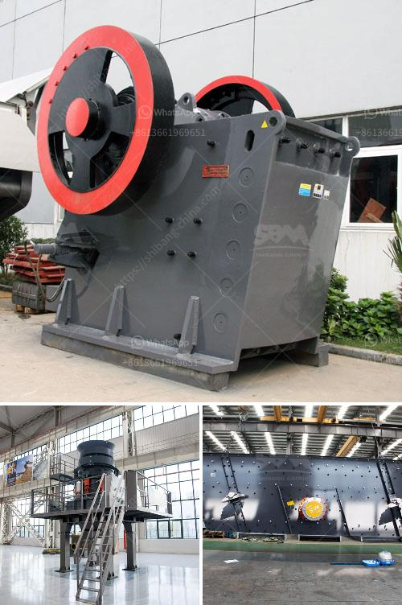

<h3>distributor stone crusher in guatemala</h3>
Guatemala, a Central American country south of Mexico, is known for its vast biodiversity and rich cultural heritage. In recent years, Guatemala has witnessed rapid economic growth and development, leading to an increase in construction projects and infrastructure investments. As a result, there has been a growing demand for construction materials, including stone aggregates.

Stone aggregates are essential materials used in various construction projects, such as roadways, bridges, buildings, and landscaping. These aggregates are obtained from natural sources, like quarries, where large rocks are extracted and then crushed into smaller sizes. This process is carried out by specialized machinery, such as stone crushers.

A stone crusher is a machine used to convert large stones into smaller sizes that can be used in construction or other purposes. There are several types of stone crushing machines, including jaw crushers, hammer crushers, impact crushers, and cone crushers. Each of these machines has its specific function and uses, depending on the type of stone and the desired end product.

In Guatemala, the stone crushing industry plays a crucial role in the country's infrastructure development. With the increasing demand for stone aggregates, there is a need for reliable stone crusher distributors who can provide efficient and high-quality crushing equipment to meet these requirements.

Stone crusher distributors in Guatemala cater to both the domestic and international markets. They supply stone crushers globally and have a strong presence in countries like the United States, Canada, and European countries. The stone crushing machinery provided by these distributors is manufactured using state-of-the-art technology, ensuring the highest level of performance and reliability.

Additionally, stone crusher distributors in Guatemala offer various after-sales services. These services include installation support, maintenance training, spare parts availability, and technical assistance. By providing these services, the distributors aim to establish long-term relationships with their customers and ensure customer satisfaction.

The stone crushing industry in Guatemala also has a positive impact on the local economy. It creates employment opportunities for skilled workers, such as machine operators, technicians, and maintenance staff. Moreover, stone crusher distributors often collaborate with local suppliers for raw materials, equipment, and logistical support, further boosting the local economy.

However, like any other industry, the stone crushing sector also faces challenges and risks. Environmental concerns, such as pollution from dust and noise, are significant issues that need to be addressed. Distributors need to adhere to strict regulations and implement sustainable practices to mitigate the environmental impact of stone crushing operations.

Overall, the stone crushing industry in Guatemala is a significant contributor to infrastructure development and economic growth. Distributors play a crucial role in meeting the increasing demand for stone aggregates by providing reliable and efficient crushing machinery. As the construction sector continues to thrive, the need for stone crushers and their distributors is expected to further grow, driving more investment in this essential industry.
<h3>Contact us</h3><ul><li><strong>Whatsapp:&nbsp;<a href="https://wa.me/8613661969651">+8613661969651</a></strong></li><li><a href="https://swt.shibang-china.com/?git&amp;zhl&amp;distributor stone crusher in guatemala"><strong>Online Service(chat now)</strong></a></li></ul><h3>Related</h3><ul><li><a href='capacity screener coal tonhcapacity stone crusher.md'>capacity screener coal tonhcapacity stone crusher</a></li><li><a href='jaw crusher 0 5 t 1ton per hour.md'>jaw crusher 0 5 t 1ton per hour</a></li><li><a href='cost of malaysia mobile crusher in india.md'>cost of malaysia mobile crusher in india</a></li><li><a href='iron ore beneficiation flowsheet.md'>iron ore beneficiation flowsheet</a></li><li><a href='quarry machine manufacturers.md'>quarry machine manufacturers</a></li></ul>