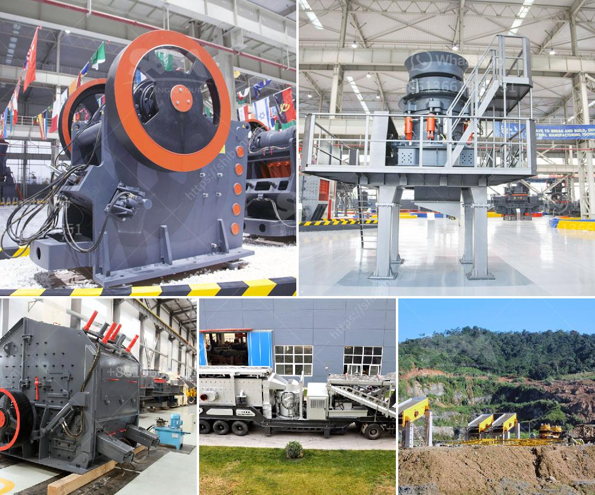

<h3>distributor stone crusher surabaya</h3>
With its increasing development, the construction industry drives the increasing demand for stone materials. And as the main material for building roads, pebbles have become a highly sought after material. So, the need for stone crushing plants is also increasing, resulting in a proliferation of stone crusher distributors in Surabaya ciudad and surrounding areas.

The development of stone crusher machines in Surabaya city is very rapid, with a variety of supporting industries and infrastructure, such as road construction, building construction, and more. In particular, the construction of national roads and bridges requires large amounts of aggregates of various sizes. And this is where the stone crushing plants come into play.

A stone crusher plant is a powerful machine used to reduce the size of rocks and stones. It is often used in the construction industry to facilitate the operations of making concrete, asphalt, and other materials. These plants are designed to be heavy-duty machines capable of crushing even the hardest materials. With the rapid growth in the construction industry, the demand for stone crusher plants has consistently increased.

To meet this demand efficiently, distributors of stone crusher machines are on the rise. As an official distributor in Indonesia, we can provide different types and sizes of crushing machines as per the customer's specifications. Our machines are quite durable, easy to operate and maintain, and have successfully been utilized in construction projects nationwide. To ensure the maximum satisfaction of our customers, we also provide after-sales services, including installation, maintenance, and spare parts supply.

When looking for a stone crusher distributor, it is important to note that there are different types of crushers available, each with its specific purpose and capacity. The right crusher choice will depend on your particular needs and requirements. Here are some of the popular types of stone crushers available in the market today:

1. Jaw Crusher: This is the most commonly used crusher in construction projects. It is versatile and convenient, making it suitable for small to medium-sized projects. It has a simple structure, high crushing ratio, and is reliable and efficient.

2. Impact Crusher: This type of crusher is suitable for crushing materials with compressive strength not exceeding 350 MPa. It has a high reduction ratio and can handle large amounts of material efficiently. It is commonly used in the production of sand and gravel aggregates.

3. Cone Crusher: The cone crusher is often used for medium and fine crushing of hard and medium-hard materials. It has a large crushing ratio and provides an excellent reduction and product cubicity for the production of high-quality aggregates.

As a distributor of stone crushing machines in Surabaya, we strive to provide the best service and technical support to our customers. We have professional technicians who can perform maintenance and repairs on all of our products. In addition, we are constantly updating our inventory to ensure that we have the latest models and spare parts available.

Ultimately, as the construction industry continues to grow, the demand for stone crushers in Surabaya increases. As a reputable distributor of stone crushing machines, we strive to provide the best solutions to our customers' needs. With our extensive knowledge and experience in the industry, we can assist customers in selecting the right equipment that best suits their specific requirements.
<h3>Contact us</h3><ul><li><strong>Whatsapp:&nbsp;<a href="https://wa.me/8613661969651">+8613661969651</a></strong></li><li><a href="https://swt.shibang-china.com/?git&amp;zhl&amp;distributor stone crusher surabaya"><strong>Online Service(chat now)</strong></a></li></ul><h3>Related</h3><ul><li><a href='vibrating screens manufacturers.md'>vibrating screens manufacturers</a></li><li><a href='ball mill hou feng in china.md'>ball mill hou feng in china</a></li><li><a href='mica processing machinery pictures.md'>mica processing machinery pictures</a></li><li><a href='stone crusher for gold.md'>stone crusher for gold</a></li><li><a href='portable track mounted mini jaw crusher.md'>portable track mounted mini jaw crusher</a></li></ul>