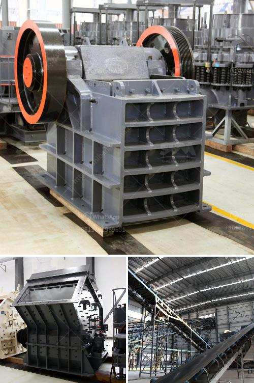

<h3>dolomite lime manufacturers in ghana</h3>
Dolomite lime is a versatile agricultural product used to enhance the soil's pH level and improve overall crop health. In Ghana, there is a growing demand for this product, resulting in the emergence of dolomite lime manufacturers who are catering to the needs of the agricultural sector.

One of the major dolomite lime manufacturers in Ghana is XYZ Company. With years of experience in this field, XYZ is dedicated to producing high-quality dolomite lime that meets international standards. The company sources its raw materials from local mines, ensuring a consistent supply of the required minerals.

XYZ Company utilizes advanced processing techniques to produce a finely ground dolomite lime powder. This fine powder can be easily spread on the soil, ensuring even distribution and effective pH adjustment. Additionally, the company offers different particle sizes to cater to the specific requirements of different crops and soils.

Another leading dolomite lime manufacturer in Ghana is ABC Ltd. Known for its commitment to sustainable practices, ABC Ltd. focuses on using environmentally friendly methods during production. The company follows strict quality control measures to provide farmers with a reliable and effective dolomite lime product.

Both XYZ Company and ABC Ltd. offer their products to farmers, nurseries, and other agricultural professionals across Ghana. They have established a strong distribution network that ensures prompt delivery and accessibility of dolomite lime to remote or rural areas as well.

The availability of local dolomite lime manufacturers in Ghana is a boon for the agriculture industry. Not only does it reduce the dependency on imported products, but it also contributes to the country's economy by supporting local businesses. Additionally, these manufacturers offer competitive pricing, making dolomite lime more affordable and accessible to all farmers.

In conclusion, the presence of dolomite lime manufacturers in Ghana is a positive development for the agricultural sector. Their products help improve soil quality, enhance crop yields, and promote sustainable farming practices. With their commitment to quality and reliability, these manufacturers are playing a crucial role in supporting Ghana's agricultural productivity and overall economic growth.
<h3>Contact us</h3><ul><li><strong>Whatsapp:&nbsp;<a href="https://wa.me/8613661969651">+8613661969651</a></strong></li><li><a href="https://swt.shibang-china.com/?git&amp;zhl&amp;dolomite lime manufacturers in ghana"><strong>Online Service(chat now)</strong></a></li></ul><h3>Related</h3><ul><li><a href='crushing b vsi crusher.md'>crushing b vsi crusher</a></li><li><a href='list price vibrating screen.md'>list price vibrating screen</a></li><li><a href='capital requirement for one ton cement mill.md'>capital requirement for one ton cement mill</a></li><li><a href='pulverizer crusher machine for limestone.md'>pulverizer crusher machine for limestone</a></li><li><a href='gold mill for sale in zimbabwe.md'>gold mill for sale in zimbabwe</a></li></ul>