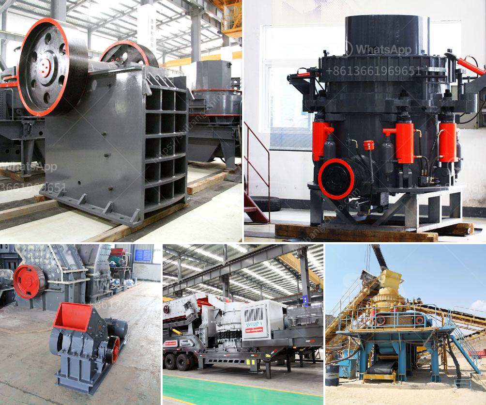

<h3>dolomite powder machine in sri lanka</h3>
Dolomite is a carbonate mineral, consisting of calcium magnesium carbonate. It is found in both sedimentary and metamorphic rocks across the globe. In Sri Lanka, dolomite has become a useful raw material for various industries. It is used in the production of cement, ceramics, glass, and fertilizers. Dolomite powder machine in Sri Lanka plays an important role in various industrial applications.

One of the most common uses of dolomite powder is in the construction industry. It is added to cement and concrete mixtures to improve the strength and durability of the end product. Dolomite acts as a filler, reducing the overall cost of production while also enhancing the properties of the final material. With the construction industry in Sri Lanka booming, the demand for dolomite powder is expected to rise steadily.

Furthermore, dolomite powder is also widely used in the production of ceramics and glass. In the ceramic manufacturing process, dolomite powder is added to clay-based bodies to improve their thermal and mechanical properties. It helps in reducing shrinkage during firing and increases the overall strength and durability of ceramic products. Similarly, in the glass industry, dolomite powder is used as a fluxing agent to lower the melting point of the glass, reduce viscosity, and improve its chemical stability.

Another significant application of dolomite powder is in agriculture. Dolomite acts as a source of magnesium and calcium, essential nutrients for plant growth. It helps in maintaining proper pH levels in the soil, promoting healthy root development, and improving the overall nutrient uptake by plants. Dolomite powder is usually incorporated into fertilizers to enhance their nutrient content and improve the fertility of the soil. In Sri Lanka, where agriculture plays a crucial role in the economy, the demand for dolomite powder in the agricultural sector is expected to witness a steady growth.

To meet the increasing demand for dolomite powder in Sri Lanka, various manufacturers have established dolomite powder machine facilities. These machines are specifically designed to crush dolomite rocks into fine powder, which can then be used in various industrial applications. The dolomite powder machine in Sri Lanka is equipped with cutting-edge technology and advanced machinery to ensure efficient and consistent production. The powdered dolomite is screened and processed to meet the specific requirements of different industries.

In conclusion, dolomite powder machine in Sri Lanka plays a vital role in various industries such as construction, ceramics, glass, and agriculture. Dolomite powder is widely used as a filler, fluxing agent, and nutrient source, among other applications. The increasing demand for dolomite powder in Sri Lanka has prompted the establishment of specialized machinery to meet the needs of the market. As the economy continues to grow, the demand for dolomite powder is expected to rise, driving further development and innovation in the industry.
<h3>Contact us</h3><ul><li><strong>Whatsapp:&nbsp;<a href="https://wa.me/8613661969651">+8613661969651</a></strong></li><li><a href="https://swt.shibang-china.com/?git&amp;zhl&amp;dolomite powder machine in sri lanka"><strong>Online Service(chat now)</strong></a></li></ul><h3>Related</h3><ul><li><a href='aggregate mining process.md'>aggregate mining process</a></li><li><a href='crusher plant in turkey.md'>crusher plant in turkey</a></li><li><a href='iron ore beneficiation flowsheet.md'>iron ore beneficiation flowsheet</a></li><li><a href='coal dry wash project cost.md'>coal dry wash project cost</a></li><li><a href='stamler usa feeder breaker crusher.md'>stamler usa feeder breaker crusher</a></li></ul>