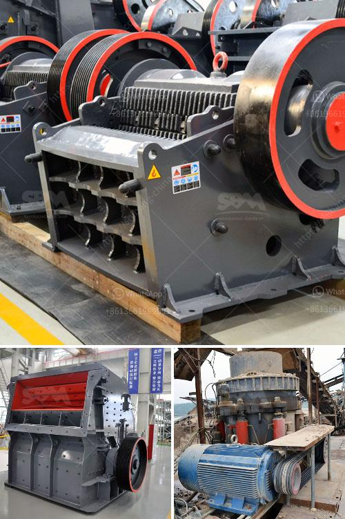

<h3>dolomite powder making machine</h3>
Dolomite is a carbonate mineral composed of calcium magnesium carbonate. It is a common sedimentary rock-forming mineral that can be found in massive beds known as dolomites. Dolomite powder is widely used in various industries like agriculture, glass, ceramics, construction, and chemical manufacturing. This article focuses on the dolomite powder making machine with 300-500 mesh.

First of all, let's discuss the importance of dolomite powder. Dolomite powder has a unique chemical composition that provides numerous benefits to various industries. It is used as an agricultural soil amendment to balance soil pH levels, improve calcium and magnesium deficiencies, and enhance water retention capacity in the soil. Additionally, dolomite powder is an essential ingredient in the glass and ceramics industry, where it acts as a flux, reducing the melting temperature and improving the transparency and strength of the glass or ceramic products.

To obtain high-quality dolomite powder, the use of dolomite powder making machines is crucial. These machines process raw dolomite into desired powder size for various applications. Dolomite is crushed and ground into powder-like particles, and the finished product is often classified by particle size and grading to meet specific requirements. The dolomite powder making machine plays a significant role in dolomite powder production technology.

There are several types of dolomite powder making machines on the market, including jaw crusher, impact crusher, cone crusher, ball mill, Raymond mill, high pressure mill, ultrafine mill, and vertical roller mill. These machines are suitable for processing dolomite powder with different fineness requirements. Jaw crusher is used for primary crushing, and impact crusher or cone crusher is used for secondary crushing. The ball mill, Raymond mill, ultrafine mill, and vertical roller mill can grind fine powder with different fineness.

Among them, the ultrafine mill equipment is an exclusive equipment for fine powder processing. It has comprehensive mechanical crushing performance such as rolling, grinding, and impact. The fineness of grinding can be adjusted between 325-2500 mesh, and the capacity is higher. The ultrafine mill machine can meet the production requirements of large-scale fine powder production.

In conclusion, the dolomite powder making machine is essential in the dolomite powder production process. Whether it is from crushing, grinding, or ultrafine grinding, various types of equipment are developed to create a high-quality dolomite powder. Dolomite powder making machines are widely worked in numerous industries due to their versatility, efficiency, and low energy consumption.
<h3>Contact us</h3><ul><li><strong>Whatsapp:&nbsp;<a href="https://wa.me/8613661969651">+8613661969651</a></strong></li><li><a href="https://swt.shibang-china.com/?git&amp;zhl&amp;dolomite powder making machine"><strong>Online Service(chat now)</strong></a></li></ul><h3>Related</h3><ul><li><a href='crusher plant supplier in nepal.md'>crusher plant supplier in nepal</a></li><li><a href='what are the prices of crushing equipment.md'>what are the prices of crushing equipment</a></li><li><a href='beneficiation of iron ore in dry methods.md'>beneficiation of iron ore in dry methods</a></li><li><a href='grinding mills supplier in gujraanwala.md'>grinding mills supplier in gujraanwala</a></li><li><a href='vertical impact crusher quote.md'>vertical impact crusher quote</a></li></ul>