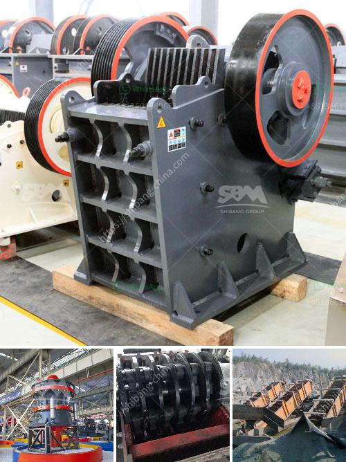

<h3>dolomite powder mill mesh</h3>
Dolomite powder mill is a professional grinding equipment that is widely used in the industry of dolomite processing.

Dolomite powder mill is the ideal equipment for dolomite ore grinding. It adopts the advanced grinding technology from Europe and combines various grinding machines for ultrafine powder production. It has many advantages such as low energy consumption, high grinding efficiency, strong drying ability, stable product quality, and easy maintenance. The fineness of the finished product can be adjusted from 325 to 3000 mesh, making it suitable for various production requirements.

The dolomite powder mill can process various types of dolomite ore with a particle size of up to 35mm and a Mohs hardness of up to 9.3. It takes jaw crushers, cone crushers, and impact crushers as the core crushing equipment. On this basis, we have developed a complete selection of conveying equipment, such as belt conveyors, bucket elevators, vibrating feeders, etc., to meet the needs of different customers.

The dolomite powder mill is also equipped with a cyclone dust collector and pulse dust collector. Both of them can collect the ultrafine powder generated during the grinding process, reducing environmental pollution and saving production costs. In addition, dolomite powder mill also has a complete set of auxiliary devices, such as crushers, feeders, hoists, etc. These devices can be freely combined according to the actual needs of customers to achieve a higher production efficiency and lower operating costs.

The Dolomite powder mill can produce dolomite powder up to 300-500 mesh. In terms of the application range, dolomite powder mill can be used in more industries. For example, it can be used in rubber, plastic, papermaking, building materials, coatings, paints and other fields. The dolomite powder mill can not only effectively improve the performance of rubber products, but also reduce costs. In the field of papermaking, dolomite powder can be used as filler to improve the opacity and smoothness of paper, as well as enhance the wear resistance of paper.

In conclusion, dolomite powder mill is an ideal equipment for dolomite ore grinding. It has wide application range, high grinding efficiency, low energy consumption, and stable product quality. With the increasing demand for dolomite powder, the dolomite powder mill will surely bring great benefits to customers.
<h3>Contact us</h3><ul><li><strong>Whatsapp:&nbsp;<a href="https://wa.me/8613661969651">+8613661969651</a></strong></li><li><a href="https://swt.shibang-china.com/?git&amp;zhl&amp;dolomite powder mill mesh"><strong>Online Service(chat now)</strong></a></li></ul><h3>Related</h3><ul><li><a href='coal washing plant design.md'>coal washing plant design</a></li><li><a href='detail project report on quartz powder plant.md'>detail project report on quartz powder plant</a></li><li><a href='gemstones found in nigeria.md'>gemstones found in nigeria</a></li><li><a href='size of a 50 tpd rotary kiln.md'>size of a 50 tpd rotary kiln</a></li><li><a href='artificial sand making in karnataka.md'>artificial sand making in karnataka</a></li></ul>