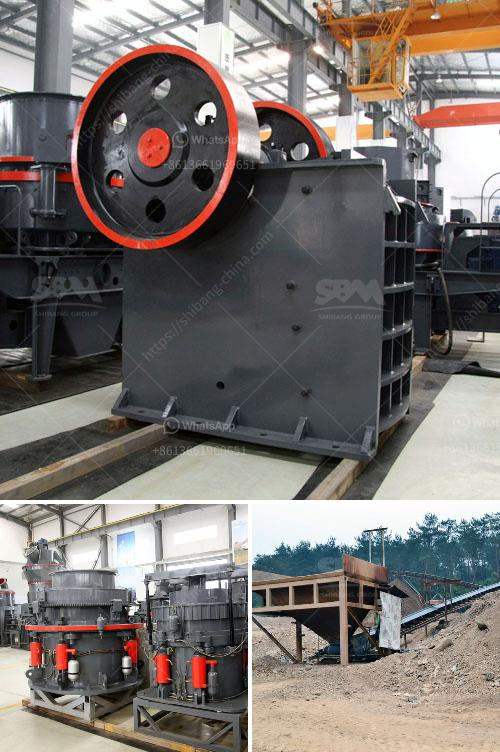

<h3>dolomite processing plan in ethiopia</h3>
Dolomite is a mineral that is commonly found in Ethiopia, and it is an essential ingredient in the production of cement. It is mainly used as a fluxing agent in the metallurgical industry, and as a construction aggregate in the construction industry. Dolomite processing plants are generally constructed on the site of extraction to reduce transportation costs.

Dolomite is one of the abundant resources in Ethiopia. However, its extraction and processing cannot be easily done due to its high hardness, making it difficult to crush and grind. Furthermore, dolomite can be abrasive to processing equipment, requiring finesse in handling and operation. 

To tackle these challenges, dolomite processing plants in Ethiopia are adopting modern and innovative technologies. Advanced crushing, grinding, and separation techniques are being utilized to obtain high-quality dolomite products. These processes involve primary crushing, secondary crushing, fine grinding, and magnetic separation to remove impurities and obtain the desired particle size and chemical composition.

Moreover, environmental considerations play a crucial role in the processing of dolomite. Efforts are made to minimize the impact on the surrounding ecosystem and to ensure proper waste management. These include measures such as dust suppression, land reclamation, and water recycling.

Dolomite processing plants in Ethiopia are also focusing on improving efficiency and reducing operating costs. By optimizing the entire process chain, from mining to transportation and processing, they aim to enhance productivity while minimizing energy consumption and emissions. Additionally, by investing in research and development, they are constantly exploring new techniques and methods to streamline operations and increase product quality.

The dolomite processing industry in Ethiopia holds immense potential for economic growth and development. It not only contributes to the local economy through job creation but also supports the construction and metallurgical sectors, both crucial for infrastructure development. With the use of modern technologies and sustainable practices, Ethiopia's dolomite processing plants are poised to meet the growing demand for dolomite products while ensuring long-term environmental sustainability.
<h3>Contact us</h3><ul><li><strong>Whatsapp:&nbsp;<a href="https://wa.me/8613661969651">+8613661969651</a></strong></li><li><a href="https://swt.shibang-china.com/?git&amp;zhl&amp;dolomite processing plan in ethiopia"><strong>Online Service(chat now)</strong></a></li></ul><h3>Related</h3><ul><li><a href='crushing plant process flow.md'>crushing plant process flow</a></li><li><a href='300tpd mini cement plant task cost in india.md'>300tpd mini cement plant task cost in india</a></li><li><a href='price on a mining ball mill 10 tons per hour.md'>price on a mining ball mill 10 tons per hour</a></li><li><a href='iron ore beneficiation flowsheet.md'>iron ore beneficiation flowsheet</a></li><li><a href='list of equipment used gold diamond mining.md'>list of equipment used gold diamond mining</a></li></ul>