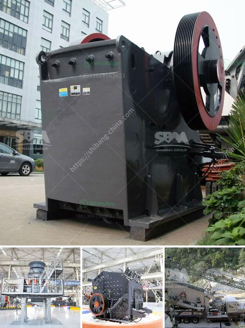

<h3>dolomite processing plants from germany</h3>
Dolomite is a naturally occurring mineral composed of calcium magnesium carbonate. It is widely used in various industries like construction, agriculture, and manufacturing. Germany is one of the world's leading producers of dolomite, and it has a long history of dolomite mining and processing.

Dolomite processing plants are a key component in the production of dolomite products. These plants have a significant impact on the environment and can benefit local economies. In Germany, most dolomite deposits are found in the southern part of the country. Therefore, dolomite processing plants are typically located in this region.

The process of dolomite processing involves crushing, washing, and grinding raw dolomite to obtain the desired particle size. It is then purified using a series of separators and screens to remove impurities and unwanted materials. The processed dolomite is then transported to various industries for further use.

One of the primary uses of dolomite is in the construction industry. It is a key ingredient in the production of cement, concrete, and asphalt. Dolomite enhances the durability and strength of these materials, making them suitable for various construction applications. Dolomite can also be used as a filler material in paints, plastics, and ceramics.

In the agricultural sector, dolomite is used as a soil conditioner. It helps to neutralize acidic soils and provides essential nutrients like calcium and magnesium. Dolomite application improves soil structure and promotes healthy plant growth. Farmers often apply dolomite to their fields to enhance crop yield and quality.

Dolomite processing plants in Germany also cater to the manufacturing industry. Dolomite is used as an additive in glass and ceramics production. It enhances the transparency and strength of glass products. Dolomite is also used as a fluxing material in iron and steel manufacturing. It helps remove impurities and improve the flowability of molten metal.

Besides its industrial uses, dolomite also has medical and cosmetic applications. It is used in the production of dietary supplements to provide calcium and magnesium to the body. Dolomite is also a common ingredient in skincare products like face masks and scrubs. It helps to exfoliate and cleanse the skin, leaving it smooth and radiant.

In conclusion, dolomite processing plants in Germany play a significant role in the production of various dolomite products. These plants employ advanced technologies and adhere to strict environmental regulations. Dolomite has versatile applications in construction, agriculture, manufacturing, and even healthcare. The industry supports local economies and contributes to Germany's status as a leading producer of dolomite. As demand for dolomite continues to grow, it is crucial to develop sustainable practices and explore innovative uses for this valuable mineral.
<h3>Contact us</h3><ul><li><strong>Whatsapp:&nbsp;<a href="https://wa.me/8613661969651">+8613661969651</a></strong></li><li><a href="https://swt.shibang-china.com/?git&amp;zhl&amp;dolomite processing plants from germany"><strong>Online Service(chat now)</strong></a></li></ul><h3>Related</h3><ul><li><a href='precipitated calcium carbonate manufacturing machinery.md'>precipitated calcium carbonate manufacturing machinery</a></li><li><a href='used portable gravel screens for sale.md'>used portable gravel screens for sale</a></li><li><a href='sand making plant sand washing plant.md'>sand making plant sand washing plant</a></li><li><a href='50 tph stone crusher plant.md'>50 tph stone crusher plant</a></li><li><a href='fine grinding mill.md'>fine grinding mill</a></li></ul>