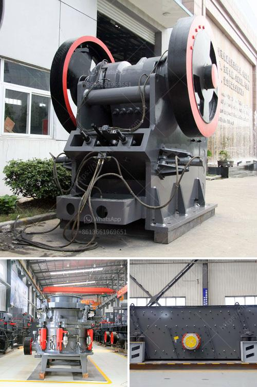

<h3>double roll crusher indonesia</h3>
Double roll crusher is used for crushing stone, coal, cement, limestone and other materials in bulk quantities. Double roll crusher Indonesia has many advantages. The two rollers rotating in opposite directions automatically minimize the possibility of an explosion caused by the mixing of fuel and air. Double roll crusher Indonesia has smooth and grooved rollers which are used to crush and compress the materials that are placed on the two rollers.

Double roll crusher is mainly used for the crushing of medium or lower-hardness mines and rocks with medium or lower rigidity in mine selection, chemicals, cement and building materials industrial production. Roll crushers have a theoretical maximum reduction ratio of 4:1. If a 2-inch particle is fed to the roll crusher the absolute smallest size one could expect from the crusher is 1/2 inch. Roll crushers can adjust the wedge device between rollers to control the feed and discharge size of the machine.

In general, the processing system of them exists two types: a closed system and an open system. Closed systems usually process materials that are not separated from the crushing plant. The materials are reduced to small pieces that can pass through the holes of the sieve mesh. The system reduces the materials in the crushing chamber repeatedly and after several times of being crushed, the materials can finally reach the required size. Open systems crush blocks of materials and process them through a step-by-step process. In this case, the produced materials are square in shape and have angular edges that make them suitable for use as transportation ballast or decorative. To apply for the construction of roads, the material must be in a high-quality condition, and this can be achieved through double roll crusher.

Indonesia is one of the countries with abundant coal resources in the world. With the depletion of oil, natural gas and other energy resources, coal resources have become one of the most important energy sources. The emergence of double roll crusher has brought new development opportunities for coal industry. In terms of its working principle, the double roller crusher adopts the principle of squeezing to crush the materials, which is equivalent to the combination of two jaw crushers.

To meet the requirements of crushing the coal samples, the double roll crusher in CIMMA is provided with a product size adjustment system, which is characterized by the fact that during the crushing process, the size of the nut between the two rollers can be adjusted as a result of the fact that both rollers are provided with adjusting screws. The barrel body is provided with a gap between the upper and lower counter rollers, and the size of the gap can be adjusted accordingly.

In conclusion, double roll crusher Indonesia is widely used in coal mining, cement production and other industries. It has the advantages of low maintenance cost, reliable operation, small size, lightweight, low energy consumption and strong adaptability. Therefore, it is widely used in coal mines and coal preparation plants. Moreover, the mobile double roll crusher ensures a good particle size and high crushing efficiency. It is a good choice for coal gangue crushing.
<h3>Contact us</h3><ul><li><strong>Whatsapp:&nbsp;<a href="https://wa.me/8613661969651">+8613661969651</a></strong></li><li><a href="https://swt.shibang-china.com/?git&amp;zhl&amp;double roll crusher indonesia"><strong>Online Service(chat now)</strong></a></li></ul><h3>Related</h3><ul><li><a href='stone crusher for excavator cost.md'>stone crusher for excavator cost</a></li><li><a href='limestone mines for sale in cambodia.md'>limestone mines for sale in cambodia</a></li><li><a href='simple stone crusher dubai.md'>simple stone crusher dubai</a></li><li><a href='dolomite powder mill mesh.md'>dolomite powder mill mesh</a></li><li><a href='coal pulverizer manufacturer.md'>coal pulverizer manufacturer</a></li></ul>