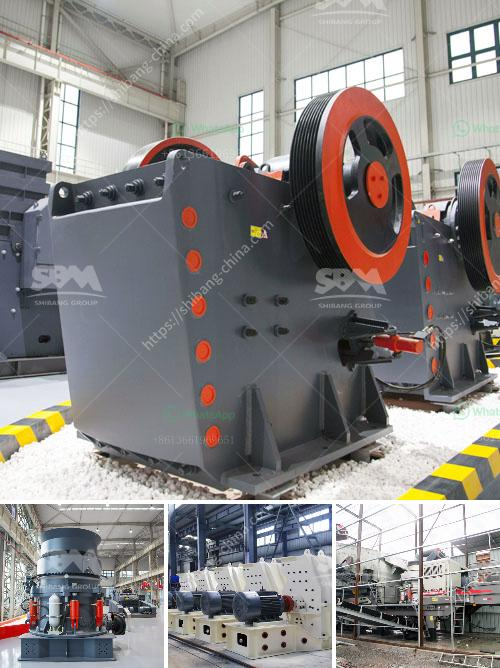

<h3>double toggle jaw crusher</h3>
The double toggle jaw crusher is a piece of machinery that utilizes two jaws to crush aggregate material. This machine is also known as the Blake crusher and is mainly used for reducing large rocks and stones into smaller sizes in the construction industry. It is regarded as a reliable and efficient machine for this purpose.

The working principle of the double toggle jaw crusher involves the vertical movement of the swing jaw, which moves like a pendulum as it leads the material towards the crushing chamber. The single toggle jaw crusher has a fixed jaw and a moving jaw pivoted at the top. The movement of the toggle plate pushes the material towards the crushing chamber, while the discharge opening is adjusted by the variable size of the toggle plate. This allows different-sized materials to pass through the machine, ensuring efficient and consistent crushing.

One of the main advantages of the double toggle jaw crusher is that it has a large feed opening, which can accommodate large stones and rocks. This reduces the need for secondary crushing, resulting in a more efficient and cost-effective crushing process. Additionally, the double toggle jaw crusher produces a uniform product size, which can be easily adjusted by changing the toggle plate's setting. This versatility allows for greater control over the final product, making it ideal for various applications in the construction industry.

The double toggle jaw crusher is also known for its strong and durable components due to the heavy-duty construction characteristics. The toggle plate is made of high-quality steel and is capable of withstanding extreme pressure and friction forces. The jaw plates are also made of manganese steel, which ensures excellent wear resistance and long service life. These robust features contribute to the machine's reliability and low maintenance requirements.

In terms of energy efficiency, the double toggle jaw crusher performs well, as it requires less power to produce the required amount of crushed materials compared to alternative crushing equipment. This leads to reduced energy consumption and operating costs. Additionally, the machine's simple design ensures ease of maintenance and repair, minimizing downtime and increasing productivity.

To conclude, the double toggle jaw crusher is a reliable and efficient machine that is used in a variety of industries. It provides a cost-effective solution for reducing large-sized materials into smaller sizes, producing a uniform product. The durable construction and energy-efficient design make it a preferred choice for many construction projects. Whether it's crushing stones, rocks, or other materials, the double toggle jaw crusher is an effective option for any crushing application.
<h3>Contact us</h3><ul><li><strong>Whatsapp:&nbsp;<a href="https://wa.me/8613661969651">+8613661969651</a></strong></li><li><a href="https://swt.shibang-china.com/?git&amp;zhl&amp;double toggle jaw crusher"><strong>Online Service(chat now)</strong></a></li></ul><h3>Related</h3><ul><li><a href='list of stone crusher plant in bangladesh.md'>list of stone crusher plant in bangladesh</a></li><li><a href='gold mill for sale in zimbabwe.md'>gold mill for sale in zimbabwe</a></li><li><a href='xzm series ultra fine mill zenith.md'>xzm series ultra fine mill zenith</a></li><li><a href='gemstones found in nigeria.md'>gemstones found in nigeria</a></li><li><a href='price list sag mill for sale.md'>price list sag mill for sale</a></li></ul>