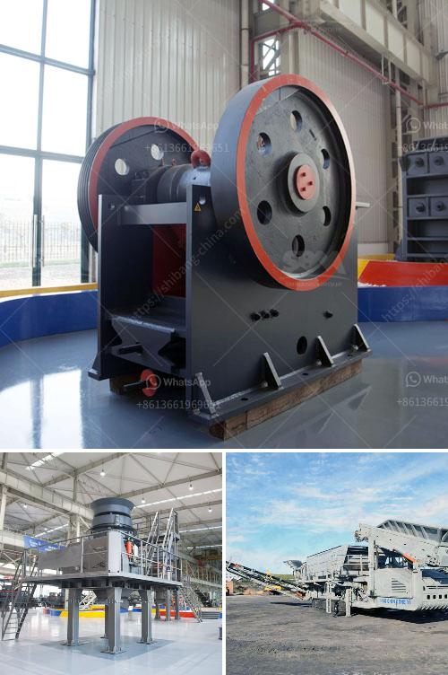

<h3>drawing for raymond mill</h3>
Drawing is an age-old art form that has captivated human beings since ancient times. It serves as a medium of expression, allowing individuals to communicate their thoughts, emotions, and ideas through visual representation. However, as technology advances, so does the equipment and tools available to artists. One such tool, the Raymond Mill, has revolutionized the art of drawing, enabling artists to unleash their full potential with precision and accuracy.

The Raymond Mill is a powerful and versatile tool for artists, providing them with a wide range of features and capabilities. This machine, typically used in industries such as mining, metallurgy, and chemical engineering, has found a unique application in the realm of art. Its primary function is to reduce materials into fine powder, making it an ideal tool for grinding and processing materials needed for drawing.

One of the most significant advantages of using a Raymond Mill for drawing is the precise control it offers over the grinding process. Artists can adjust the mill's speed and pressure to achieve the desired level of fineness in their materials. This level of control allows for detailed and intricate drawings, with every line and stroke coming out exactly as intended.

Furthermore, the Raymond Mill's grinding mechanism ensures the consistency of the processed material. This leads to uniformity in the texture and composition of the powdered materials used for drawing. With consistent materials, artists can focus solely on their creative process, without worrying about variations in the quality of their supplies.

Another noteworthy feature of the Raymond Mill is its ability to grind various materials, ranging from traditional art mediums such as graphite and charcoal to unconventional materials like rocks and minerals. This versatility expands an artist's repertoire, allowing them to experiment with different textures and effects in their drawings. The ability to grind unconventional materials also opens the door to using natural pigments and dyes, further enhancing the artistic experience.

Additionally, the Raymond Mill's durability and longevity make it a valuable investment for artists. Unlike traditional grinding tools that may wear over time, this machine is designed to withstand heavy use. Its robust construction ensures that it can handle the demands of a busy artist's studio for years to come, guaranteeing a consistent and reliable tool for creating stunning drawings.

Moreover, the Raymond Mill's efficiency saves artists valuable time and effort. With its fast grinding capability, artists can produce large quantities of powdered materials in a short period. This allows for uninterrupted work sessions, as the artist does not need to interrupt their workflow frequently to prepare materials. The time saved can be better spent on refining techniques and exploring new artistic possibilities.

In conclusion, the Raymond Mill has become an indispensable tool for aspiring and professional artists alike. Its precise control, grinding consistency, versatility, durability, and efficiency make it the perfect tool for unleashing artistic potential. With this machine, artists can create masterful drawings, explore new textures and effects, and save time in their artistic journey. So, embrace the Raymond Mill, and let your creativity flow with precision and accuracy.
<h3>Contact us</h3><ul><li><strong>Whatsapp:&nbsp;<a href="https://wa.me/8613661969651">+8613661969651</a></strong></li><li><a href="https://swt.shibang-china.com/?git&amp;zhl&amp;drawing for raymond mill"><strong>Online Service(chat now)</strong></a></li></ul><h3>Related</h3><ul><li><a href='used vertical roller mill for sale.md'>used vertical roller mill for sale</a></li><li><a href='limestone rock crushing company.md'>limestone rock crushing company</a></li><li><a href='small scale mine business plan pdf.md'>small scale mine business plan pdf</a></li><li><a href='impact crusher manufacturers china.md'>impact crusher manufacturers china</a></li><li><a href='jaw crusher south africa.md'>jaw crusher south africa</a></li></ul>