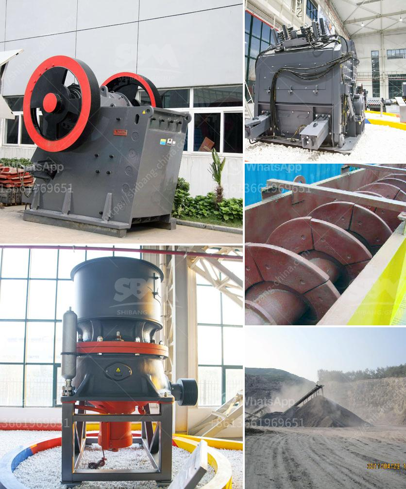

<h3>dry wash prospecting unit for sale western philippines</h3>
Dry wash prospecting units are becoming increasingly popular among mining enthusiasts in the western Philippines. These innovative machines offer a convenient and efficient way to extract gold from dry soils without the need for water. If you are looking to invest in a dry wash prospecting unit, now is the perfect time as there are several units available for sale in the region.

Dry wash prospecting units utilize a combination of air and vibration to separate gold particles from the surrounding material. The units are equipped with powerful blowers that create a strong airflow, which in turn exposes the soil to a continuous stream of air. This air stream lifts and removes lightweight materials such as sand and gravel while leaving the heavier gold particles behind.

One of the main advantages of dry wash prospecting units is that they eliminate the need for water, making them ideal for areas with limited water sources or locations where water regulations are in place. This not only saves time and resources but also reduces the impact on the environment.

These units are designed to be portable and easy to use, making them suitable for both experienced prospectors and newcomers to the world of mining. Most dry wash prospecting units come with adjustable settings, allowing users to fine-tune the vibration and airflow to suit their specific needs.

If you are interested in purchasing a dry wash prospecting unit in the western Philippines, you have several options available. Local mining equipment suppliers and online platforms dedicated to mining tools often have a range of units for sale. It is advisable to compare prices and features to ensure you choose the unit that best suits your requirements and budget.

With a dry wash prospecting unit, you can unlock the hidden potential of dry soils in the western Philippines and discover the thrill of finding gold without relying on water. Whether you are a seasoned prospector or a beginner, investing in a dry wash prospecting unit opens up a whole new world of possibilities in the world of mining.
<h3>Contact us</h3><ul><li><strong>Whatsapp:&nbsp;<a href="https://wa.me/8613661969651">+8613661969651</a></strong></li><li><a href="https://swt.shibang-china.com/?git&amp;zhl&amp;dry wash prospecting unit for sale western philippines"><strong>Online Service(chat now)</strong></a></li></ul><h3>Related</h3><ul><li><a href='prices of crusher machine in pakistan.md'>prices of crusher machine in pakistan</a></li><li><a href='grinding mills supplier in gujraanwala.md'>grinding mills supplier in gujraanwala</a></li><li><a href='graphite processing plant.md'>graphite processing plant</a></li><li><a href='dolomite processing plan in ethiopia.md'>dolomite processing plan in ethiopia</a></li><li><a href='stone crusher price ton per day.md'>stone crusher price ton per day</a></li></ul>