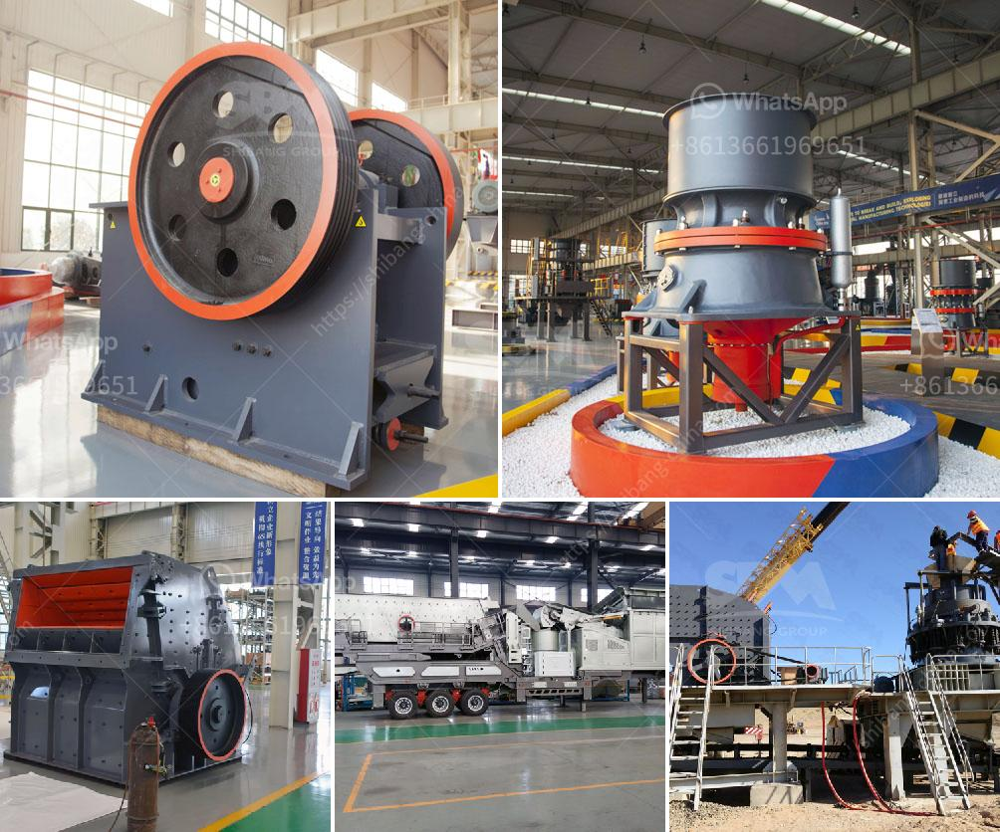

<h3>equipment to start up a quarry crusher</h3>
Starting a quarry is a profitable venture that involves excavation, extraction, cutting, and crushing of various stones. However, assembling equipment for a quarry crusher can be a complex and meticulous process. Therefore, it is essential to identify and acquire essential equipment needed in starting a quarry crusher. 

One of the primary pieces of equipment needed for a quarry crusher is a rock crusher. The rock crusher uses a hydraulic press to break down large rocks into small gravels or stones. There are different types of rock crushers available, including jaw crushers, cone crushers, and impact crushers. The chosen rock crusher will depend on factors such as the size and hardness of rocks in the quarry. 

Another essential piece of equipment is a vibrating feeder, which helps regulate and control the flow of rocks into the crusher. The vibrating feeder ensures a consistent supply of rocks to maintain efficient operations in the quarry. 

A conveyor system is also necessary for transporting rocks and materials within the quarry. This equipment enables the seamless movement of rocks from the extraction point to the crusher and other processing areas of the quarry. The conveyor system reduces manual handling and improves efficiency.

To ensure the safety of employees and protect the environment, dust control equipment is indispensable. This equipment, such as dust collectors or baghouses, captures and filters the dust and airborne particles generated during the crushing process. Implementing appropriate dust control measures prevents air pollution and promotes a healthy working environment.

Additionally, it is vital to have screening equipment in place. This equipment separates the crushed stones into different sizes to meet specific project requirements. A vibrating screen is commonly used for this purpose, sorting the stones into various grades and removing any unwanted debris.

In conclusion, starting up a quarry crusher requires several essential pieces of equipment. These include a rock crusher, vibrating feeder, conveyor system, dust control equipment, and screening equipment. Investing in high-quality equipment is crucial for the success of a quarry crusher venture. Properly selected and maintained equipment will lead to increased productivity, efficiency, and profitability in quarry operations.
<h3>Contact us</h3><ul><li><strong>Whatsapp:&nbsp;<a href="https://wa.me/8613661969651">+8613661969651</a></strong></li><li><a href="https://swt.shibang-china.com/?git&amp;zhl&amp;equipment to start up a quarry crusher"><strong>Online Service(chat now)</strong></a></li></ul><h3>Related</h3><ul><li><a href='kenya stone crusher.md'>kenya stone crusher</a></li><li><a href='diatomite processing plant.md'>diatomite processing plant</a></li><li><a href='sand making plant sand washing plant.md'>sand making plant sand washing plant</a></li><li><a href='hammer mill dimensions.md'>hammer mill dimensions</a></li><li><a href='aggregate crushing machines.md'>aggregate crushing machines</a></li></ul>