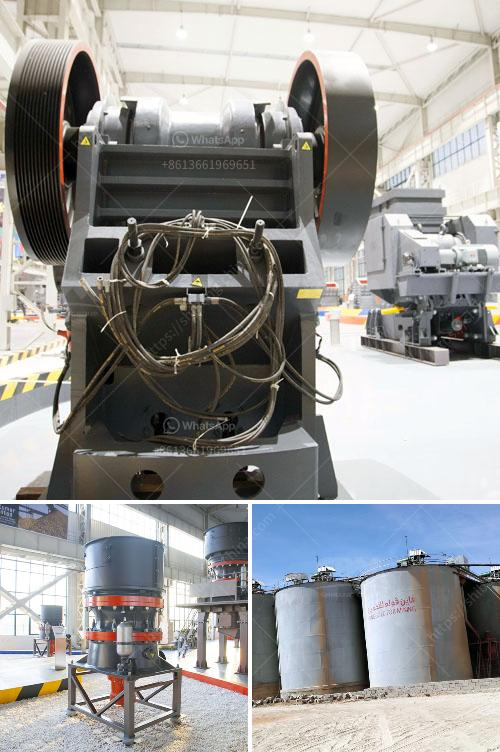

<h3>equipos para triturado de mineria</h3>
Equipo para triturado de minería: la clave para la eficiencia y seguridad en la extracción de minerales

La industria minera es fundamental para el desarrollo económico de muchos países alrededor del mundo. Sin embargo, sabemos que la extracción de minerales implica una serie de procesos que requieren un cuidado especial para garantizar la eficiencia y seguridad de los trabajadores. En este sentido, contar con equipos para el triturado de minería se convierte en una necesidad imperante.

El triturado de minería es una etapa crucial en el proceso de extracción de minerales, ya que es aquí donde se reduce el tamaño del material extraído para su posterior procesamiento. La elección de los equipos adecuados es fundamental, ya que impacta directamente en la productividad de la operación y en la calidad del producto final.

Existen diversos equipos para el triturado de minería en el mercado, cada uno con características y capacidades diferentes. Por ejemplo, las trituradoras de mandíbula son ideales para la trituración primaria, mientras que las trituradoras de impacto se utilizan comúnmente en la trituración secundaria. Asimismo, existen trituradores de cono, que son muy eficientes en la trituración terciaria.

Además de elegir el equipo adecuado, también es importante considerar factores como la capacidad de producción requerida, el tipo de material a triturar y la facilidad de mantenimiento. Los equipos modernos suelen contar con tecnología avanzada que permite un control preciso del proceso, lo que contribuye a maximizar la eficiencia y minimizar los tiempos de inactividad.

Sin embargo, no solo la eficiencia es importante en la elección de equipos para el triturado de minería, sino también la seguridad. La manipulación de grandes volúmenes de material puede representar riesgos para los trabajadores, por lo que es crucial contar con equipos que cumplan con los estándares de seguridad y protección necesarios. Además, los equipos modernos suelen incorporar sistemas de automatización y control remoto que minimizan la exposición de los trabajadores a situaciones peligrosas.

En resumen, el uso de equipos para el triturado de minería es esencial en la industria minera. Estos equipos no solo garantizan la eficiencia de la operación y la calidad del producto final, sino que también contribuyen a la seguridad de los trabajadores. La elección adecuada de los equipos, junto con el mantenimiento regular y la capacitación del personal, permite a las empresas mineras maximizar su rendimiento y seguir operando de manera sustentable en el tiempo.
<h3>Contact us</h3><ul><li><strong>Whatsapp:&nbsp;<a href="https://wa.me/8613661969651">+8613661969651</a></strong></li><li><a href="https://swt.shibang-china.com/?git&amp;zhl&amp;equipos para triturado de mineria"><strong>Online Service(chat now)</strong></a></li></ul><h3>Related</h3><ul><li><a href='mini crusher for gravel sale in philippines.md'>mini crusher for gravel sale in philippines</a></li><li><a href='aggregate production plant pdf.md'>aggregate production plant pdf</a></li><li><a href='fine powder grinders 30 50 microns.md'>fine powder grinders 30 50 microns</a></li><li><a href='method statement for using mobile jaw crusher.md'>method statement for using mobile jaw crusher</a></li><li><a href='process of making methanol from coal.md'>process of making methanol from coal</a></li></ul>