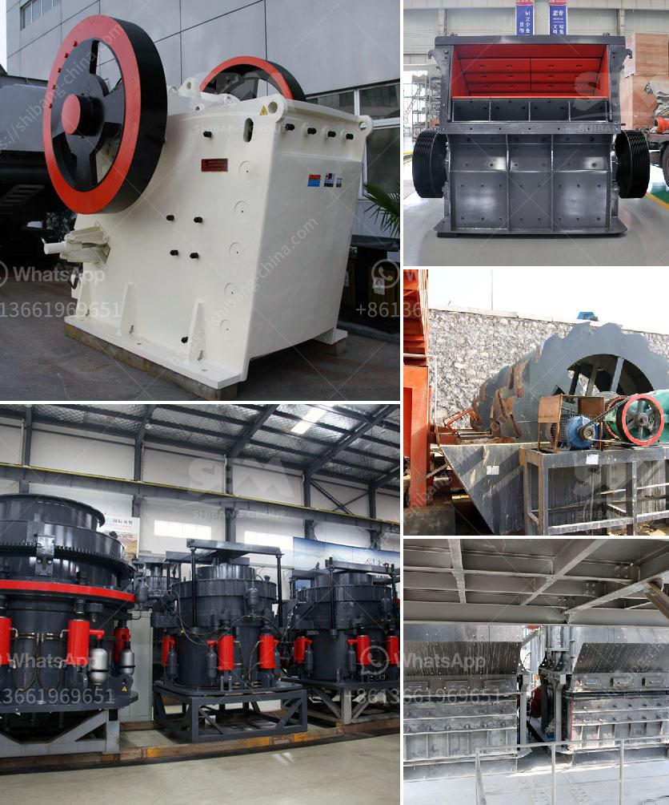

<h3>famous manganese cone crusher parts made china</h3>
China has established itself as a global leader in manufacturing high-quality, cost-effective machinery and equipment. This reputation extends to the production of manganese cone crusher parts used by various industries worldwide. With decades of experience and expertise, Chinese manufacturers are renowned for providing reliable and durable crusher components that enhance the operational efficiency of crushing machinery. This article explores the fame and excellence associated with manganese cone crusher parts made in China.

Cone crushers are widely used in the mining and aggregate industries for their ability to crush hard and abrasive materials. Manganese cone crusher parts, such as concave and mantle, play a crucial role in the crushing process. These parts are subjected to extreme wear and tear, and their proper functioning is essential for optimal performance.

Chinese manufacturers of manganese cone crusher parts are well-known for their commitment to producing high-quality products. They employ advanced manufacturing techniques and technologies to ensure the parts meet international standards. Furthermore, stringent quality control measures are implemented throughout the production process to guarantee the reliability and durability of the components.

One of the key strengths of Chinese manufacturers is their ability to customize manganese cone crusher parts to suit specific requirements. They work closely with customers to understand their needs and preferences, resulting in tailor-made solutions that deliver maximum performance and efficiency. Moreover, Chinese manufacturers constantly invest in research and development to innovate and improve their products, staying ahead of the competition.

Chinese manufacturers are known for providing cost-effective solutions without compromising on quality. By leveraging their expertise and efficient production processes, they offer manganese cone crusher parts at competitive prices. This affordability makes these parts an excellent choice for businesses looking to optimize their crushing operations without breaking the bank.

In recent years, Chinese manufacturers have made significant strides in adopting sustainable and responsible manufacturing practices. They prioritize environmental protection, resource conservation, and waste reduction throughout their operations. This commitment ensures that the manganese cone crusher parts made in China not only deliver exceptional performance but are also produced with minimal impact on the environment.

The fame and popularity of manganese cone crusher parts made in China stem from the unwavering commitment to quality, customization, innovation, and cost-effectiveness. With advanced manufacturing techniques, Chinese manufacturers offer reliable, durable, and efficient crusher components that withstand the most demanding crushing operations. By embracing sustainability and responsible manufacturing practices, they also contribute to a greener and cleaner future. As a result, these renowned Chinese manufacturers continue to dominate the industry, providing businesses worldwide with exceptional manganese cone crusher parts.
<h3>Contact us</h3><ul><li><strong>Whatsapp:&nbsp;<a href="https://wa.me/8613661969651">+8613661969651</a></strong></li><li><a href="https://swt.shibang-china.com/?git&amp;zhl&amp;famous manganese cone crusher parts made china"><strong>Online Service(chat now)</strong></a></li></ul><h3>Related</h3><ul><li><a href='stone crusher machine price in kenya.md'>stone crusher machine price in kenya</a></li><li><a href='rollers for conveyor belts manizales.md'>rollers for conveyor belts manizales</a></li><li><a href='calcite powder making machine in india.md'>calcite powder making machine in india</a></li><li><a href='gypsum manufacturing unit in nigeria.md'>gypsum manufacturing unit in nigeria</a></li><li><a href='grinding machinery for sale in guatemala.md'>grinding machinery for sale in guatemala</a></li></ul>