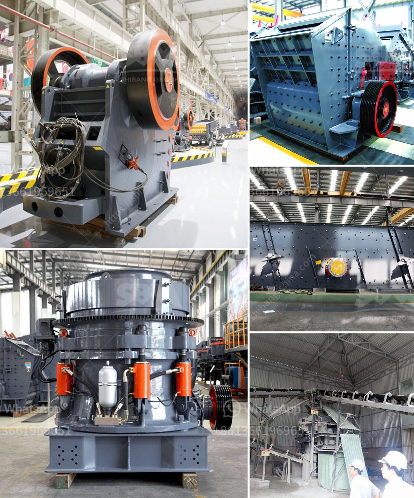

<h3>feasibility study on stone crushing</h3>
Stone crushing has long been associated with exposure to airborne crystalline silica dust to both workers and those residing in close proximity to these operations. Water spray dust control measures are effective at reducing levels of respirable crystalline silica dust. Studies have reported reductions in the range of 60% to 86% for respirable silica and dust in various applications including stone crushing, construction, mining, and manufacturing industries.

Crystalline silica is a common mineral found in the earth's crust. It occurs primarily in quartz, making up as much as 30% of the earth's crust. These quartz particles form at various temperatures, including during the process of stone crushing. Workers in these industries are at risk of developing silicosis, an irreversible lung disease characterized by scarring and inflammation of the lung tissue. It can lead to breathing difficulties, chronic cough, and even death.

This study aims to assess the present feasibility of using these stone dusts as an alternative for river sand in the production of concrete. This feasibility study investigates the feasibility of a potential surface mine in Limestone County, northeastern Alabama. The report presents research conducted on each of the stone benches at Mount Stephens covering the period November 1992 through September 1993.

The study includes a method for assessing the potential of stone crushing operations in the area. The results of this preliminary study suggest that stone crushing operations constitute a significant source of worker exposure to respirable crystalline silica. Quantitative exposure limits have been established by regulatory agencies to limit exposure and protect workers. These limits are typically expressed as a time-weighted average concentration over an eight-hour work shift.

To mitigate the risk of exposure to crystalline silica, different measures need to be taken into account. The use of water spray systems or local exhaust ventilation at the crusher to control dust may generate wet conditions that can create potential health hazards for employees exposed to respirable crystalline silica. These hazards may include slips, trips, and falls, electrical shock, and musculoskeletal injuries. Therefore, workers need to be trained and equipped with personal protective equipment (PPE) such as masks, eye protection, and gloves.

A feasibility study on stone crushing is essential for sustainable development. This study examines the feasibility and sustainability of stone crushing operations in a region with a high prevalence of respiratory diseases. The study suggests that stone crushing operations constitute a significant source of worker exposure to crystalline silica dust. Therefore, it is crucial to implement appropriate control measures to mitigate the risks associated with these operations.

Furthermore, regulations and guidelines need to be developed and enforced to protect workers' health and well-being. Organizations and industry stakeholders should work together to raise awareness, provide training, and foster a culture of safety within the stone crushing industry. By doing so, we can achieve sustainable development while safeguarding the health and livelihoods of workers in this crucial field.
<h3>Contact us</h3><ul><li><strong>Whatsapp:&nbsp;<a href="https://wa.me/8613661969651">+8613661969651</a></strong></li><li><a href="https://swt.shibang-china.com/?git&amp;zhl&amp;feasibility study on stone crushing"><strong>Online Service(chat now)</strong></a></li></ul><h3>Related</h3><ul><li><a href='output of crushing plant.md'>output of crushing plant</a></li><li><a href='black stone crushing thailand.md'>black stone crushing thailand</a></li><li><a href='cement plants suppliers from china.md'>cement plants suppliers from china</a></li><li><a href='how much does a mobile crusher cost.md'>how much does a mobile crusher cost</a></li><li><a href='iron crushing equipment.md'>iron crushing equipment</a></li></ul>