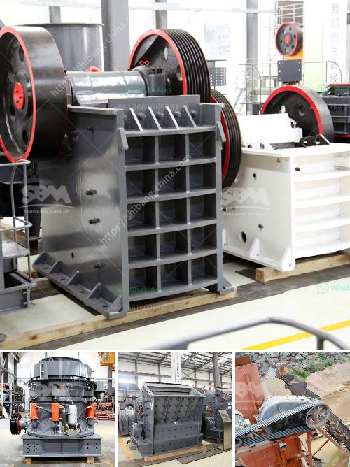

<h3>feeding stone crushers</h3>
Stone crushing is a tedious and costly process that involves multiple stages of crushing, screening, and washing to meet stringent specifications set by construction authorities. However, it is important to recognize that not all stone crushers are equally efficient. Some are built for high-volume production, while others are designed specifically for smaller projects. In order to maximize productivity and efficiency, proper feeding of stone crushers is of utmost importance.

When it comes to feeding stone crushers, the type and size of the feed material can make a significant difference in terms of both productivity and durability of the equipment. The hardness, moisture content, and particle size distribution of the material should be carefully considered before choosing the proper feeding method.

Firstly, it is essential to ensure a continuous and evenly distributed feed to the crusher. Irregular feeding can cause a series of issues such as uneven wear of the crushing chamber, early fatigue failure of bearings, premature wear of teeth, or even mechanical damage to the crusher itself. To avoid these problems, it is recommended to use a vibrating feeder or a hydraulic excavator directly feeding the stone into the crusher.

Vibrating feeders offer a reliable and cost-effective method of feeding stone crushers, as they provide a continuous and uniform feed to the crusher. This helps to keep the crusher running smoothly, preventing sudden shutdowns due to blockages or clogs. Another important feature of vibrating feeders is that they automatically compensate for the varying feed rates, ensuring a steady supply of material to the crusher.

On the other hand, hydraulic excavators are ideal for feeding stone crushers directly into the crushing chamber. They provide an even and continuous flow of material to the crusher, thereby minimizing sudden peaks in material feed rates. This can significantly reduce crusher wear and tear, leading to increased efficiency and lifespan of the equipment.

In addition to the feeding method, the feed size and moisture content of the material also play a crucial role in determining the efficiency of stone crushers. Ideally, the feed size should be less than 80% of the crusher's inlet opening to ensure uniform distribution of material throughout the chamber. Excessive fines in the feed material can cause issues such as material build-up in the crushing chamber, reducing capacity and increasing wear. Moisture content in the feed should also be monitored and controlled as excessive moisture can cause material clogging or sticking to the crusher components.

Proper feeding of stone crushers is not only important to maintain the productivity of the equipment but also to enhance the overall efficiency and lifespan of the crusher. Constancy of feed material flow and uniform distribution of the feed material are crucial factors for achieving optimal crushing results. By selecting the appropriate feeding method, monitoring the feed size and moisture content, and ensuring continuous and uniform feed supply, operators can maximize the efficiency and productivity of their stone crushers, ultimately leading to cost savings and increased profitability.
<h3>Contact us</h3><ul><li><strong>Whatsapp:&nbsp;<a href="https://wa.me/8613661969651">+8613661969651</a></strong></li><li><a href="https://swt.shibang-china.com/?git&amp;zhl&amp;feeding stone crushers"><strong>Online Service(chat now)</strong></a></li></ul><h3>Related</h3><ul><li><a href='typical flow sheet for granite quarry.md'>typical flow sheet for granite quarry</a></li><li><a href='crushing machine malaysia.md'>crushing machine malaysia</a></li><li><a href='stone crusher machine price list zambia.md'>stone crusher machine price list zambia</a></li><li><a href='how much is the mobile mill for small scale mining.md'>how much is the mobile mill for small scale mining</a></li><li><a href='200 tph stone crusher price.md'>200 tph stone crusher price</a></li></ul>