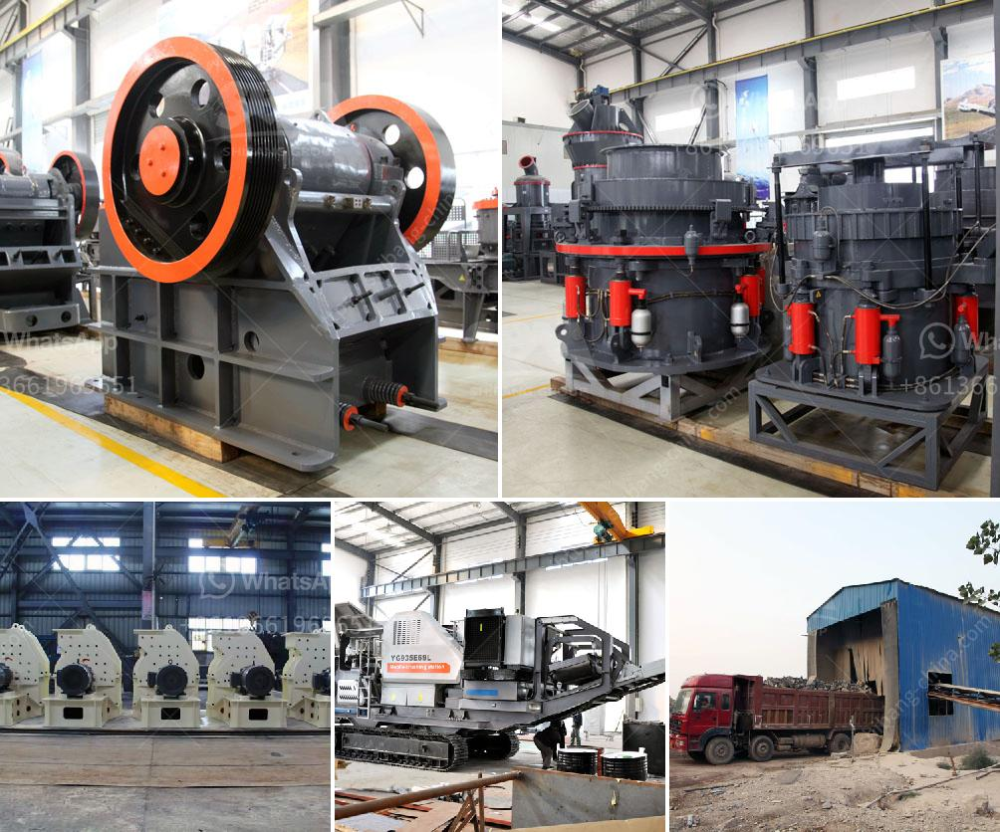

<h3>feldspar crusher impactor</h3>
Feldspar is a common mineral found on the earth's crust, making up about 60% of the Earth's crust. It is widely used in ceramics, glass, and construction materials. One of the most important processes in feldspar mining is crushing, as it breaks down large chunks of feldspar into smaller particles for further processing.

In the world of crushing equipment, an impactor is one of the most commonly used machines. An impactor feldspar crusher is commonly used in the field of construction, mining, and chemical industry. It is ideal choice for high grade aggregate production and construction waste recycling.

The impactor's design incorporates a number of features to enhance durability and ease of maintenance. It has a heavy-duty rotor with exchangeable impact lining plates. This allows for easy replacement when worn, reducing downtime and increasing the crusher's lifespan. Additionally, the impactor is equipped with hydraulic-opening device, making it easy and convenient to perform maintenance tasks such as replacing the blow bars.

The feldspar crusher impactor is designed with a wide range of feed sizes, allowing for maximum flexibility in producing different particle sizes. The adjustable curtains within the crusher chamber allow for precise control of the final product size. This feature is particularly useful for producing high-quality aggregates for road construction and concrete production.

Another important feature of the feldspar crusher impactor is its high crushing ratio. With a large feed opening and a powerful crushing chamber, it can crush materials of various hardness with ease. This ensures efficient and uniform crushing throughout the entire process.

In addition to its impressive performance, the feldspar crusher impactor is also designed with safety in mind. It is equipped with a number of safety features, including a hydraulic top-opening device to ensure that the rotor is safely accessible during maintenance operations. It also has a heavy-duty frame and a reinforced rotor, providing excellent protection against accidental damage and maintaining the crusher's integrity.

With its robust construction and advanced features, the feldspar crusher impactor offers a reliable and efficient solution for crushing feldspar minerals. Its versatility, durability, and ease of maintenance make it an ideal choice for various applications in the mining and construction industries.

In conclusion, the feldspar crusher impactor is a reliable and efficient machine that plays a crucial role in the mining and construction industries. Its durable construction, advanced features, and high crushing ratio make it a valuable asset for any quarry or mine. Whether it is used for primary crushing or secondary crushing, the feldspar crusher impactor ensures efficient and uniform particle size reduction, making it an indispensable tool in the production of high-quality aggregates and construction materials.
<h3>Contact us</h3><ul><li><strong>Whatsapp:&nbsp;<a href="https://wa.me/8613661969651">+8613661969651</a></strong></li><li><a href="https://swt.shibang-china.com/?git&amp;zhl&amp;feldspar crusher impactor"><strong>Online Service(chat now)</strong></a></li></ul><h3>Related</h3><ul><li><a href='mineral used for making talcum powder.md'>mineral used for making talcum powder</a></li><li><a href='crushing b vsi crusher.md'>crushing b vsi crusher</a></li><li><a href='roll grinders manufacturers.md'>roll grinders manufacturers</a></li><li><a href='100 tph stone crusher.md'>100 tph stone crusher</a></li><li><a href='calculations on the capacity of cone crusher.md'>calculations on the capacity of cone crusher</a></li></ul>