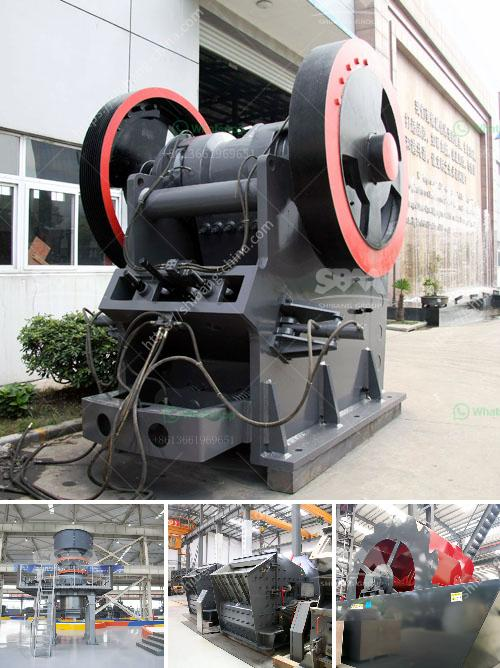

<h3>feldspar grinding in raymond mill</h3>
Feldspar is a mineral resource with high industrial value, which is widely used in ceramics, glass, cement, chemical, and other industries. Raymond mill is a commonly used grinding equipment for processing non-metallic mineral grinding powder. Its structure is mainly composed of a host, an analyzer, a fan, a finished product cyclone separator, a fine powder cyclone separator, and an air pipe.

Among them, the host is composed of a machine frame, grinding roller, grinding ring, blade, air inlet volute, and cover. It has a large crushing ratio and can easily grind feldspar into a variety of different fineness of powders. With the development of the milling industry, Raymond mill has made large improvements in processing field feldspar.

According to the needs of the market and customers, Hongxing Machinery tailor-made a variety of feldspar grinding mills such as Raymond mill, ultra-fine mill, vertical roller mill, and other equipment to meet different production needs of customers and obtain high grinding efficiency.

Raymond mill is a commonly used equipment for high-fine powder milling of various ores. It can grind materials into powder with a particle size of 80-325 mesh. The fine powder can be adjusted between 325-2500 mesh. Its grinding efficiency is high, and it is a large-scale milling equipment in the field of powder grinding.

With the development of the powder processing industry, the application of Raymond mill has become more and more extensive. The equipment covers a number of patented technologies. It can grind various ores with Mohs hardness below 7 and humidity below 6%. Such as limestone, marble, barite, dolomite, granite, kaolin, bauxite, white ash, feldspar, etc.

Raymond mill has a wide range of applications in the field of beneficiation. Through continuous improvement and optimization, it can achieve more efficient grinding capacity, and bring higher efficiency to the production of customers in the field of feldspar grinding.
<h3>Contact us</h3><ul><li><strong>Whatsapp:&nbsp;<a href="https://wa.me/8613661969651">+8613661969651</a></strong></li><li><a href="https://swt.shibang-china.com/?git&amp;zhl&amp;feldspar grinding in raymond mill"><strong>Online Service(chat now)</strong></a></li></ul><h3>Related</h3><ul><li><a href='screening and crushing equipment for chrome.md'>screening and crushing equipment for chrome</a></li><li><a href='conveyor belt user in tanzania.md'>conveyor belt user in tanzania</a></li><li><a href='used gupsum board plant sale.md'>used gupsum board plant sale</a></li><li><a href='stone crushing machines uk.md'>stone crushing machines uk</a></li><li><a href='jaw crushers supplier.md'>jaw crushers supplier</a></li></ul>