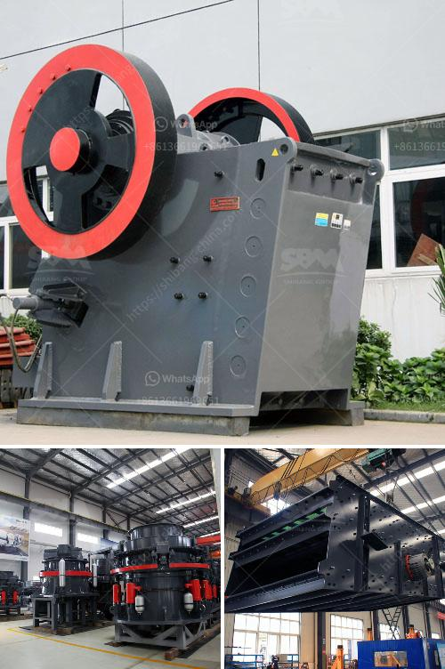

<h3>feldspar stone processing plant</h3>
Feldspar is a common mineral found in igneous, metamorphic, and sedimentary rocks. It is an essential component in a variety of industries, including ceramics, glass manufacturing, and more. To meet the growing demand for feldspar, various processing plants have been established across the globe.

One such processing plant is the feldspar stone processing plant. This plant is designed to process 80-600 mesh feldspar powder for different industries. While there are several feldspar processing plants in the market, this article focuses on the plant with a capacity of 20-200t/h.

The feldspar stone processing plant consists of various machines like jaw crusher, impact crusher, vibrating feeder, etc. The capacity is between 30-800t/h depending on the final size and the grinding materials. Jaw crusher is the primary crusher; it is used in feldspar coarse crushing process. Impact crusher is generally used for fine crushing of feldspar. It also can be used as secondary crusher. Vibrating feeder is used to send raw materials into jaw crusher evenly and continuously.

Once the raw materials are processed, the feldspar powder is produced. The feldspar stone processing plant utilizes advanced equipment like Raymond mill for grinding feldspar powder. Raymond mill is a high-efficiency closed-loop and high-fine powder processing equipment that can replace ball mill to process feldspar powder. Its finished product size is 80-325 mesh and the capacity is 5-10 tons per hour.

The feldspar powder produced by the Raymond mill is remarkably pure and has a high whiteness index. This makes it ideal for use in the ceramics industry. It can be used to produce high-quality porcelain, sanitary ware, and other ceramic products. The feldspar stone processing plant also meets the needs of environmental protection, and pure feldspar powder can be used as anti-mud materials, floors, and walls, helping to reduce mud emissions and achieving a clean and environmentally friendly production environment.

In addition to its utilization in the ceramics industry, feldspar powder has applications in other industries as well. It is used in the glass industry to produce transparent and colorless glass products. Its low coefficient of thermal expansion makes it an excellent material for glass manufacturing. Feldspar powder is also used in the chemical industry for the production of cleaning agents, fire extinguishers, and compounds used in the manufacturing of ceramics and glass.

In conclusion, the feldspar stone processing plant is a valuable investment for businesses in various industries. It provides a reliable source of high-quality feldspar powder, which is essential in the production of ceramics, glass, and other products. With its advanced equipment and environmentally friendly processes, the plant ensures a clean and efficient production environment while meeting the growing demands of the market.
<h3>Contact us</h3><ul><li><strong>Whatsapp:&nbsp;<a href="https://wa.me/8613661969651">+8613661969651</a></strong></li><li><a href="https://swt.shibang-china.com/?git&amp;zhl&amp;feldspar stone processing plant"><strong>Online Service(chat now)</strong></a></li></ul><h3>Related</h3><ul><li><a href='silica flour mill.md'>silica flour mill</a></li><li><a href='china clay grinding machine.md'>china clay grinding machine</a></li><li><a href='jaw crusher thailand.md'>jaw crusher thailand</a></li><li><a href='coal crushing and screening plant for sale.md'>coal crushing and screening plant for sale</a></li><li><a href='used clinker grinding mill for sale.md'>used clinker grinding mill for sale</a></li></ul>