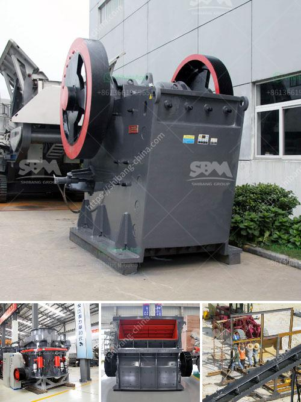

<h3>financial projection of a quarry business</h3>
A quarry business, also known as mining or excavation business, is a highly lucrative one that involves extracting minerals, rocks, gravel, sand, or clay from the earth’s surface. Quarrying activities create employment opportunities, stimulate the local economy, and contribute to the infrastructure development of a nation. For entrepreneurs looking to venture into this industry, it is crucial to develop a comprehensive financial projection that outlines the expected revenue, expenses, and profitability of the quarry business.

To begin with, the revenue projection of a quarry business mainly depends on the volume and quality of materials extracted. Moreover, the demand for construction materials, such as gravel, sand, and crushed stones, will significantly impact the revenue generation. Conducting market research to analyze the current demand and supply dynamics within the region of operation is essential. This research will help in estimating the anticipated sales volume and the relevant pricing strategy.

The quarry business typically generates revenue through the sale of materials to contractors, construction companies, and individuals involved in construction or infrastructure projects. Therefore, establishing a robust network of potential clientele is crucial. Collaborating with suppliers, contractors, and local businesses could enhance the visibility and reach of the quarry, ultimately leading to increased revenue.

In terms of expenses, a quarry business incurs several costs, such as lease or ownership of the quarry site, machinery and equipment, labor, transportation, and permits or licenses. It is imperative to accurately estimate the initial investment required for acquiring the lease or purchasing the land for quarrying. Additionally, the cost of machinery and equipment, which includes excavators, loaders, crushers, and trucks, must be factored into the financial projection.

The labor cost is another essential component to consider. Depending on the scale of the quarry operations, the number of employees required may vary. Adequate staffing levels should be estimated based on workload calculations and industry standards. Moreover, it is necessary to analyze the prevailing wage rates and employment laws to ascertain the labor cost.

Transportation expenses involve transporting the extracted materials from the quarry site to the customers' location, typically using trucks or conveyor belts. It is important to account for fuel costs, maintenance, and any tolls or licensing fees associated with transportation.

Furthermore, obtaining the necessary permits and licenses is vital to conducting quarrying activities legally. Many jurisdictions have specific regulations and environmental requirements that must be fulfilled. These legal formalities often involve fees and ongoing compliance costs.

Lastly, to determine the profitability of the quarry business, all the projected revenues and expenses must be consolidated. The net income or profit can be ascertained by subtracting the total expenses from the total revenue. It is advisable to develop both short-term and long-term financial projections to have a comprehensive view of the quarry business's financial prospects.

In conclusion, a well-prepared financial projection is crucial for the success of a quarry business. Accurately estimating revenue, considering market demand, and establishing a reliable network of customers are key factors in achieving profitability. Carefully analyzing and estimating expenses, such as lease, labor, machinery, and transportation, will enable the entrepreneur to determine the feasibility and overall financial health of the quarry business.
<h3>Contact us</h3><ul><li><strong>Whatsapp:&nbsp;<a href="https://wa.me/8613661969651">+8613661969651</a></strong></li><li><a href="https://swt.shibang-china.com/?git&amp;zhl&amp;financial projection of a quarry business"><strong>Online Service(chat now)</strong></a></li></ul><h3>Related</h3><ul><li><a href='ball mill for sale uk.md'>ball mill for sale uk</a></li><li><a href='marble mine processing equipment manufacturers in india.md'>marble mine processing equipment manufacturers in india</a></li><li><a href='calculations on the capacity of cone crusher.md'>calculations on the capacity of cone crusher</a></li><li><a href='how to design surge bin hopper crusher.md'>how to design surge bin hopper crusher</a></li><li><a href='product japan crushing plant.md'>product japan crushing plant</a></li></ul>