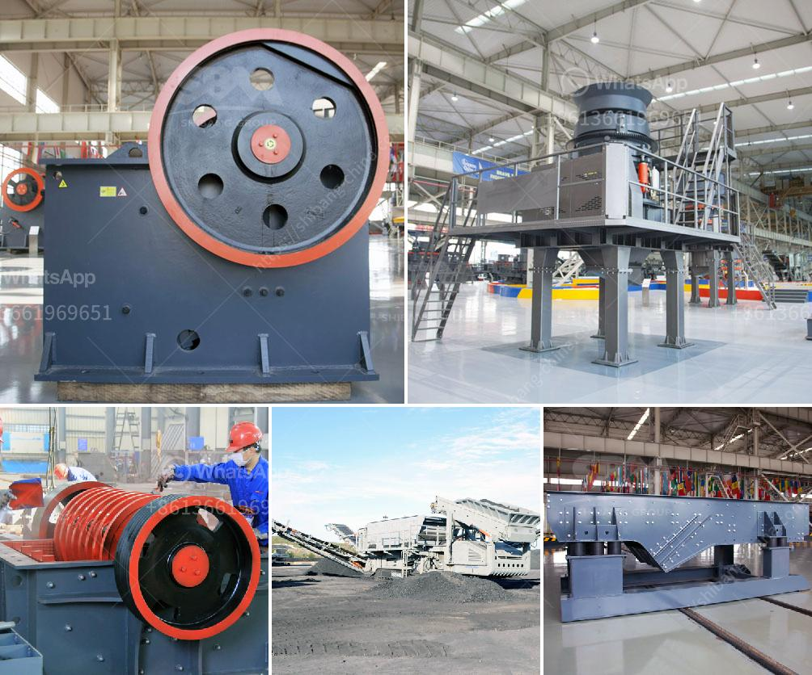

<h3>financial projections for a ore mining company</h3>
Financial projections are a crucial tool for planning and managing the operations of any business, and ore mining companies are no exception. These projections provide a glimpse into the company's future financial health, helping stakeholders make informed decisions regarding investments and resource allocation. In this article, we will explore the key components of financial projections for an ore mining company.

Revenue projections form the backbone of financial projections for any company. For an ore mining company, revenue projections are based on factors such as the quantity and quality of ore in reserves, the market demand for the specific ore, and the prevailing market prices. By analyzing historical data and industry trends, the company can estimate the volume of ore it expects to extract and sell in a given period, along with the expected price per unit. This information allows the company to project its revenue and plan accordingly.

Operating costs are another essential component of financial projections. They include expenses such as labor, machinery maintenance, transportation costs, and regulatory compliance. It is crucial to perform a comprehensive analysis of the company's cost structure to predict these expenses accurately. Additionally, considering potential factors impacting costs, such as fuel price fluctuations or changing labor laws, can enhance the accuracy of these projections.

Profit margins and net income play a vital role in determining the financial feasibility of an ore mining company. By deducting the projected operating costs from the projected revenue, the company can estimate its profit margin. This margin serves as a good indicator of the company's efficiency and competitiveness within the industry. Furthermore, projecting the net income allows the company to evaluate its profitability and viability.

Financial projections also involve forecasting cash flows, which entails assessing incoming and outgoing funds. For an ore mining company, incoming funds primarily include revenue from ore sales, while outgoing funds involve expenses like wages, equipment purchases, and debt obligations. By analyzing these cash flows, the company can gauge its liquidity and financial stability.

In conclusion, financial projections are a critical tool for ore mining companies to navigate the complexities of the industry successfully. By analyzing revenue, operating costs, profit margins, net income, and cash flows, these projections provide strategic insights, enabling effective decision-making. While projections require ongoing monitoring and adjusting due to unforeseen market fluctuations, they serve as a valuable guiding compass for an ore mining company's financial future.
<h3>Contact us</h3><ul><li><strong>Whatsapp:&nbsp;<a href="https://wa.me/8613661969651">+8613661969651</a></strong></li><li><a href="https://swt.shibang-china.com/?git&amp;zhl&amp;financial projections for a ore mining company"><strong>Online Service(chat now)</strong></a></li></ul><h3>Related</h3><ul><li><a href='magnetic separator for iron sand.md'>magnetic separator for iron sand</a></li><li><a href='recycling of construction materials.md'>recycling of construction materials</a></li><li><a href='bauxite mining machine.md'>bauxite mining machine</a></li><li><a href='used stone crushing plant for sale in germany.md'>used stone crushing plant for sale in germany</a></li><li><a href='mobile crusher made in turkey.md'>mobile crusher made in turkey</a></li></ul>