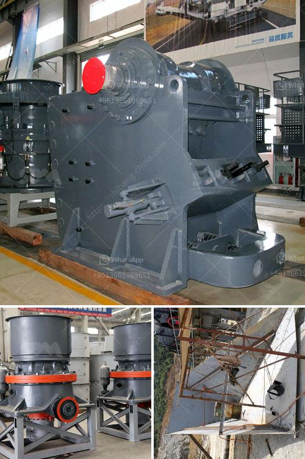

<h3>fine grinding mill</h3>
In the world of industrial grinding, it is often the case that larger is better. The larger the grinding mill, the more materials can be processed, resulting in higher production rates and more efficient operation. However, there are instances where a smaller, more precise grinding mill is required to achieve a specific particle size distribution. This is where the fine grinding mill comes into play.

A fine grinding mill is a machine that grinds minerals or other materials to a typical product size of a few micrometers or less. With the advancement of technology and the increasing demand for ultra-fine powders in various industries, fine grinding mills have become increasingly important in grinding applications.

One of the key features of a fine grinding mill is its ability to produce finely ground particles. This is achieved by using grinding media such as beads or balls with a small diameter. These small grinding media create a high shear force, resulting in a narrow particle size distribution. The grinding media also ensures that the grinding process is efficient, as every particle is subjected to the grinding action.

Fine grinding mills are available in various designs and configurations to suit different applications and requirements. Some of the common types of fine grinding mills include ball mills, vibration mills, pin mills, jet mills, and roller mills. Each type of mill has its unique advantages and disadvantages, and the selection of the appropriate mill depends on factors such as the desired particle size, the hardness of the material, and the required throughput rate.

Ball mills are perhaps the most common type of fine grinding mill. They consist of a rotating cylinder filled with grinding media, which causes the particles to be ground by impact and attrition. Ball mills are versatile and can be used for both wet and dry grinding. However, they are limited in terms of the maximum feed size and the fineness of the product.

Vibration mills, on the other hand, utilize the principle of vibration to grind materials. The grinding media in vibration mills moves back and forth rapidly, causing the particles to collide and break apart. Vibration mills are well-suited for fine grinding of fragile materials and can achieve very small particle sizes compared to other types of mills.

Pin mills are another popular choice for fine grinding. They consist of a rotor with pins that rotate at high speed, causing the particles to be impacted against stationary pins. Pin mills are known for their ability to produce very fine particles, making them ideal for applications that require extremely narrow particle size distributions.

Jet mills use high-pressure air or steam to grind particles. The grinding process in a jet mill is ultra-fast and produces particles with a narrow size distribution. Jet mills are commonly used in the pharmaceutical, food, and chemical industries.

Roller mills, also known as high-pressure grinding rolls, use two or more rotating rollers to compress and grind the material. Roller mills are capable of producing very fine particles and are often used in the mining industry for ore processing.

In conclusion, the fine grinding mill is a crucial machine in various industries that require the production of ultra-fine powders. With its ability to achieve precise particle size distributions, it plays a vital role in the manufacturing of products ranging from pharmaceuticals to food additives. Selecting the appropriate type of fine grinding mill depends on the specific requirements of the application, and careful consideration should be given to factors such as particle size, material hardness, and desired throughput rate.
<h3>Contact us</h3><ul><li><strong>Whatsapp:&nbsp;<a href="https://wa.me/8613661969651">+8613661969651</a></strong></li><li><a href="https://swt.shibang-china.com/?git&amp;zhl&amp;fine grinding mill"><strong>Online Service(chat now)</strong></a></li></ul><h3>Related</h3><ul><li><a href='aggregate crushing machine portable.md'>aggregate crushing machine portable</a></li><li><a href='small jaw crusher for sale south africa.md'>small jaw crusher for sale south africa</a></li><li><a href='grinding equipment cost estimate.md'>grinding equipment cost estimate</a></li><li><a href='mobile stone crusher gauteng.md'>mobile stone crusher gauteng</a></li><li><a href='cost of stone crusher plant in saudi.md'>cost of stone crusher plant in saudi</a></li></ul>