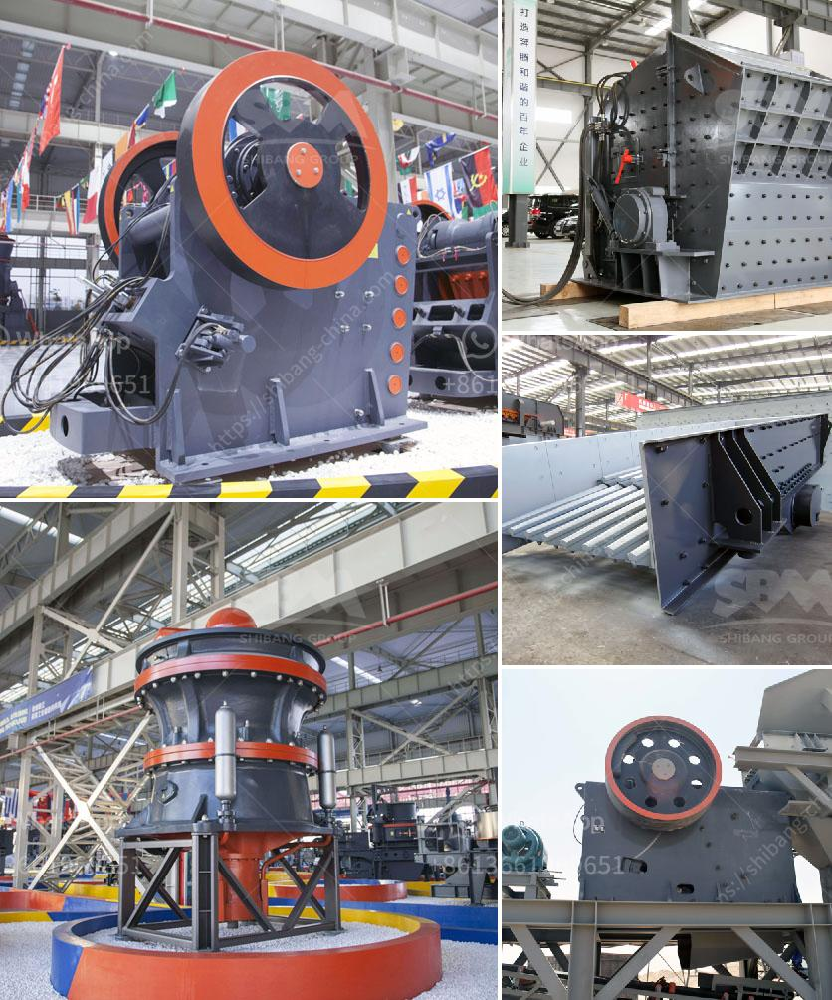

<h3>fine powder grinders 30 50 microns</h3>
Fine powder grinders with a particle size of 30-50 microns are a versatile tool used in various industries, including pharmaceuticals, chemicals, food processing, and cosmetics. These grinders are designed to finely grind materials into a powder form, allowing for more efficient and consistent processing.

With advancements in technology, fine powder grinders have become more efficient, reliable, and precise. They utilize high-speed rotating blades, hammers, or pins to break down materials into smaller particles. The size of the grinder's screen or perforations determines the final particle size, allowing for customization to meet specific requirements.

One of the key advantages of using these fine powder grinders is the ability to control particle size distribution. This is crucial in industries where different particle sizes are required for specific applications. By adjusting the grinder settings or changing the screen, manufacturers can achieve the desired particle size distribution, ensuring the consistent quality and performance of their products.

In the pharmaceutical industry, fine powder grinders play a vital role in the production of medicines, where precise particle size is critical for efficacy and safety. These grinders can efficiently process active pharmaceutical ingredients (APIs) and excipients, ensuring uniformity in the final product. Additionally, they are used in the production of inhalable medications, enabling the delivery of drugs directly to the lungs for better absorption.

The chemical industry also benefits from fine powder grinders, utilizing them for the production of pigments, dyes, and various chemical compounds. These grinders allow for the micronization of raw materials, enhancing their reactivity and solubility. This ensures that chemicals mix well and react uniformly, leading to higher quality end products.

Food processing companies also rely on fine powder grinders to achieve the desired texture and consistency in their products. From powdered sugar to spices and additives, these grinders enable uniform particle size, enhancing the flavor and appearance of food products. They are also used in the production of powdered beverages and supplements, ensuring proper dissolution and dispersion.

In conclusion, fine powder grinders with a particle size of 30-50 microns are essential equipment in various industries. Their ability to finely grind materials into a powder form allows for precise control of particle size, leading to consistent and high-quality products. As technology continues to advance, these grinders are becoming more efficient and reliable, offering improved performance and versatility to meet industry demands.
<h3>Contact us</h3><ul><li><strong>Whatsapp:&nbsp;<a href="https://wa.me/8613661969651">+8613661969651</a></strong></li><li><a href="https://swt.shibang-china.com/?git&amp;zhl&amp;fine powder grinders 30 50 microns"><strong>Online Service(chat now)</strong></a></li></ul><h3>Related</h3><ul><li><a href='manufacturers of conveyor belts in mexico.md'>manufacturers of conveyor belts in mexico</a></li><li><a href='cost of set up mini cement plant in india.md'>cost of set up mini cement plant in india</a></li><li><a href='standard specification sheet for ball mill.md'>standard specification sheet for ball mill</a></li><li><a href='list of equipments for a quarry crusher.md'>list of equipments for a quarry crusher</a></li><li><a href='grinding machine 2 micron for calcium carbonate.md'>grinding machine 2 micron for calcium carbonate</a></li></ul>