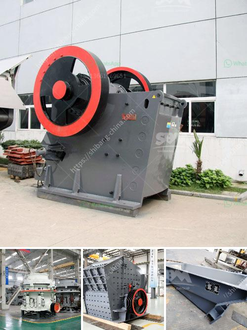

<h3>fine powder making machine</h3>
In today's fast-paced world, industries are constantly seeking ways to improve their production processes. One area that has seen significant advancements is the manufacturing and processing of fine powders. These finely ground particles are an essential component in various industries, including pharmaceuticals, chemicals, food processing, and more.

Traditionally, the production of fine powders was a time-consuming and labor-intensive process, involving multiple steps such as grinding, sieving, and classification. However, with the advent of fine powder making machines, the manufacturing industry has witnessed a revolution in powder production.

A fine powder making machine is a specialized equipment designed to break large solid materials into smaller particles with a fine size distribution. These machines use various techniques, such as grinding, crushing, and pulverizing, to achieve the desired particle size. The resulting fine powders are then ready for further processing or packaging.

One of the key advantages of fine powder making machines is their efficiency and precision. These machines are equipped with advanced technologies and innovative features that ensure uniform particle size and shape. Unlike traditional methods, which often result in uneven particle distribution, fine powder making machines offer consistent and reliable results.

The versatility of fine powder making machines is another factor contributing to their popularity in the manufacturing industry. These machines can process a wide range of materials, including minerals, chemicals, pigments, and herbal products. This flexibility allows manufacturers to produce different types of powders for various applications, catering to the diverse needs of their customers.

Moreover, fine powder making machines are designed to be user-friendly and easy to operate. They come with intuitive control panels and settings that allow operators to adjust parameters such as grinding speed, feed rate, and particle size distribution. This enables manufacturers to optimize the production process and achieve the desired powder properties with minimal effort.

Another significant benefit of using fine powder making machines is the reduction in waste and energy consumption. These machines are designed to minimize material loss during processing, resulting in higher yield and cost savings. Additionally, they are equipped with efficient motors and systems that consume less energy compared to traditional grinding methods, making them environmentally friendly and sustainable.

Furthermore, the use of fine powder making machines leads to improved product quality and consistency. The precise control over particle size and distribution ensures that the final product meets the required specifications and standards. This is particularly crucial in industries such as pharmaceuticals and food processing, where the quality and safety of the end product are of paramount importance.

In conclusion, fine powder making machines have revolutionized the manufacturing industry by improving production processes and enhancing product quality. These machines offer efficiency, precision, versatility, and eco-friendliness, making them indispensable in various sectors. As technology continues to advance, we can expect further innovations in fine powder making machines, leading to even greater efficiency and productivity in powder production.
<h3>Contact us</h3><ul><li><strong>Whatsapp:&nbsp;<a href="https://wa.me/8613661969651">+8613661969651</a></strong></li><li><a href="https://swt.shibang-china.com/?git&amp;zhl&amp;fine powder making machine"><strong>Online Service(chat now)</strong></a></li></ul><h3>Related</h3><ul><li><a href='machine cost for cement production plant machine.md'>machine cost for cement production plant machine</a></li><li><a href='jaw crusher c160 menghancurkan peralatan.md'>jaw crusher c160 menghancurkan peralatan</a></li><li><a href='output of crushing plant.md'>output of crushing plant</a></li><li><a href='used stone crushing plant for sale in germany.md'>used stone crushing plant for sale in germany</a></li><li><a href='want to buy crusher pozzolan.md'>want to buy crusher pozzolan</a></li></ul>