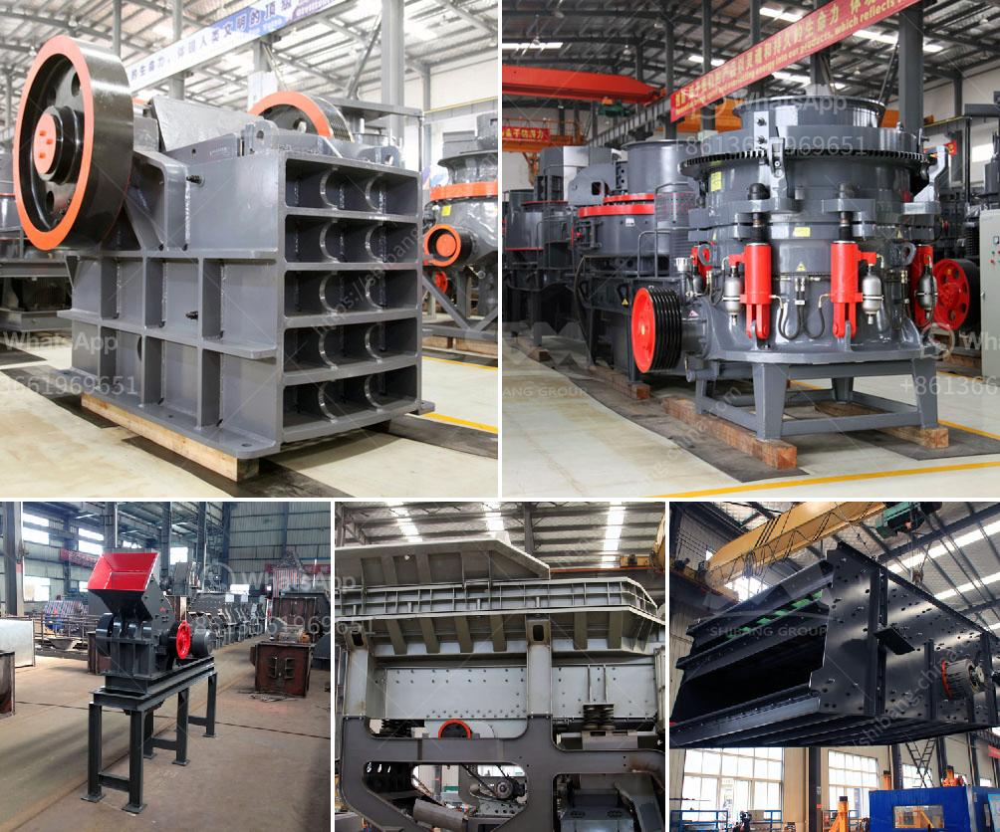

<h3>floatation washing machine for silica sand</h3>
Floatation washing machine is a revolutionary invention in the world of sand washing technology. This cutting-edge machine uses the buoyancy principle of floatation to separate impurities from silica sand. With its unique method, it effectively removes any unwanted materials, such as clay, silt, and iron oxides, to produce clean and high-quality silica sand.

The floatation washing machine operates in a three-step process: slurry preparation, floatation separation, and sand recovery. In the first step, the silica sand is mixed with water to create a slurry. This slurry is then fed into a floatation tank, where a chemical reagent is added to facilitate the separation of impurities. The chemical reagent selectively adheres to the impurities, causing them to float on the surface of the tank, while the silica sand sinks to the bottom.

Once the floatation separation is complete, the impurities can be easily removed by skimming them off the surface of the tank. This step ensures that only pure silica sand remains, leading to higher product quality. After the impurities are removed, the silica sand is collected from the bottom of the tank and sent for further processing or to be used directly.

The floatation washing machine offers several advantages over traditional sand washing methods. Firstly, it is highly efficient, capable of processing large quantities of silica sand within a short period. This not only saves time but also increases productivity for sand producers. Additionally, the machine requires relatively low energy consumption, contributing to environmental sustainability.

Furthermore, the floatation washing machine ensures minimal water consumption. By using a closed-loop water system, the machine recycles the same water for continuous use. This feature not only reduces water wastage but also minimizes the need for additional water supply, making it a cost-effective solution for sand washing operations.

In conclusion, the floatation washing machine is a game-changer in the silica sand industry. Its ability to remove impurities effectively and produce clean sand of high quality is truly remarkable. With its efficient and sustainable operation, it offers numerous benefits for sand producers, including increased productivity, reduced energy consumption, and minimized water usage. As technology continues to advance, the floatation washing machine paves the way for higher standards in silica sand processing.
<h3>Contact us</h3><ul><li><strong>Whatsapp:&nbsp;<a href="https://wa.me/8613661969651">+8613661969651</a></strong></li><li><a href="https://swt.shibang-china.com/?git&amp;zhl&amp;floatation washing machine for silica sand"><strong>Online Service(chat now)</strong></a></li></ul><h3>Related</h3><ul><li><a href='sayaji impact crusher.md'>sayaji impact crusher</a></li><li><a href='gypsum powder production process in india pdf.md'>gypsum powder production process in india pdf</a></li><li><a href='gypsum powder dryer price pakistan.md'>gypsum powder dryer price pakistan</a></li><li><a href='quartz stone heating machine for sale.md'>quartz stone heating machine for sale</a></li><li><a href='costruire une machine pour broyer des briques.md'>costruire une machine pour broyer des briques</a></li></ul>