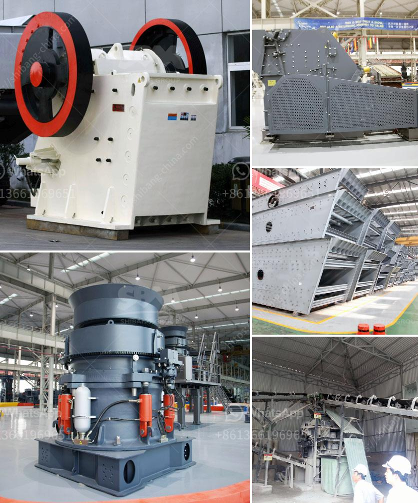

<h3>flow diagram by gypsum process</h3>
Gypsum, a popular mineral known for its use in construction projects, is the result of a complex and intricate process. This article aims to provide a comprehensive understanding of the flow diagram of the gypsum process, offering insights into the various stages involved in its production.

The production of gypsum begins with the mining and extraction of the mineral from a deposit. This is usually done through strip mining or underground mining methods. Once the gypsum deposit has been identified and extracted, it goes through a primary crushing process. This involves breaking the large-sized gypsum rocks into smaller pieces that can be easily transported.

Next, the crushed gypsum is heated in a calcination kiln at high temperatures. This is a crucial step in the gypsum production process, as it involves the removal of excess water content. The heat causes the gypsum to lose water molecules, converting it into a dry, powdery substance known as plaster of Paris. The calcination process also enhances the gypsum’s fire-resistant properties, making it an ideal material for construction purposes.

After the gypsum is calcined and transformed into plaster of Paris, it undergoes a milling process. This involves grinding the plaster to achieve a fine and uniform texture. The milled gypsum is then packed into bags or containers for transportation and storage.

Upon reaching its destination, the gypsum powder is mixed with water to create a paste, which can be shaped and molded into various forms. This paste-like substance sets quickly, making it an efficient material for creating decorative elements, such as cornices, ceiling tiles, and architectural ornaments.

The flow diagram of the gypsum process illustrates the different stages involved in its production, from extraction to the final product. Starting with the mining and crushing of gypsum rocks, followed by the calcination and milling processes, each step is crucial in transforming the raw material into a high-quality construction material.

Furthermore, the flow diagram highlights the importance of energy-intensive processes, such as calcination, in the gypsum production process. This step requires a considerable amount of heat, which directly impacts the overall energy consumption and environmental footprint of the industry. As such, advancements in energy-efficient technologies and sustainable practices are necessary to mitigate the environmental impact of gypsum production.

In conclusion, the flow diagram of the gypsum process provides a comprehensive overview of the various stages involved in its production. From mining and extraction to the final product, each step is crucial in transforming the raw material into a versatile and widely used construction material. As the demand for sustainable construction practices increases, the gypsum industry must continue to explore energy-efficient technologies and environmentally friendly practices to ensure a more sustainable future for the sector.
<h3>Contact us</h3><ul><li><strong>Whatsapp:&nbsp;<a href="https://wa.me/8613661969651">+8613661969651</a></strong></li><li><a href="https://swt.shibang-china.com/?git&amp;zhl&amp;flow diagram by gypsum process"><strong>Online Service(chat now)</strong></a></li></ul><h3>Related</h3><ul><li><a href='granite processing machines china.md'>granite processing machines china</a></li><li><a href='cone crusher for sale in south africa.md'>cone crusher for sale in south africa</a></li><li><a href='price list of granite crusher.md'>price list of granite crusher</a></li><li><a href='crushing plant aggregate type.md'>crushing plant aggregate type</a></li><li><a href='puzzolana 200 tph cone crushers parts.md'>puzzolana 200 tph cone crushers parts</a></li></ul>