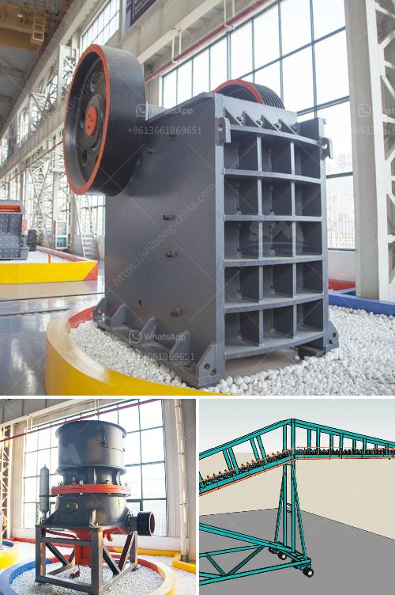

<h3>fluorite ore processing equipment manufacturer</h3>
Fluorite, also known as fluorspar, is a common mineral that is primarily composed of calcium fluoride (CaF2). It is widely used in various industries, including metallurgy, chemistry, ceramics, and glass-making, due to its unique properties. To meet the growing demand for fluorite, efficient fluorite ore processing equipment is necessary.

As a professional fluorite ore processing equipment manufacturer, Prominer Machinery has specialized in the research and development of mineral processing machinery for years. We provide customized services to meet customers' specific requirements in fluorite processing. With decades of experience, we have accumulated a wealth of knowledge in designing, manufacturing, and commissioning mineral processing plants.

One of the key equipment in fluorite processing is the crushing stage. Crushing equipment is used to crush fluorite ore into small particles. Normally, common fluorite crushers include jaw crusher, impact crusher, and cone crusher. Jaw crusher is usually used as the primary crusher in fluorite crushing plant, and it has a large crushing ratio. Impact crusher is the secondary crusher, which is used to crush the crushed material further down to the required size. Cone crusher is used for the fine crushing of fluorite ore and is also applicable for other hard and medium hard stones.

After crushing, the fluorite ore needs to be ground into a fine powder. In the grinding process, vertical roller mill, ball mill, and Raymond mill are commonly used. The final size of fluorite powder is usually 100 mesh, 200 mesh, 400 mesh. Raymond Mill is commonly used in case of fluorite powder processing. Compared with traditional Raymond mill, it can produce fine powder up to 800 mesh. The fineness is uniform and the screening rate is high, which is often used in fluorite processing.

Flotation is widely used in fluorite processing. In order to separate fluorite and gangue minerals, mineral processing equipment such as flotation machine is required. Flotation machine can separate fluorite and gangue minerals effectively, simplify the process, and save costs. In flotation, the fluorite ore is ground to a certain size, mixed with water and flotation reagent, and then heated to make the suspension form the mineralized froth layer.

In addition to the above equipment, Prominer Machinery also provides various auxiliary equipment for fluorite processing, including vibrating screen, belt conveyor, spiral classifier, flotation cell, and other related machines. These machines work together to complete the whole fluorite ore beneficiation process, ensuring high efficiency and high-quality final products.

As a professional fluorite ore processing equipment manufacturer, Prominer Machinery has a wealth of experience in the design and manufacture of mineral processing equipment. We provide customers with a wide range of fluorite processing solutions, all of which are customized to meet customers' specific requirements. Our equipment is not only reliable and efficient but also environmentally friendly. With the advantages of advanced technology, excellent quality, and considerate service, we have built a good reputation in the industry. Contact us now to get the most competitive fluorite ore processing solutions!
<h3>Contact us</h3><ul><li><strong>Whatsapp:&nbsp;<a href="https://wa.me/8613661969651">+8613661969651</a></strong></li><li><a href="https://swt.shibang-china.com/?git&amp;zhl&amp;fluorite ore processing equipment manufacturer"><strong>Online Service(chat now)</strong></a></li></ul><h3>Related</h3><ul><li><a href='calcium carbonate production line in germany.md'>calcium carbonate production line in germany</a></li><li><a href='the largest stone crusher system.md'>the largest stone crusher system</a></li><li><a href='crushing service with peru jaw crusher.md'>crushing service with peru jaw crusher</a></li><li><a href='standard specification sheet for ball mill.md'>standard specification sheet for ball mill</a></li><li><a href='stone crushing feasibility study.md'>stone crushing feasibility study</a></li></ul>