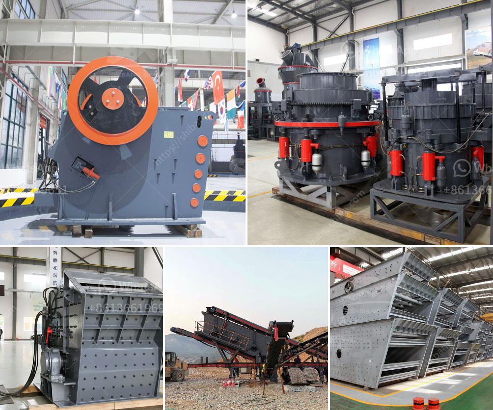

<h3>fly ash processing plant machinery</h3>
Fly ash, also known as pulverized fuel ash, is a byproduct of coal-fired power plants. It is created during the combustion process and consists of fine particles that are carried away by the flue gases. Over the years, fly ash has gained significant attention due to its potential as a sustainable substitute for cement in the construction industry.

To harness the full potential of fly ash, the development of fly ash processing plant machinery has become crucial. These innovative plants are designed to process fly ash into high-quality products that can be used in various applications.

One of the key components of a fly ash processing plant is the pulverizer. This machine grinds the fly ash particles into a fine powder, making it suitable for various applications. The pulverizer ensures a consistent particle size distribution, allowing for enhanced performance of the final product.

Another critical piece of machinery in a fly ash processing plant is the classifier. This machine separates the fly ash particles based on their size and density. By accurately classifying the particles, the classifier ensures that only the desired particle sizes are used in the end product, resulting in improved strength and durability.

Additionally, fly ash processing plants may include equipment such as bag filters and scrubbers. These units help control and minimize emissions, making the plant environmentally friendly and compliant with regulations.

Furthermore, some advanced fly ash processing plants incorporate techniques like electrostatic precipitation and froth flotation. These technologies help remove impurities and enhance the quality of the final product.

In conclusion, fly ash processing plant machinery plays a crucial role in harnessing the potential of fly ash as a sustainable substitute for cement. These plants have revolutionized the way fly ash is used, opening up new possibilities for the construction industry. With the right machinery and processes in place, fly ash can be transformed into a valuable resource that not only reduces waste but also contributes to the creation of sturdy and eco-friendly structures.
<h3>Contact us</h3><ul><li><strong>Whatsapp:&nbsp;<a href="https://wa.me/8613661969651">+8613661969651</a></strong></li><li><a href="https://swt.shibang-china.com/?git&amp;zhl&amp;fly ash processing plant machinery"><strong>Online Service(chat now)</strong></a></li></ul><h3>Related</h3><ul><li><a href='gemstone washing machine in china.md'>gemstone washing machine in china</a></li><li><a href='portable concrete crusher.md'>portable concrete crusher</a></li><li><a href='ultra fine mill manufacturers in india.md'>ultra fine mill manufacturers in india</a></li><li><a href='conveyor belts in opracion.md'>conveyor belts in opracion</a></li><li><a href='cost of stone crusher plant in saudi.md'>cost of stone crusher plant in saudi</a></li></ul>