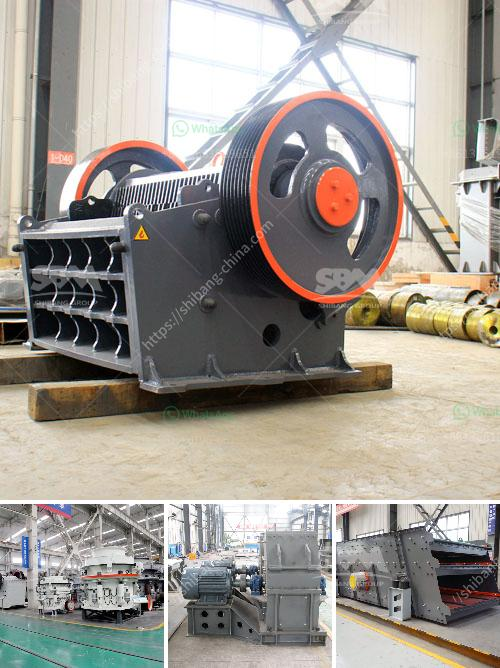

<h3>for sale rock crushing plant 150 tons</h3>
Rock crushing plant 150 tons is a unique and compact solution for the efficient crushing of hard stone and rubble materials. It is equipped with a powerful and efficient crushing unit that meets the most demanding requirements and allows high-performance results. Used as a stand-alone unit or in combination with other equipment, this plant enables the smooth processing of various materials, including granite, limestone, and concrete debris.

The 150-ton capacity ensures that large quantities of materials can be efficiently processed, reducing costs and saving time. The plant is designed to handle large rock sizes and features a vibrating feeder with a grizzly section that allows for effective separation of fines before the crushing process. This results in a higher overall efficiency and better quality end products.

Additionally, the rock crushing plant 150 tons can be easily transported and set up at various job sites. Its compact design and minimal footprint make it versatile and suitable for both urban and remote locations. The plant's hydraulic system allows for quick and easy setup, reducing downtime and maximizing productivity.

The crushing plant is powered by a reliable diesel engine, ensuring uninterrupted operation even in remote areas with limited power supply. Its robust construction and high-quality materials make it a durable and long-lasting investment. Regular maintenance and easy access to components further contribute to its longevity and excellent performance.

Whether you are a construction company looking to process materials on-site or a mining operation in need of a secondary crushing unit, the rock crushing plant 150 tons offers a cost-effective and efficient solution. With its impressive capacity, easy portability, and reliable performance, this plant is a valuable asset for any operation.

In conclusion, the rock crushing plant 150 tons is a reliable and efficient solution for crushing hard stones and rubble materials. Its compact design and consistent performance make it ideal for various applications, while its low maintenance needs and high durability ensure a profitable investment. If you are in the market for a rock crushing plant, this 150-ton unit could be the perfect fit for your needs.
<h3>Contact us</h3><ul><li><strong>Whatsapp:&nbsp;<a href="https://wa.me/8613661969651">+8613661969651</a></strong></li><li><a href="https://swt.shibang-china.com/?git&amp;zhl&amp;for sale rock crushing plant 150 tons"><strong>Online Service(chat now)</strong></a></li></ul><h3>Related</h3><ul><li><a href='malaysia hammer mills.md'>malaysia hammer mills</a></li><li><a href='rock crushing machines for sale.md'>rock crushing machines for sale</a></li><li><a href='stone crusher quote list.md'>stone crusher quote list</a></li><li><a href='crushing plant for sale.md'>crushing plant for sale</a></li><li><a href='portable track mounted mini jaw crusher.md'>portable track mounted mini jaw crusher</a></li></ul>