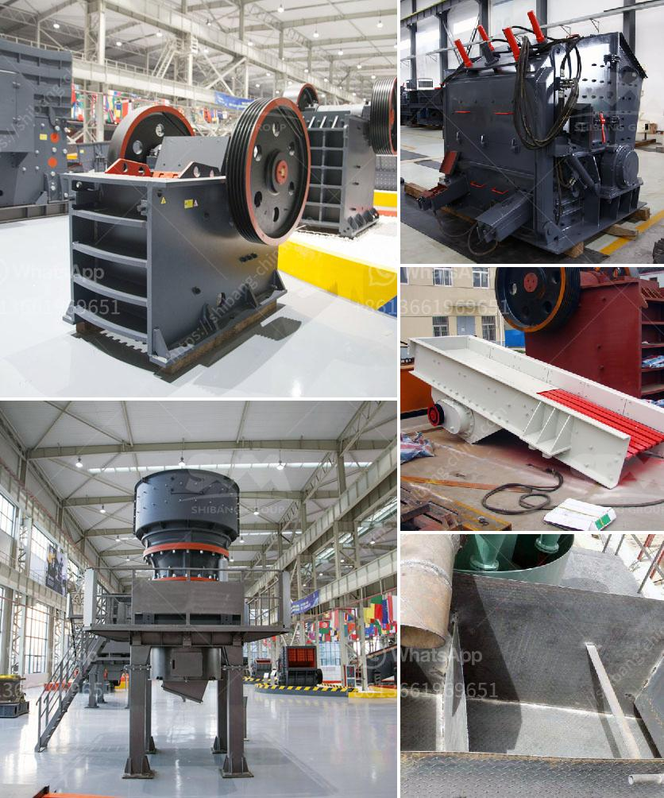

<h3>found stone crusher in davao</h3>
The found stone crusher in Davao is an invaluable asset to the construction industry in the region. The machine converts large chunks of limestone into smaller pieces for various applications such as road construction, building construction, and cement production. It is a crucial piece of equipment that plays a significant role in boosting the local economy and infrastructure development.

One of the primary uses of the stone crusher is the production of aggregates for construction projects. These aggregates, also known as crushed stone, are essential for the development of infrastructure like roads, bridges, and buildings. The machine crushes large rocks and stones into smaller, more manageable sizes, making them suitable for use in these constructions.

Additionally, the stone crusher is an integral part of the cement manufacturing process. Limestone, one of the main ingredients of cement, needs to be crushed into smaller pieces before it can be mixed with other materials to produce cement. The found stone crusher in Davao ensures a steady supply of crushed limestone for the local cement industry, thereby facilitating the production of high-quality cement.

The presence of the stone crusher also enhances the development of small-scale construction businesses in the region. Instead of purchasing costly crushed stone from distant suppliers, local contractors can rely on the found stone crusher in Davao to meet their construction needs efficiently and cost-effectively. This not only reduces their operational expenses but also supports the local economy by promoting entrepreneurship.

In conclusion, the found stone crusher in Davao is an essential asset for the construction industry. Its ability to convert large chunks of limestone into smaller pieces for various applications boosts the local economy and infrastructure development. Moreover, it facilitates the production of aggregates for construction projects and supports the growth of small-scale construction businesses in the region. Overall, the stone crusher is a valuable machine that contributes significantly to the progress of Davao's construction industry.
<h3>Contact us</h3><ul><li><strong>Whatsapp:&nbsp;<a href="https://wa.me/8613661969651">+8613661969651</a></strong></li><li><a href="https://swt.shibang-china.com/?git&amp;zhl&amp;found stone crusher in davao"><strong>Online Service(chat now)</strong></a></li></ul><h3>Related</h3><ul><li><a href='cost of cinder powder in bangalore.md'>cost of cinder powder in bangalore</a></li><li><a href='mica processing machinery pictures.md'>mica processing machinery pictures</a></li><li><a href='stone crusher cost.md'>stone crusher cost</a></li><li><a href='gemstones found in nigeria.md'>gemstones found in nigeria</a></li><li><a href='cost of set up mini cement plant in india.md'>cost of set up mini cement plant in india</a></li></ul>