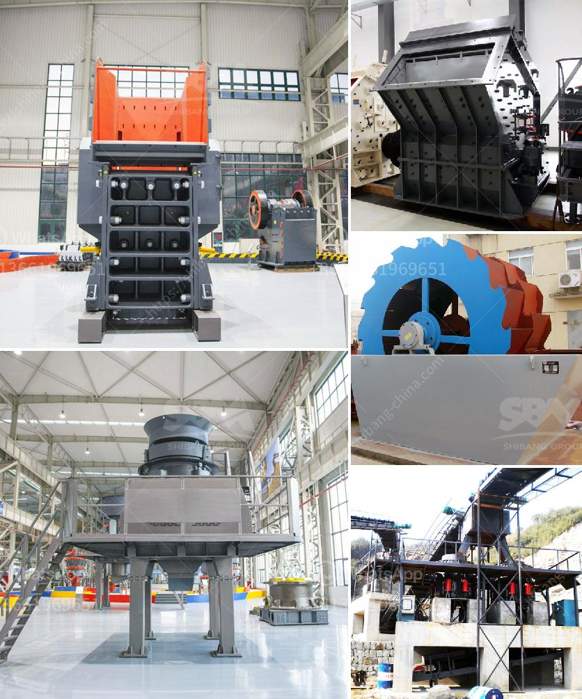

<h3>ft standard cone crusher pdf</h3>
The FT Standard Cone Crusher PDF is a cone crusher that offers an improved product shape for a variety of applications. It is known for its excellent throughput capacity and optimal energy efficiency.

The FT Standard Cone Crusher PDF features a variable speed drive, which allows you to adjust the crusher's speed to achieve the desired product gradation. It also employs a large-diameter main shaft with high-tensile steel construction, ensuring long-term durability and reliability.

One of the key features of the FT Standard Cone Crusher PDF is its innovative design with fewer moving parts. This leads to reduced maintenance and downtime, resulting in increased productivity and profitability. Additionally, the machine's simple structure makes it easy to operate and maintain, even for less experienced operators.

With a maximum feed size of up to 320mm (12.6 inches) and a closed-side discharge setting range of 25 to 60mm (1 to 2.4 inches), the FT Standard Cone Crusher PDF can crush a wide variety of materials with ease. It is suitable for crushing hard and medium-hard rocks, ores, and minerals.

Another advantage of the FT Standard Cone Crusher PDF is its hydraulic clearing system, which significantly reduces downtime during maintenance. This system allows you to clear the crushing chamber quickly and easily, saving valuable time and ensuring efficient operation.

The FT Standard Cone Crusher PDF also offers excellent safety features to protect both the operator and the machine. It includes a hydraulic tramp release system, which prevents damage to the crusher when uncrushable materials enter the crushing chamber. Additionally, the cone crusher is equipped with a sensor that detects excessive vibrations, alerting the operator and preventing potential machine damage.

In conclusion, the FT Standard Cone Crusher PDF is an ideal option for any crushing application. Its innovative design, high throughput capacity, and energy efficiency make it a reliable and cost-effective choice. Whether you are processing hard rocks, ores, or minerals, this cone crusher delivers consistent performance and excellent product shape. With its simplified maintenance, easy operation, and superior safety features, the FT Standard Cone Crusher PDF will undoubtedly enhance your crushing operations.
<h3>Contact us</h3><ul><li><strong>Whatsapp:&nbsp;<a href="https://wa.me/8613661969651">+8613661969651</a></strong></li><li><a href="https://swt.shibang-china.com/?git&amp;zhl&amp;ft standard cone crusher pdf"><strong>Online Service(chat now)</strong></a></li></ul><h3>Related</h3><ul><li><a href='hammer mills for sale in zimbabwe.md'>hammer mills for sale in zimbabwe</a></li><li><a href='product japan crushing plant.md'>product japan crushing plant</a></li><li><a href='cement plant equipment.md'>cement plant equipment</a></li><li><a href='conveyor belts specifications.md'>conveyor belts specifications</a></li><li><a href='what are the prices of crushing equipment.md'>what are the prices of crushing equipment</a></li></ul>