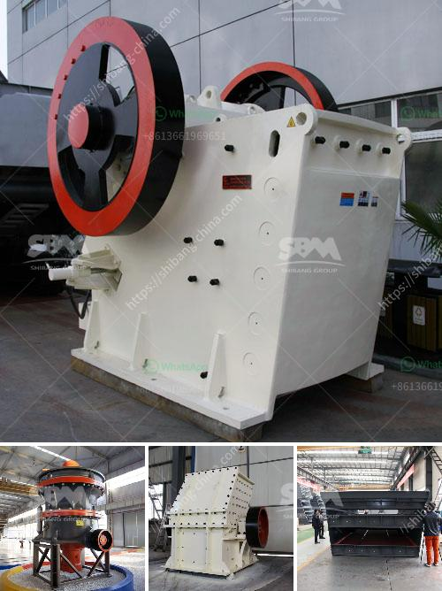

<h3>gemstone washing machine in china</h3>
China, known for its technological advancements and innovative products, has once again introduced a game-changing innovation in the jewelry industry: the gemstone washing machine. Used for cleaning and polishing gemstones, this machine has transformed the way gemstones are processed, bringing efficiency and precision to the manufacturing process.

Traditionally, gemstones have been cleaned by hand using a variety of tools and techniques. The process, while effective, is time-consuming and labor-intensive. Gemstone washing machines have now simplified and accelerated this process, reducing production time and increasing productivity for jewelry manufacturers.

The gemstone washing machine, also referred to as a gemstone cleaner, is a specialized piece of equipment designed specifically for cleaning gemstones. It consists of a drum that holds the gemstones and a system of water jets that spray water and cleaning agents onto the gemstones, removing dirt, dust, and other impurities.

One of the key advantages of the gemstone washing machine is its ability to clean gemstones thoroughly and gently. The water jets effectively remove any dirt or debris trapped within the gemstone's crevices, ensuring a pristine finish. Additionally, the machine's gentle handling prevents any damage to the gemstones, preserving their natural shine and luster.

In addition to cleaning, the gemstone washing machine can also be used for polishing gemstones. With the use of specialized polishing agents, the machine can enhance the gemstone's appearance, giving it a brilliant shine. This feature has significantly simplified the gemstone polishing process, eliminating the need for manual polishing, which was often time-consuming and required skilled labor.

The gemstone washing machine is not only efficient and effective but also highly versatile. It can accommodate a wide range of gemstone sizes, from small, delicate stones to larger ones, ensuring that all gemstones can be cleaned and polished with ease. This versatility has made the machine a valuable asset for both small-scale and large-scale jewelry manufacturers in China.

China's gemstone washing machine has revolutionized the jewelry industry, enabling manufacturers to produce high-quality gemstones at a faster pace. Jewelry manufacturers can now meet the increasing demand for gemstone jewelry while maintaining the standards of craftsmanship and quality.

Moreover, the introduction of the gemstone washing machine has also had a positive impact on the environment. The machine reduces water consumption by recycling the water used during the cleaning process, ensuring a more sustainable and responsible approach to gemstone processing. This aligns with China's commitment to environmental conservation and sustainable development.

As the gemstone washing machine gains popularity in China, it is also attracting attention from international jewelry manufacturers. Its efficiency, versatility, and eco-friendly features make it an appealing investment for businesses worldwide. Chinese manufacturers are now at the forefront of gemstone processing technology, exporting gemstone washing machines to meet the demands of the global jewelry market.

In conclusion, the gemstone washing machine in China has revolutionized the jewelry industry. Its efficiency, versatility, and eco-friendly features have transformed the traditional gemstone cleaning and polishing process, providing a faster and more sustainable approach. As this innovative machine continues to gain popularity, the jewelry industry is set to evolve, with China leading the way as a technological pioneer in gemstone processing.
<h3>Contact us</h3><ul><li><strong>Whatsapp:&nbsp;<a href="https://wa.me/8613661969651">+8613661969651</a></strong></li><li><a href="https://swt.shibang-china.com/?git&amp;zhl&amp;gemstone washing machine in china"><strong>Online Service(chat now)</strong></a></li></ul><h3>Related</h3><ul><li><a href='crusher for quartz.md'>crusher for quartz</a></li><li><a href='cobalt ore processing plant supplier.md'>cobalt ore processing plant supplier</a></li><li><a href='silica processing company.md'>silica processing company</a></li><li><a href='harga stone crusher kapasitas 200 ton jam.md'>harga stone crusher kapasitas 200 ton jam</a></li><li><a href='crushing plant application.md'>crushing plant application</a></li></ul>