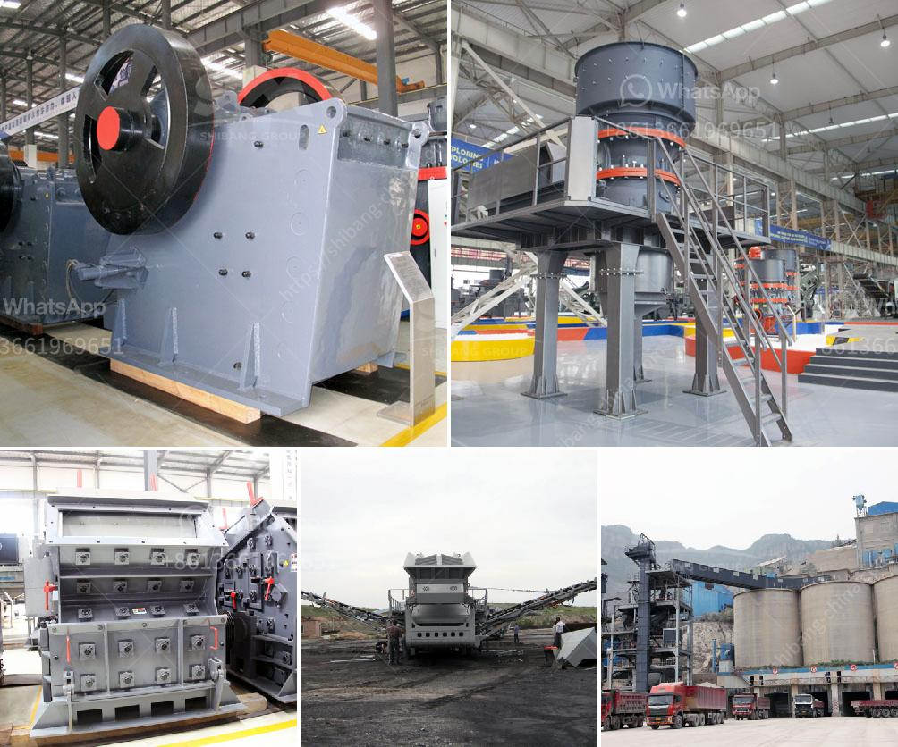

<h3>generic mining safety induction powerpoint</h3>
Mining is an essential industry that plays a significant role in global economies. However, it is also one of the most hazardous sectors, with various risks and dangers associated with the extraction of minerals and resources from the earth. To mitigate these risks, mining companies prioritize the safety of their workforce by implementing comprehensive safety protocols and guidelines. One vital component of this safety culture is the generic mining safety induction PowerPoint presentation.

A generic mining safety induction PowerPoint is a tool used to provide essential information regarding safety guidelines, procedures, and potential hazards to all newly employed personnel or visitors who enter a mining site. This induction plays a crucial role in creating awareness and understanding of safety practices specific to the mining industry. It ensures that everyone working or visiting the site is informed and equipped with the knowledge required to maintain a safe working environment.

The PowerPoint presentation typically covers a wide range of topics related to mining safety. It begins with an overview of the mining industry, highlighting the significance of safety and the potential risks associated with mining activities. This section aims to provide a clear understanding of the importance of adhering to safety guidelines and regulations.

The induction presentation also includes information on personal protective equipment (PPE), which is essential for safeguarding employees from various hazards. It outlines the types of PPE required in mining operations, such as helmets, safety glasses, earplugs, gloves, and protective clothing. The presentation educates individuals on the proper use, maintenance, and storage of PPE to ensure their maximum effectiveness.

Another critical aspect covered in the generic mining safety induction PowerPoint is hazard identification and risk assessment. It educates employees on recognizing potential hazards, such as unstable ground conditions, machinery-related risks, chemical exposures, and noise hazards. The presentation also emphasizes the importance of reporting hazards promptly to the appropriate personnel.

Moreover, the induction powerpoint provides guidelines on emergency procedures and evacuation plans. It outlines the actions to be taken during various emergency situations, such as fires, explosions, medical emergencies, or natural disasters. This section helps employees understand their role in ensuring a safe and orderly evacuation, emphasizing the importance of maintaining calm and following designated escape routes.

Furthermore, the presentation introduces safety controls and procedures specific to mining operations. It covers topics like safe work practices, equipment operation guidelines, and the importance of regular maintenance and inspections. The induction highlights the significance of adhering to established safety protocols, including lockout/tagout procedures, confined space entry protocols, and traffic management guidelines.

A generic mining safety induction PowerPoint is a dynamic tool that can incorporate engaging visuals, videos, and interactive quizzes to enhance learning and retention. This approach keeps the audience engaged and ensures that they understand and internalize the information being presented. Additionally, the presentation is often designed to be easily customized, allowing mining companies to tailor it to their specific site conditions, equipment, and hazards.

In conclusion, a generic mining safety induction PowerPoint plays a vital role in promoting a safety-oriented culture within the mining industry. By providing essential information on safety guidelines, procedures, and potential hazards, it equips employees and visitors with the knowledge needed to maintain a safe working environment. Mining companies must prioritize the implementation of an effective and engaging induction presentation to ensure the well-being of their workforce.
<h3>Contact us</h3><ul><li><strong>Whatsapp:&nbsp;<a href="https://wa.me/8613661969651">+8613661969651</a></strong></li><li><a href="https://swt.shibang-china.com/?git&amp;zhl&amp;generic mining safety induction powerpoint"><strong>Online Service(chat now)</strong></a></li></ul><h3>Related</h3><ul><li><a href='jaw crusher price philippines.md'>jaw crusher price philippines</a></li><li><a href='100tpd crusher plant.md'>100tpd crusher plant</a></li><li><a href='rock crusher rock crusher.md'>rock crusher rock crusher</a></li><li><a href='grinding lm vertical mill.md'>grinding lm vertical mill</a></li><li><a href='cement manufacturing process flow chart.md'>cement manufacturing process flow chart</a></li></ul>