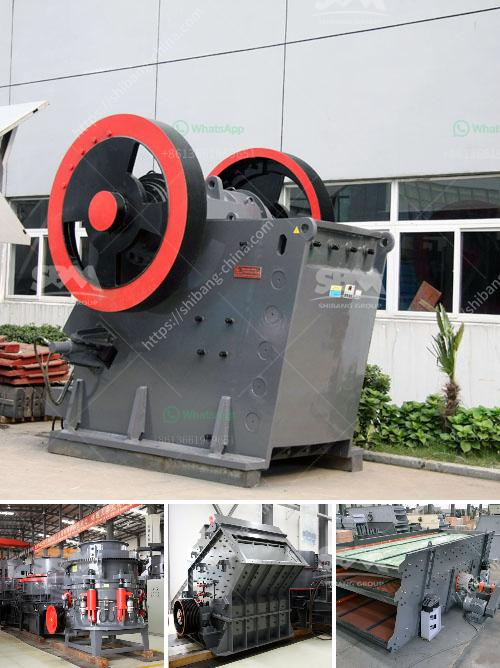

<h3>german crusher plants</h3>
German crusher plants refer to the stone crushing machines used for crushing various stones, rocks, ore, coal, and other materials in Germany. These plants are widely used in construction sites, mining industry, metallurgy, cement production plants, and other industries.

In Germany, crusher plants are available in stationary, portable and mobile configurations. All of them have their own unique features. For instance, stationary plants are suitable for large-scale projects with long construction periods. They are capable of producing high-quality aggregates and are equipped with advanced technology for efficient crushing.

On the other hand, portable crusher plants are designed for short-term projects or locations where transportation is a challenge. They can be easily moved from one site to another, offering flexibility and convenience. These plants are ideal for contractors or quarry operators who frequently need to relocate their equipment.

Mobile crusher plants, as the name suggests, are mounted on wheels and can be easily transported to different locations. They are compact in size and can be operated remotely, making them highly efficient and versatile. With the increasing demand for mobile crushing solutions, German manufacturers have developed robust and reliable mobile crusher plants to cater to different customer needs.

German crusher plants are known for their strength and durability. They are built to withstand heavy usage and can process a wide range of materials. These plants are equipped with high-quality components such as crushers, screens, feeders, and conveyors, ensuring efficient operation and low maintenance.

Furthermore, German crusher plants adhere to strict environmental regulations. They are designed to minimize dust emission, noise pollution, and other environmental impacts. This commitment to sustainability makes German crusher plants a preferred choice for many contractors and industries.

In conclusion, German crusher plants offer efficient and reliable solutions for crushing various materials. Whether for large-scale construction projects or small-scale quarry operations, these plants provide high-quality aggregates needed in the industry. With their robust design, advanced technology, and adherence to environmental regulations, German crusher plants are an excellent investment for any organization.
<h3>Contact us</h3><ul><li><strong>Whatsapp:&nbsp;<a href="https://wa.me/8613661969651">+8613661969651</a></strong></li><li><a href="https://swt.shibang-china.com/?git&amp;zhl&amp;german crusher plants"><strong>Online Service(chat now)</strong></a></li></ul><h3>Related</h3><ul><li><a href='best marble grinder mill.md'>best marble grinder mill</a></li><li><a href='industrial aluminum can crusher in saudi arabia.md'>industrial aluminum can crusher in saudi arabia</a></li><li><a href='orifice of coal mill machine.md'>orifice of coal mill machine</a></li><li><a href='second hand crushers and screens in south africa.md'>second hand crushers and screens in south africa</a></li><li><a href='vibrating screen in the philippines.md'>vibrating screen in the philippines</a></li></ul>