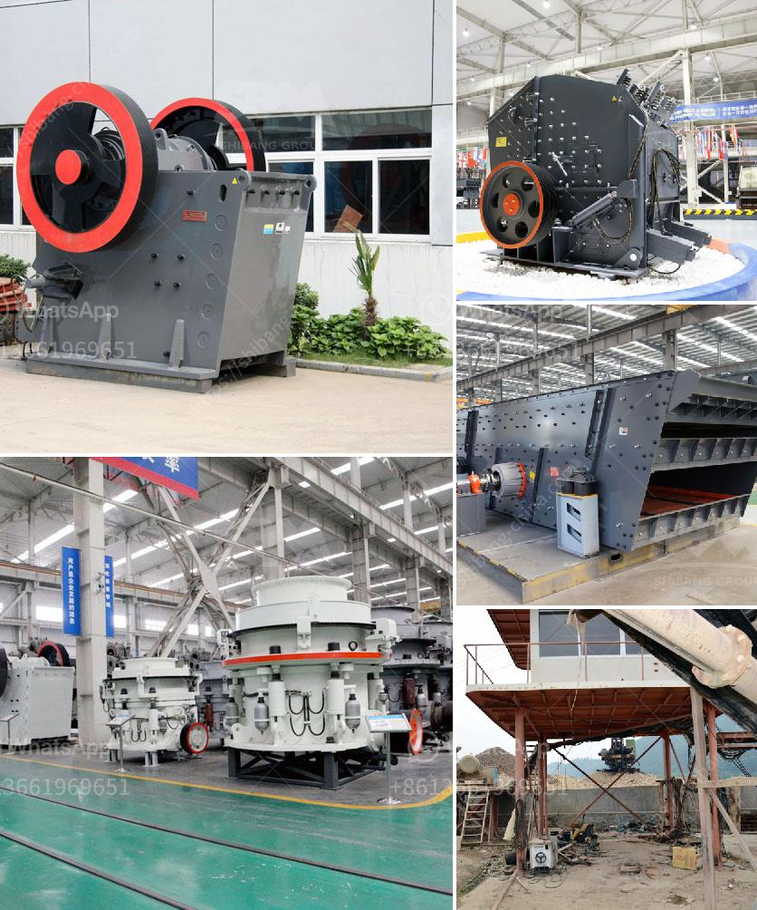

<h3>german stone grinding machine manufacturer</h3>
Germany is renowned for its engineering expertise in heavy machinery and equipment manufacturing. The German stone grinding machine manufacturer, KUKA Robotics, is a leading player in this industry. The company's high-performance stone grinding machines are used for a variety of applications, including precision engineering, automotive manufacturing, industrial manufacturing, and aerospace.

KUKA Robotics has been in the industry for several decades, constantly advancing its technology and improving its machines' performance. The company's dedication to innovation and precision has made it a trusted name in the field of stone grinding machines. Their machines are known for their exceptional precision, efficiency, and durability.

One of the key advantages of the German stone grinding machines is their ability to deliver consistent and precise results. These machines are equipped with advanced technologies that enable them to provide high levels of accuracy and repeatability. This is essential in industries where precision is of utmost importance, such as the automotive and aerospace sectors. The machines' ability to deliver precise results ensures that the final product meets the required specifications and quality standards.

Another notable feature of German stone grinding machines is their robust construction and high-quality components. These machines are built to withstand heavy usage and harsh environments, ensuring their longevity and reliability. The strong construction and high-quality components also contribute to the machines' consistent performance and excellent grinding results.

Additionally, KUKA Robotics' stone grinding machines are designed with user-friendliness in mind. The company focuses on creating machines that are easy to operate and maintain, offering intuitive interfaces and clear instructions. This not only improves the productivity of operators but also reduces the risk of errors, ensuring optimal grinding results.

Moreover, KUKA Robotics places great importance on the safety of its machines. The company incorporates various safety features into its stone grinding machines to protect operators and prevent accidents. These safety features include emergency stop buttons, protective enclosures, and sensors that detect any anomalies during the grinding process. KUKA Robotics' commitment to safety ensures a safe working environment for operators and minimizes the risk of accidents or injuries.

In conclusion, German stone grinding machine manufacturer, KUKA Robotics, is at the forefront of the industry due to its commitment to precision, quality, durability, user-friendliness, and safety. The company's machines are widely used in various industries for their exceptional performance and reliability. With its long-standing experience and continuous innovation, KUKA Robotics is a trusted partner for businesses in need of high-quality stone grinding machines.
<h3>Contact us</h3><ul><li><strong>Whatsapp:&nbsp;<a href="https://wa.me/8613661969651">+8613661969651</a></strong></li><li><a href="https://swt.shibang-china.com/?git&amp;zhl&amp;german stone grinding machine manufacturer"><strong>Online Service(chat now)</strong></a></li></ul><h3>Related</h3><ul><li><a href='ball mill plant in south africa.md'>ball mill plant in south africa</a></li><li><a href='laboratory jaw crusher.md'>laboratory jaw crusher</a></li><li><a href='crushing plant for sale.md'>crushing plant for sale</a></li><li><a href='flow diagram by gypsum process.md'>flow diagram by gypsum process</a></li><li><a href='ultrafine grinder for producing powder.md'>ultrafine grinder for producing powder</a></li></ul>