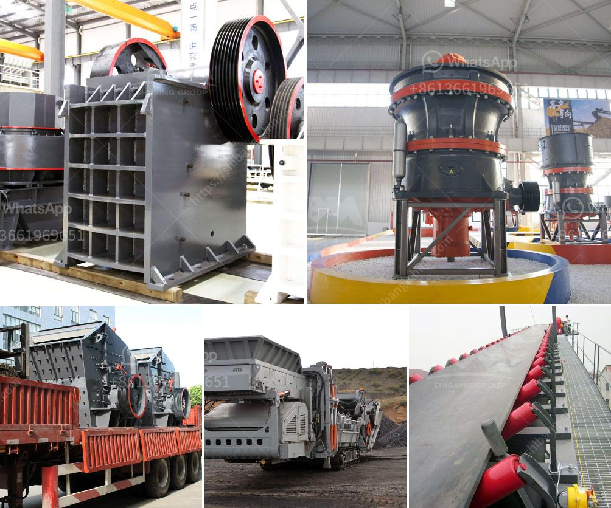

<h3>germany gypsum production line</h3>
Germany has been a leading player in the gypsum production industry. The country's gypsum production line is recognized for its high quality and efficiency. 

Gypsum, also known as calcium sulfate dihydrate, is a soft mineral that is widely used in a variety of industries, including plasterboard, cement, and agriculture. Germany's gypsum production line is equipped with advanced technology and state-of-the-art machinery, ensuring the production of top-quality gypsum products.

One of the key factors contributing to Germany's success in gypsum production is its rich reserves of gypsum deposits. The country has abundant gypsum resources, which allows for the continuous production of gypsum products. These reserves guarantee a stable and reliable supply of gypsum, meeting domestic and international demands.

Germany's gypsum production line is also known for its environmental sustainability. The country adheres to strict environmental regulations and employs eco-friendly practices throughout the production process. These practices include efficient energy use, waste management, and low carbon emissions. By prioritizing sustainability, Germany ensures that its gypsum production line remains environmentally friendly and socially responsible.

Furthermore, Germany's gypsum production line is highly efficient, allowing for the production of a large quantity of gypsum products in a short amount of time. The advanced machinery and automated processes in place ensure high productivity and cost-effectiveness. This efficiency contributes to Germany's position as a leading exporter of gypsum products, catering to the global demand.

In conclusion, Germany's gypsum production line demonstrates its commitment to producing high-quality gypsum products efficiently and sustainably. With abundant gypsum reserves, advanced technology, and environmentally-friendly practices, Germany continues to play a significant role in the global gypsum industry.
<h3>Contact us</h3><ul><li><strong>Whatsapp:&nbsp;<a href="https://wa.me/8613661969651">+8613661969651</a></strong></li><li><a href="https://swt.shibang-china.com/?git&amp;zhl&amp;germany gypsum production line"><strong>Online Service(chat now)</strong></a></li></ul><h3>Related</h3><ul><li><a href='washing plant for silica.md'>washing plant for silica</a></li><li><a href='malaysia hammer mills.md'>malaysia hammer mills</a></li><li><a href='crushing service with peru jaw crusher.md'>crushing service with peru jaw crusher</a></li><li><a href='150 tph mobile jaw crusher for sale in malaysia.md'>150 tph mobile jaw crusher for sale in malaysia</a></li><li><a href='mobile jaw crusher dealers south africa.md'>mobile jaw crusher dealers south africa</a></li></ul>