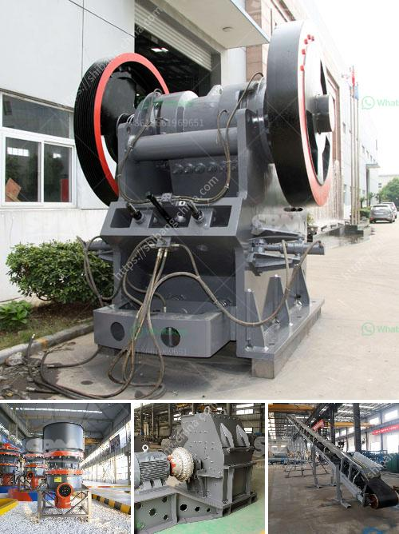

<h3>germany stone crushing plants</h3>
Germany is one of the leading nations in the world for stone crushers. With multiple crushing plants in operation across the country, the key to successful implementation is a deep understanding of the requirements of the stone crushing industry. This guide will help you navigate through the different machinery available and choose the right product for your operation.

Stone crushing plants in Germany rely on high-quality components and field-proven technology to help them perform reliably year after year. One of the essential requirements of any stone crushing application is tough operating conditions. Being able to withstand intense continuous operation while maintaining efficiency is crucial for the plants to run smoothly.

The first consideration when selecting a stone crushing plant is the nature of the raw material being extracted. Stones like granite and marble have different characteristics, which require different types of crushers to operate efficiently. Jaw crushers are commonly used for primary crushing, whereas cone crushers are common for secondary and tertiary crushing stages.

Next, the capacity of the plant must be determined. Germany stone crushing plants are designed to handle a wide range of materials, and when choosing the appropriate crusher, it's important to understand the capabilities of each crusher in order to select the best suited machine for the job.

Some plants are fitted with pre-screening machinery to remove the fines before they reach the crusher. This helps to prevent excessive wear and tear on the crusher, as well as improve overall crushing performance. Pre-screening also allows for the separation of different sized materials, which can be useful in certain applications.

In addition to the crushers themselves, Germany stone crushing plants also need to ensure that the machinery they use is reliable and easy to maintain. Regular maintenance and servicing are vital in order to keep the plant running smoothly and prevent any costly breakdowns.

Furthermore, many stone crushing plants adopt environmentally friendly technologies to minimize emissions and reduce their carbon footprint. This includes the use of dust suppression systems to minimize dust pollution and incorporating energy-efficient equipment to minimize energy consumption.

When it comes to Germany stone crushing plants, there is no one-size-fits-all solution. Each operation has its own unique requirements, and selecting the appropriate equipment is critical to achieving optimal performance and minimizing downtime.

In conclusion, stone crushing plants in Germany are characterized by tough operating conditions and require high-quality components to ensure reliability and efficiency. The selection of the right machines and the proper maintenance practices can help operators maximize the productivity and profitability of their operations. With a thorough understanding of the stone crushing industry and the options available, operators can make informed decisions when it comes to purchasing new equipment or upgrading existing plants.
<h3>Contact us</h3><ul><li><strong>Whatsapp:&nbsp;<a href="https://wa.me/8613661969651">+8613661969651</a></strong></li><li><a href="https://swt.shibang-china.com/?git&amp;zhl&amp;germany stone crushing plants"><strong>Online Service(chat now)</strong></a></li></ul><h3>Related</h3><ul><li><a href='mini coke processing plant.md'>mini coke processing plant</a></li><li><a href='clinker grinding plant manufacturers germany.md'>clinker grinding plant manufacturers germany</a></li><li><a href='mobile crushing plant philippines.md'>mobile crushing plant philippines</a></li><li><a href='stone crusher for sale in usa.md'>stone crusher for sale in usa</a></li><li><a href='basalt crusher price in senegal.md'>basalt crusher price in senegal</a></li></ul>