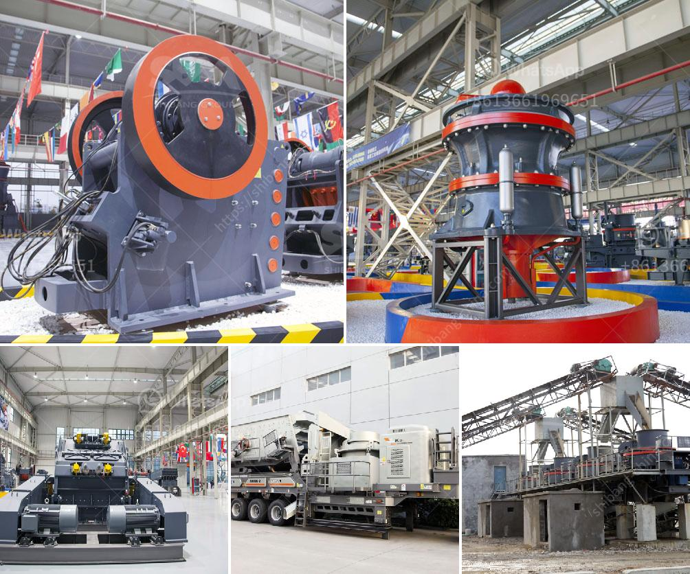

<h3>ghana quarry crusher</h3>
Ghana is renowned for its rich mineral resources, thriving mining industry, and impressive quarrying sector. The country’s significant mineral deposits include gold, bauxite, manganese, diamonds, limestone, and granite. Furthermore, Ghana is the second-largest producer of gold on the African continent.

The quarrying industry plays a vital role in Ghana's socio-economic development. It contributes significantly to the country's revenue generation, job creation, and infrastructure development. Quarrying involves the extraction of various minerals and stones from the earth's surface and plays a crucial role in the construction industry.

One essential component of the quarrying process is crushers. Quarry crushers are machines that break down large stones into smaller pieces, ensuring the efficient extraction of valuable minerals. These crushers are used extensively in the mining and quarrying industry in Ghana.

The main types of crushers used in Ghanaian quarries include jaw crushers, impact crushers, and cone crushers. Jaw crushers are used for primary crushing stages and are commonly used for the initial crushing of minerals and rocks. They are designed to be exceptionally sturdy and can handle tough materials.

Impact crushers are utilized for secondary crushing and provide a high reduction ratio. They are commonly used for processing materials with a high abrasion index and can produce finely crushed materials in a single pass. This makes them particularly suitable for quarrying operations.

Cone crushers, on the other hand, are typically used for tertiary or final-stage crushing. They are particularly useful in processing hard and abrasive materials. Cone crushers excel in producing cubical-shaped end products and can efficiently crush even the hardest rocks.

The quarrying industry in Ghana has seen tremendous growth over the years due to the increasing demand for construction materials, such as crushed stones, aggregates, and sand. The availability of efficient crushers significantly enhances the productivity and profitability of quarrying operations in the country.

Improved technology and innovative designs have revolutionized the quarrying sector and increased the efficiency of crushers. Modern crushers are equipped with advanced features, such as hydraulic systems, control panels, and automation, which optimize the crushing process and reduce downtime.

The benefits of investing in high-quality crushers in Ghana's quarrying industry cannot be overstated. These machines enable quarry operators to produce a wide range of materials at varying sizes, meeting the diverse needs of the construction industry. Additionally, they help reduce the environmental impact by minimizing material wastage and improving resource management.

In conclusion, Ghana's quarrying industry plays a crucial role in the country's development, providing valuable minerals and building materials for the construction sector. Crushers are essential equipment in the quarrying process, enabling efficient extraction and processing of minerals. Investing in high-quality quarry crushers brings numerous benefits, including increased productivity, profitability, and environmental sustainability. As Ghana continues to experience growth in its mining and quarrying sectors, the importance of crushers in the industry is set to remain paramount.
<h3>Contact us</h3><ul><li><strong>Whatsapp:&nbsp;<a href="https://wa.me/8613661969651">+8613661969651</a></strong></li><li><a href="https://swt.shibang-china.com/?git&amp;zhl&amp;ghana quarry crusher"><strong>Online Service(chat now)</strong></a></li></ul><h3>Related</h3><ul><li><a href='rock pulverizer for manufacturing.md'>rock pulverizer for manufacturing</a></li><li><a href='iron processing equipment price.md'>iron processing equipment price</a></li><li><a href='coal cushing and gdrinding machine.md'>coal cushing and gdrinding machine</a></li><li><a href='cone crusher suppliers in south africa.md'>cone crusher suppliers in south africa</a></li><li><a href='price of grinding machine.md'>price of grinding machine</a></li></ul>