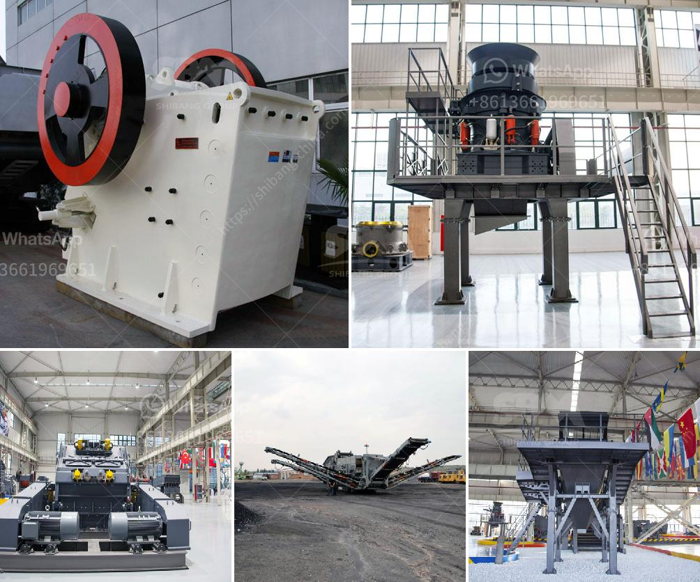

<h3>gold crusher equipment</h3>
Gold is a precious metal that has been sought after for centuries due to its beauty and rarity. In order to extract gold from its ores, miners have used various equipment over the years. One piece of equipment that has revolutionized the gold mining industry is the gold crusher.

A gold crusher is a machine designed to reduce large rocks into smaller rocks, gravel, or rock dust. Crushers may be used to reduce the size, or change the form, of waste materials so they can be more easily disposed of or recycled, or to reduce the size of a solid mix of raw materials (as in rock ore), so that pieces of different composition can be differentiated. Crushing is the process of transferring a force amplified by mechanical advantage through a material made of molecules that bond together more strongly, and resist deformation more, than those in the material being crushed do.

Gold crushers have been in use for centuries, with the earliest known example dating back to Ancient Rome. In the modern era, gold crushers have evolved significantly to handle larger quantities of material and to achieve a more refined end product. Today, gold crushers can be found in large-scale mining operations, where they are used to crush ore into smaller particles for further processing. These crushers can process hundreds of tons of ore per hour and are ideal for medium to large-scale operations.

1. Jaw crushers: These are the most commonly used crushers due to their ability to crush all kinds of material, including the hardest rocks. The crushing chamber comprises two jaws – a stationary jaw and a movable jaw. The ore is fed into the top of the crusher and is crushed between the jaws as it moves down, eventually exiting through the bottom of the machine.

2. Cone crushers: These crushers are similar to gyratory crushers in that they have a mantle that rotates within a bowl, but they have a smaller crushing chamber and are more suited for secondary crushing. Cone crushers are often used in conjunction with jaw crushers to achieve the desired end product.

3. Impact crushers: These crushers use impact rather than pressure to crush the material. They are often used in the final stage of crushing to produce a cubical-shaped end product. Impact crushers can be configured to perform two or three-stage crushing, depending on the application.

Gold crusher equipment has played a crucial role in the advancement of the gold mining industry over the years, and with the advancements in technology, it is now possible to crush gold ore in even more efficient and precise ways. Whether you are new to gold mining or have been in the industry for years, gold crusher equipment can make a difference in your productivity and profitability.

In conclusion, gold crusher equipment has proven to be a valuable asset in the gold mining industry. With the ability to process hundreds of tons of ore per hour, gold crushers are a necessary tool for any large-scale gold mining operation. Whether you are looking to invest in new equipment or simply upgrade your existing machinery, gold crushers offer a reliable and efficient solution for crushing gold ore.
<h3>Contact us</h3><ul><li><strong>Whatsapp:&nbsp;<a href="https://wa.me/8613661969651">+8613661969651</a></strong></li><li><a href="https://swt.shibang-china.com/?git&amp;zhl&amp;gold crusher equipment"><strong>Online Service(chat now)</strong></a></li></ul><h3>Related</h3><ul><li><a href='vibratory screen manufacturer.md'>vibratory screen manufacturer</a></li><li><a href='pulverizer grinding machine philippines.md'>pulverizer grinding machine philippines</a></li><li><a href='stone grinding mills in pakistan.md'>stone grinding mills in pakistan</a></li><li><a href='ultrafine grinder for producing powder.md'>ultrafine grinder for producing powder</a></li><li><a href='vertical grinding machine defination.md'>vertical grinding machine defination</a></li></ul>