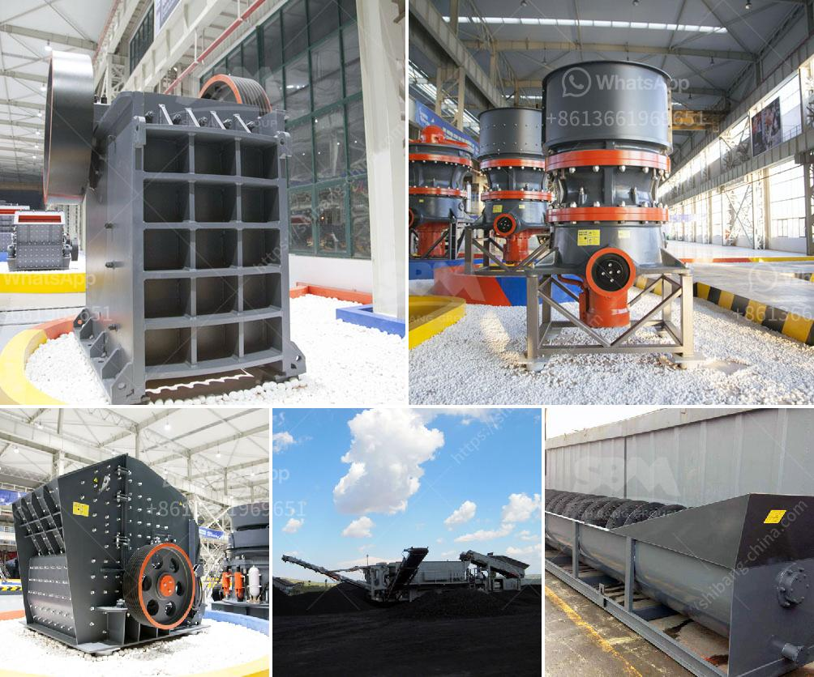

<h3>gold hammer mill for sale in south africa</h3>
Gold mining in South Africa has been the principal focus and interest of countless investors and individuals for over a century. With significant deposits scattered across the region, it is almost impossible not to be intrigued by the precious commodity that has played a vital role in shaping the nation's history.

One of the key pieces of equipment used in gold processing, production, and recovery is the gold hammer mill. Defined as a pulverizing machine, the gold hammer mill is widely utilized in small and medium-sized mines, achieving the desired grind by crushing and grinding rocks containing gold ore. Many grams of gold flakes can be extracted from ore, and occasionally even larger nuggets can be found.

For those in the mining industry or individuals looking to venture into gold mining, buying a gold hammer mill in South Africa can be a wise investment. Today, there is a wide range of gold hammer mills available across the country, with numerous suppliers and manufacturers vying for customers' attention. The sheer amount of options can sometimes overwhelm potential buyers, but with careful research and understanding, finding the perfect gold hammer mill is within reach.

The primary factor to consider when purchasing a gold hammer mill is its capacity. Different mills cater to different scale operations, and it is vital to choose one that matches your specific needs. A mill with a capacity of 300 to 500 kilograms per hour is considered suitable for small to medium-sized operations. Such a mill can effectively crush and grind a significant amount of ore, allowing for efficient gold extraction.

Secondly, it is essential to evaluate the durability and reliability of the gold hammer mill. Mining operations can be harsh and demanding, requiring equipment that can withstand constant use and extreme conditions. Look for reputable suppliers who offer mills made from high-quality materials, ensuring longevity and optimal performance.

To ensure the gold hammer mill can be seamlessly integrated into your existing mining setup, it is crucial to check for compatibility. Consider factors such as power requirements, maintenance needs, and the availability of spare parts. Choosing a mill that aligns with your current infrastructure reduces downtime and allows for a smoother transition.

Price is also an important consideration. While it can be tempting to choose the cheapest option available, it is equally crucial to prioritize quality and reliability. Consider the long-term benefits of investing in a superior gold hammer mill, as it will often prove more cost-effective in the long run.

South Africa's rich gold mining heritage, combined with its abundant resources, provides an ideal environment for individuals and companies to engage in the gold mining sector. Whether you are already part of this industry or looking to venture into it, investing in a gold hammer mill is a step towards potential success.

In conclusion, the availability of gold hammer mills for sale in South Africa presents a significant opportunity for individuals and companies involved in gold mining to expand their operations. The reliable and efficient performance of these mills contributes to the success and growth of the industry. As with any investment, thorough research and consideration of factors such as capacity, durability, compatibility, and price are crucial in finding the perfect gold hammer mill to meet your specific needs.
<h3>Contact us</h3><ul><li><strong>Whatsapp:&nbsp;<a href="https://wa.me/8613661969651">+8613661969651</a></strong></li><li><a href="https://swt.shibang-china.com/?git&amp;zhl&amp;gold hammer mill for sale in south africa"><strong>Online Service(chat now)</strong></a></li></ul><h3>Related</h3><ul><li><a href='germany stone crushing plants.md'>germany stone crushing plants</a></li><li><a href='size ball mills for miner.md'>size ball mills for miner</a></li><li><a href='project report for establishing stone crusher.md'>project report for establishing stone crusher</a></li><li><a href='vibrating grinding mill ball china.md'>vibrating grinding mill ball china</a></li><li><a href='coal crusher machine china.md'>coal crusher machine china</a></li></ul>