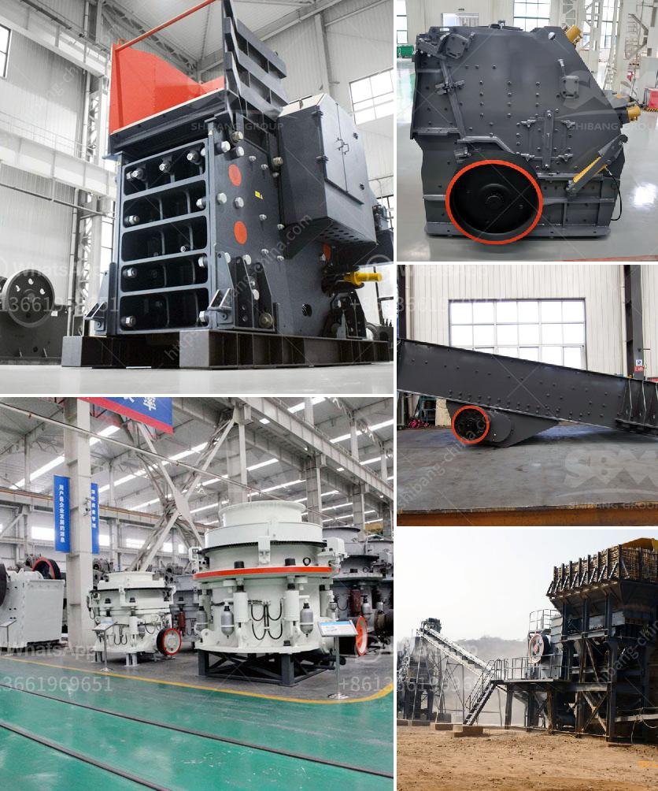

<h3>gold mill for sale in zimbabwe</h3>
Gold is a precious metal that has been highly sought after for centuries. It is used in various industries, including jewelry, electronics, and dentistry. Zimbabwe is a country rich in mineral resources, including gold. As a result, there are numerous gold mills for sale in Zimbabwe that provide the necessary equipment to extract and refine gold.

Gold mining in Zimbabwe is a complex and intricate process that involves many steps, including the extraction, sorting, and processing of materials. Zimbabwe has a significant gold mining industry, and several large gold mines are located in the country. These mines have contributed greatly to Zimbabwe's economy and employment rates.

One crucial step in the gold mining process is the crushing and grinding of ore. The extracted ore is then sent to mills, which break it down into fine particles. These particles are then mixed with water and further ground into a slurry. Afterward, the slurry is passed through several stages of gold recovery, which may include gravity separation, flotation, or cyanidation.

Gold mills in Zimbabwe are crucial equipment for the gold mining industry and are an essential investment for any gold miner. The machinery is the backbone of the gold mining process, and the efficiency and effectiveness of these machines directly impact the overall performance and yield of a mine.

There are various types of gold mills available for sale in Zimbabwe, including jaw crushers, stamp mills, and mill machines. These types of mills have different features and capabilities, catering to the specific needs of gold miners in Zimbabwe. Additionally, these mills can vary in size, capacity, and processing speed, enabling miners to choose the most suitable option for their operations.

Investing in a gold mill in Zimbabwe offers numerous advantages for gold miners. Firstly, it allows for increased production and processing of ore, resulting in higher gold yields. This can lead to greater profits for miners and contribute to the country's economic growth.

Furthermore, owning a gold mill enables miners to have better control over the gold extraction process. They can process their ore on-site, reducing transportation costs and dependency on external mills. This gives miners more autonomy and flexibility in their operations.

In addition to the economic benefits, buying a gold mill in Zimbabwe also supports local businesses and contributes to job creation. The manufacturing and servicing of gold mills create employment opportunities for local communities, thus improving their livelihoods.

Gold mills for sale in Zimbabwe are crucial equipment for gold mining operations. They play a vital role in extracting, refining, and processing gold ore, resulting in higher gold yields and profits. Investing in a gold mill in Zimbabwe offers numerous benefits for miners while contributing to the country's economy and job creation. With its mineral-rich resources, Zimbabwe continues to provide opportunities for gold miners to thrive and expand their operations.
<h3>Contact us</h3><ul><li><strong>Whatsapp:&nbsp;<a href="https://wa.me/8613661969651">+8613661969651</a></strong></li><li><a href="https://swt.shibang-china.com/?git&amp;zhl&amp;gold mill for sale in zimbabwe"><strong>Online Service(chat now)</strong></a></li></ul><h3>Related</h3><ul><li><a href='used vertical roller mill for sale.md'>used vertical roller mill for sale</a></li><li><a href='basalt impact crusher price.md'>basalt impact crusher price</a></li><li><a href='toggle plate of jaw crusher.md'>toggle plate of jaw crusher</a></li><li><a href='mobile gold hammer crusher for sale philippines.md'>mobile gold hammer crusher for sale philippines</a></li><li><a href='germany gypsum production line.md'>germany gypsum production line</a></li></ul>