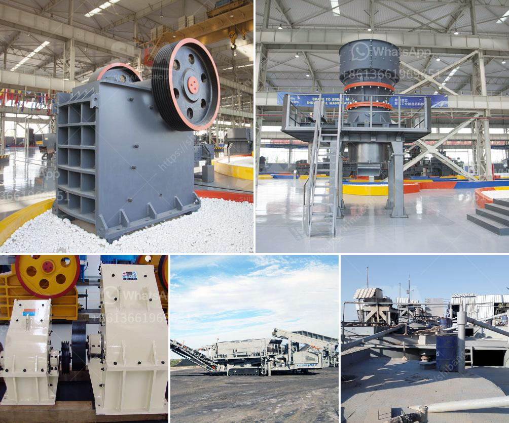

<h3>gold mining crusher in nigeria cost</h3>
Gold mining in Nigeria has been a topic of intense debate and controversy for many years. However, there is currently a resurgence in gold mining activities in the country due to the discovery of vast deposits of gold in different parts of Nigeria. With this renewed interest, the cost and benefits of gold mining in Nigeria have become a subject of discussion.

One major cost associated with gold mining in Nigeria is the environmental degradation caused by the mining activities. A considerable amount of land is damaged during the extraction process, leading to deforestation and soil erosion. Additionally, the use of chemicals such as cyanide and mercury to extract gold from ore can contaminate water sources and pose serious health risks to nearby communities. The long-term effects of these environmental damages can be detrimental to the overall well-being of the affected areas.

Another significant cost of gold mining in Nigeria is the social impact on local communities. Many small-scale miners and artisanal miners are often exploited by middlemen who offer them meager prices for their gold. This further perpetuates poverty and inequality in these communities. Moreover, the influx of people into these mining areas leads to overcrowding, pressure on social amenities, and a rise in criminal activities, leading to increased insecurity.

On the other hand, gold mining in Nigeria also presents several benefits. The revenue generated from gold mining can contribute to the economic development of the country. It can provide employment opportunities for individuals, and taxes and royalties paid by mining companies can contribute to national revenue. Additionally, the mining sector can stimulate the growth of related industries such as transportation, construction, and manufacturing, further boosting the economy.

Furthermore, gold mining can also provide opportunities for skill development and technological advancements. As mining activities increase, there is a need for skilled workers and the transfer of technology from multinational mining companies to local employees. This can contribute to the overall development of the country and improve the skillsets of its workforce.

To maximize the benefits and mitigate the costs of gold mining in Nigeria, it is crucial for the government to implement effective regulatory measures. Stricter environmental regulations should be enforced to minimize the negative impact on land, water, and communities. The government should also create policies that ensure fair and transparent trading practices, preventing exploitation of small-scale miners or artisans.

Investments in infrastructure development and social amenities in mining communities are also important. This can alleviate the strain on existing infrastructure and provide basic services such as healthcare, education, and water supply to these communities.

In conclusion, gold mining in Nigeria presents both costs and benefits. While the economic benefits are apparent, it is essential to address the environmental and social challenges associated with the mining activities. The government must enforce strong regulations, invest in community development, and promote responsible mining practices to maximize the benefits and minimize the costs. By doing so, gold mining can become a catalyst for sustainable development in Nigeria.
<h3>Contact us</h3><ul><li><strong>Whatsapp:&nbsp;<a href="https://wa.me/8613661969651">+8613661969651</a></strong></li><li><a href="https://swt.shibang-china.com/?git&amp;zhl&amp;gold mining crusher in nigeria cost"><strong>Online Service(chat now)</strong></a></li></ul><h3>Related</h3><ul><li><a href='hard rock ball mill specs.md'>hard rock ball mill specs</a></li><li><a href='quartz stone crushing machine for stone industries.md'>quartz stone crushing machine for stone industries</a></li><li><a href='kenya crusher supplier.md'>kenya crusher supplier</a></li><li><a href='vibrating screen supplier.md'>vibrating screen supplier</a></li><li><a href='barangay resolution crushing plant.md'>barangay resolution crushing plant</a></li></ul>