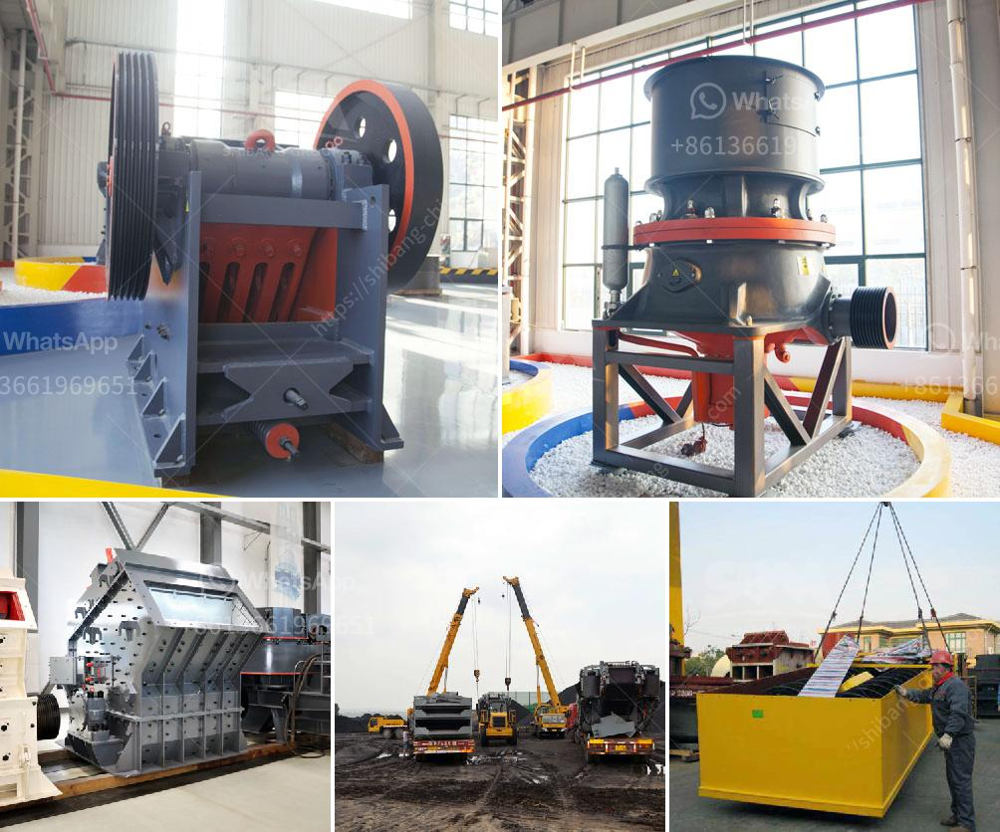

<h3>gold mining equipment for sale in uganda</h3>
Gold mining has been a significant source of income and employment in Uganda for many years. With a rich geological history, the country has a vast amount of natural resources, including gold deposits. To extract this precious metal and turn it into profit, miners rely on specialized equipment designed specifically for gold mining. In Uganda, there is a range of reliable and efficient gold mining equipment for sale.

One of the critical equipment in gold mining is a gold detector. Without a good gold detector, it is challenging to identify gold deposits accurately. There are different types of gold detectors available for sale in Uganda, including metal detectors and ground-penetrating radar devices. These advanced technological tools help prospectors locate gold underground, saving them time and effort.

Another essential piece of equipment is a gold trommel. A trommel is a rotating cylindrical sieve used to separate out larger rocks and debris from the gold-bearing material. By using a trommel, miners can ensure that the gold concentrate they collect is free from unwanted material. Trommels are available in various sizes and configurations, depending on the scale of the mining operation.

In addition to detectors and trommels, gold miners in Uganda also rely on gravity concentrators. These devices use gravity and centrifugal force to separate gold particles from other minerals. Gravity concentrators are particularly useful when dealing with fine gold particles that are difficult to capture using other methods. Some commonly used gravity concentrators include shaking tables and centrifugal concentrators. These machines are designed to maximize gold recovery and minimize the loss of valuable gold particles during the mining process.

Other essential equipment for gold mining operations includes gold pans, sluice boxes, and dredges. Gold pans are used to manually extract gold from river beds or streams, while sluice boxes are utilized for larger scale tasks, such as river mining. Dredges, on the other hand, are machines used to extract gold from river beds by suctioning up sediments and processing them to separate the gold.

It is crucial for miners in Uganda to invest in high-quality, reliable, and efficient gold mining equipment. However, there are various options available, and it can be challenging to find the right equipment at an affordable price. One option is to purchase locally manufactured equipment made by reputable companies specializing in gold mining equipment. This supports the local economy and ensures that the equipment is specifically designed for the conditions and requirements of the Ugandan mining industry.

Alternatively, there are international suppliers who offer a wide range of gold mining equipment for sale in Uganda. These suppliers often have a broader selection of equipment, including specialized machinery for different stages of the gold mining process. While purchasing equipment from international suppliers may involve additional costs such as shipping and import duties, it provides access to the latest technologies and innovations in gold mining equipment.

Regardless of whether miners choose to purchase equipment locally or internationally, it is essential to consider the long-term economic viability and efficiency of the equipment. Miners should also ensure that the equipment is well-maintained and serviced regularly to maximize its lifespan and productivity.

In conclusion, gold mining equipment is crucial for the success of mining operations in Uganda. From detectors and trommels to gravity concentrators and dredges, the right equipment can greatly enhance the efficiency and profitability of gold mining ventures. Whether miners choose to purchase locally or from international suppliers, investing in reliable and efficient equipment is key to extracting gold and turning it into profit.
<h3>Contact us</h3><ul><li><strong>Whatsapp:&nbsp;<a href="https://wa.me/8613661969651">+8613661969651</a></strong></li><li><a href="https://swt.shibang-china.com/?git&amp;zhl&amp;gold mining equipment for sale in uganda"><strong>Online Service(chat now)</strong></a></li></ul><h3>Related</h3><ul><li><a href='different ore beneficiation equipment all over the world.md'>different ore beneficiation equipment all over the world</a></li><li><a href='mobile crushing plant philippines.md'>mobile crushing plant philippines</a></li><li><a href='mobile clusher for hire tanzania.md'>mobile clusher for hire tanzania</a></li><li><a href='used stone crusher machine from japan.md'>used stone crusher machine from japan</a></li><li><a href='silica flour mill.md'>silica flour mill</a></li></ul>