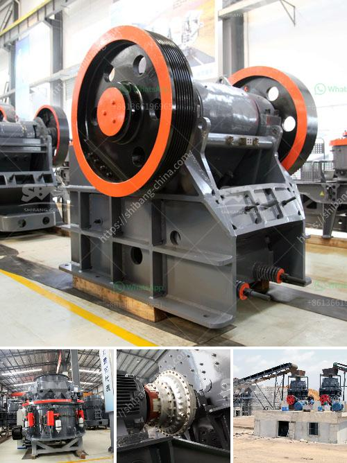

<h3>gold mining equipment for sale</h3>
Gold mining has been a lucrative business for centuries, and with the increasing demand for this precious metal, the need for efficient and reliable gold mining equipment is crucial. Whether you are an aspiring gold miner or a seasoned professional, having the right tools for the job is essential to ensure success in your mining endeavors.

Fortunately, there is a wide range of gold mining equipment available for sale, designed to cater to various mining operations and budgets. From simple hand-held tools to more advanced machinery, here are some essential pieces of equipment that you can consider:

1. Gold Pans: The most basic equipment for gold mining, gold pans are essential for separating gold from sediment and other materials. They are lightweight, portable, and easy to use, making them ideal for prospecting in rivers and streams.

2. Sluice Boxes: A sluice box is a long, narrow channel that traps and captures gold particles as water moves through it. They are highly effective for fine gold recovery and are suitable for small-scale mining operations.

3. High Bankers: High bankers are versatile machines that combine a sluice box and a power sluice into one unit. They are perfect for processing larger volumes of material and are designed to increase efficiency and gold recovery rates.

4. Trommels: Trommels are rotary screens that are commonly used in gold mining operations for separating materials of different sizes. They are excellent for processing large amounts of material and are highly efficient at recovering fine gold.

5. Metal Detectors: Metal detectors are valuable tools for locating gold nuggets and lodes buried underground. They are handy for prospecting in remote areas or detecting traces of gold in abandoned mines.

When searching for gold mining equipment for sale, it is crucial to consider the quality, durability, and reputation of the manufacturer. Opt for reputable suppliers who provide equipment that meets industry standards and offers excellent after-sales support.

Gold mining equipment comes in a wide price range, depending on the complexity and size of the machinery. It is essential to determine your specific needs and budget before making a purchase. Remember, investing in top-quality equipment will pay off in the long run by increasing your chances of striking gold and optimizing your mining operations.

In conclusion, gold mining equipment plays a vital role in the success of any mining operation. From gold pans to trommels and metal detectors, there is a vast selection of equipment available for sale. Research your options, choose wisely, and make an investment that will ultimately lead to lucrative returns in the gold mining industry.
<h3>Contact us</h3><ul><li><strong>Whatsapp:&nbsp;<a href="https://wa.me/8613661969651">+8613661969651</a></strong></li><li><a href="https://swt.shibang-china.com/?git&amp;zhl&amp;gold mining equipment for sale"><strong>Online Service(chat now)</strong></a></li></ul><h3>Related</h3><ul><li><a href='mica processing machinery pictures.md'>mica processing machinery pictures</a></li><li><a href='conveyor belt for crusher china.md'>conveyor belt for crusher china</a></li><li><a href='vertical shaft impact crusher plf.md'>vertical shaft impact crusher plf</a></li><li><a href='working principle of raw mill in cement plant.md'>working principle of raw mill in cement plant</a></li><li><a href='cone crusher suppliers in south africa.md'>cone crusher suppliers in south africa</a></li></ul>