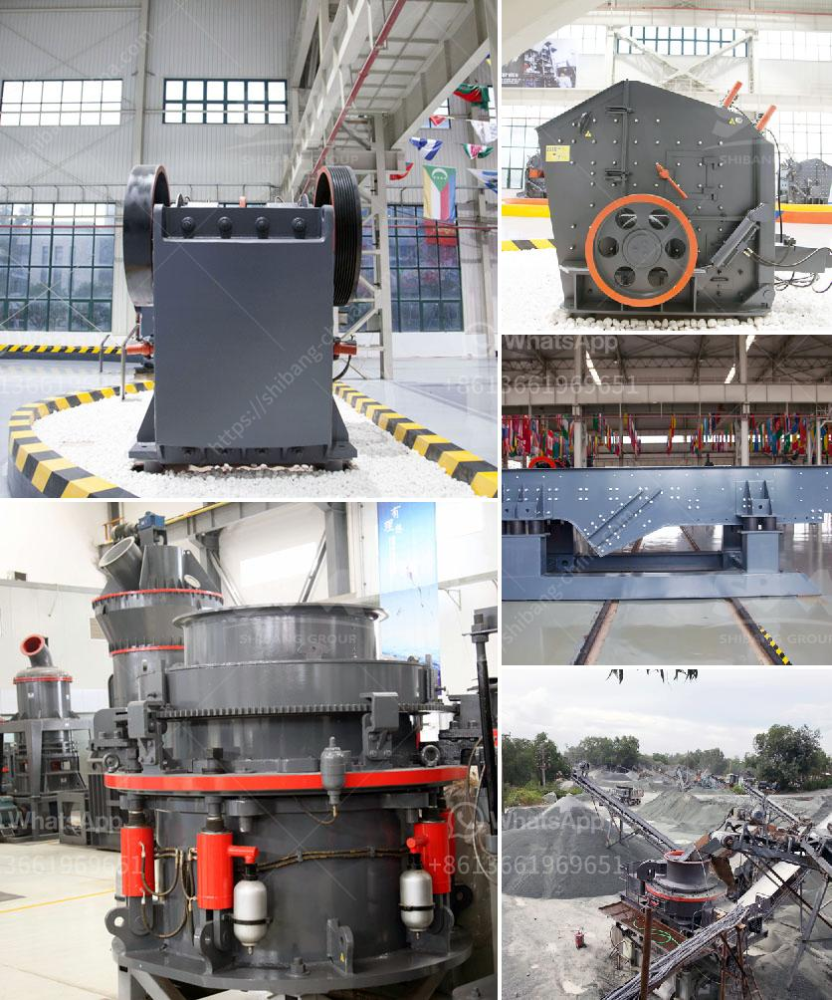

<h3>gold mining equipments manufacturers</h3>
Gold mining is a lucrative industry, attracting many investors and individuals eager to explore and extract this precious metal from the earth. However, success in the gold mining sector heavily relies on the use of high-quality equipment. Gold mining equipment manufacturers play a crucial role in enhancing the efficiency and productivity of gold mining operations around the world.

There are several key manufacturers in the market who provide innovative and reliable gold mining equipment. These manufacturers offer a wide range of equipment, including excavators, bulldozers, crushers, conveyors, and wash plants, among others. Let's take a closer look at some renowned manufacturers and their offerings.

1. Caterpillar Inc: Known as one of the leading heavy equipment manufacturers globally, Caterpillar offers a comprehensive range of equipment for the gold mining industry. Their excavators, such as the 336, are highly regarded for their reliability and durability. Bulldozers like the D9T provide powerful performance in challenging mining terrains. Caterpillar also produces loaders, haul trucks, and various other machines that cater to different mining needs.

2. Komatsu Ltd: Another prominent manufacturer in the gold mining equipment sector is Komatsu. This company specializes in producing large hydraulic excavators, known for their exceptional digging capabilities. Their PC1250 and PC2000 excavators are widely used in gold mining operations. Komatsu's dump trucks, such as the HD1500-8, are designed for heavy-duty hauling in mining environments.

3. Sandvik AB: Sandvik is a Swedish-based manufacturer that focuses on providing advanced underground mining equipment. They are renowned for their high-quality drilling and rock excavation tools used in gold mining. Sandvik's range of products includes jumbo drills, bolters, loaders, and trucks specifically designed for mining applications. Their drilling rigs, like the DT1131i and DT922i, are known for their efficiency and reliability in extracting gold from underground mines.

4. Metso Outotec: Metso Outotec is a Finnish manufacturer that offers a wide range of equipment and solutions for the gold mining industry. They specialize in crushers and grinders, critical equipment for processing mined gold-bearing rocks and ores. Metso Outotec's high-capacity crushers, such as the Nordberg® MP 2500 cone crusher, ensure efficient and precise gold extraction by reducing the size of the raw materials.

5. MSI Mining: MSI Mining is an American manufacturer that focuses solely on gold mining equipment. They offer a diverse range of equipment, including wash plants designed to remove impurities and recover gold efficiently. MSI Mining's gold shaking tables and gold finishing jigs have gained popularity among small-scale miners for their simplicity and effectiveness in gold recovery.

These are just a few notable manufacturers providing gold mining equipment globally. It is essential for mining companies to invest in reliable and efficient machinery to maximize productivity and minimize downtime. By utilizing state-of-the-art equipment from reputable manufacturers, gold mining operations can optimize their output and profitability while adhering to stringent safety standards.

In conclusion, gold mining equipment manufacturers play a pivotal role in ensuring the success of gold mining operations worldwide. Their high-quality and innovative equipment contribute to enhancing efficiency, productivity, and safety in the gold mining sector. As the demand for gold and precious metals continues to rise, the collaboration between mining companies and equipment manufacturers will continue to drive the evolution of mining technology and equipment for years to come.
<h3>Contact us</h3><ul><li><strong>Whatsapp:&nbsp;<a href="https://wa.me/8613661969651">+8613661969651</a></strong></li><li><a href="https://swt.shibang-china.com/?git&amp;zhl&amp;gold mining equipments manufacturers"><strong>Online Service(chat now)</strong></a></li></ul><h3>Related</h3><ul><li><a href='sand washing plant suppliers.md'>sand washing plant suppliers</a></li><li><a href='the world largest mobile crusher.md'>the world largest mobile crusher</a></li><li><a href='grinding media balls turkey.md'>grinding media balls turkey</a></li><li><a href='quarry machine manufacturers.md'>quarry machine manufacturers</a></li><li><a href='costs of conveyor belts.md'>costs of conveyor belts</a></li></ul>