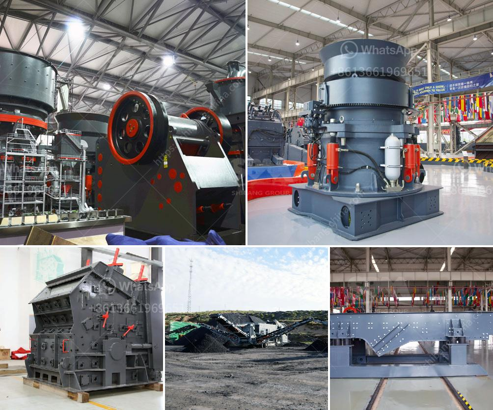

<h3>gold mining industry in tanzania</h3>
Tanzania is the fourth largest gold producer in Africa and has licensed a large number of international mining companies to carry out mining activities in the country. As the leading gold producer in Tanzania, AngloGold Ashanti has a strong presence in the country with four gold mining operations. Additionally, the company has signed a partnership agreement with the Tanzanian government to help the country meet its local content goals in the mining sector.

The presence of major international mining companies in Tanzania has helped to establish the country as a significant gold producer on the African continent. Since mining began in Tanzania over a century ago, the precious metal has played a major role in the country's socio-economic and political development. Today, gold mining remains an important source of revenue for Tanzania and the country intends to further strengthen its position in the world market.

Tanzania is well-endowed with significant mineral resources, including gold. The country's gold production is driven by small-scale miners who primarily use manual and semi-mechanical methods. These miners are largely unregulated and operate outside the formal economy, making it difficult for the government to monitor and control their activities. This has led to concerns over environmental degradation, unsafe working conditions, and the loss of potential tax revenues.

To address these concerns and harness the full potential of Tanzania's gold mining industry, the government has implemented various initiatives. One such initiative is the establishment of a mining cadastre system, which aims to provide a transparent and efficient process for granting mining licenses and leases. This system helps to reduce the prevalence of illegal mining activities and creates a level playing field for all players in the sector.

Furthermore, the Tanzanian government has increased its efforts to attract foreign direct investment in the mining sector by offering attractive fiscal incentives, such as a 3% royalty rate and 100% foreign ownership of mining companies. These measures have been successful in attracting foreign mining companies and stimulating economic activity in Tanzania.

However, challenges still persist in the gold mining industry in Tanzania. The country's inadequate infrastructure, including roads, railways, and ports, hampers the efficient transportation of mining goods and equipment. This, coupled with unreliable power supply, increases the cost of doing business and limits the productivity of mining operations.

Moreover, the unpredictable nature of the Tanzanian government's mining policies has created uncertainties for both existing and potential investors. The government's decision to ban the export of mineral concentrates in 2017, for instance, resulted in significant disruptions to the gold mining industry, causing a decline in gold production and investment confidence.

In conclusion, Tanzania's gold mining industry holds great potential for further development. The presence of major international mining companies, such as AngloGold Ashanti, has contributed to the country's position as a leading gold producer. However, challenges remain, particularly in terms of inadequate infrastructure and unpredictable government policies. These issues need to be addressed to fully unlock the economic and social benefits of gold mining in Tanzania.
<h3>Contact us</h3><ul><li><strong>Whatsapp:&nbsp;<a href="https://wa.me/8613661969651">+8613661969651</a></strong></li><li><a href="https://swt.shibang-china.com/?git&amp;zhl&amp;gold mining industry in tanzania"><strong>Online Service(chat now)</strong></a></li></ul><h3>Related</h3><ul><li><a href='quarry equipment for sale in nigeria.md'>quarry equipment for sale in nigeria</a></li><li><a href='marble stone milling plant.md'>marble stone milling plant</a></li><li><a href='stone crusher for excavator cost.md'>stone crusher for excavator cost</a></li><li><a href='broach grinding machine manufacture in china.md'>broach grinding machine manufacture in china</a></li><li><a href='start up procedure for ball mill.md'>start up procedure for ball mill</a></li></ul>