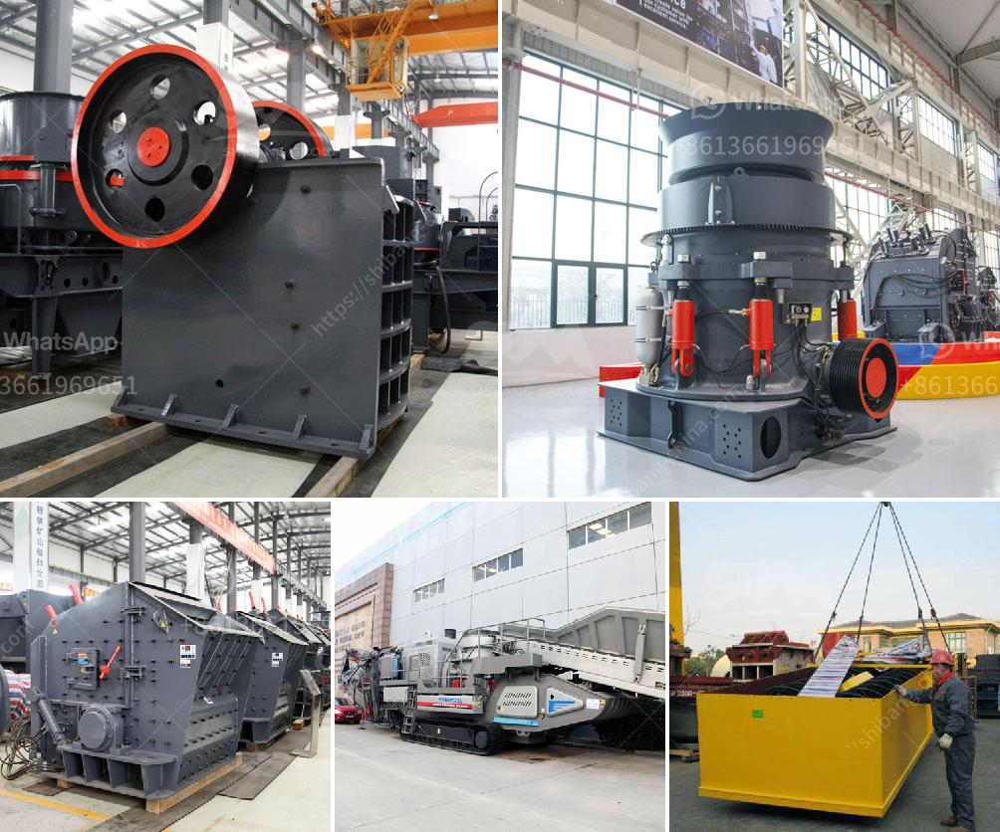

<h3>gold mining used jaw crusher</h3>
Gold mining is a process that involves extracting gold from the earth by various methods such as placer mining, underground mining, and hard rock mining. This precious metal has been used for various purposes since ancient times, and its value continues to attract investors and individuals alike. One important tool used in the gold mining process is a jaw crusher.

A jaw crusher is a primary crusher that breaks down big chunks of rock into manageable sizes. The material is first passed through a grizzly that separates larger rocks from smaller ones, and then fed into the crusher. The jaw crusher has a powerful motor that rotates the swing jaw, which forces the material against the stationary jaw, crushing it into smaller pieces.

In the context of gold mining, a jaw crusher is often utilized in the first stage of the gold ore crushing process. This early-stage crushing process is critical because it prepares the gold-bearing ore for further grinding or beneficiation processes. Having a reliable jaw crusher is essential, as it allows the ore to be crushed to the desired size efficiently.

There are several reasons why a jaw crusher is commonly used in the gold mining industry. Firstly, the jaw crusher is versatile. It can handle various types of materials, including quartz, cobble, iron ore, basalt, limestone, and other minerals. Secondly, since gold-bearing ore often contains large rocks, a jaw crusher can process these rocks efficiently, saving time and resources.

Additionally, the jaw crusher has a simple structure and is easy to operate, making it suitable for operators of all skill levels. The maintenance and operation of a jaw crusher are relatively straightforward compared to other crushing machines, ensuring a low downtime and high production rate.

Furthermore, the jaw crusher's power consumption is low, reducing both operational costs and energy usage. This is important in the gold mining industry, as it allows miners to maximize their profits and reduce their environmental impact.

When choosing a jaw crusher for gold mining, several factors should be considered. Firstly, the size of the gold mine will determine the size of the jaw crusher. For smaller operations, a portable jaw crusher with a closed-circuit system may be sufficient. However, larger mines may require a stationary crushing plant with multiple crushers.

Additionally, the hardness of the gold ore should also be considered. Hard gold ores require a high-quality jaw crusher with better wear resistance and strength. Lower-quality jaw crushers may be more prone to wearing out quickly and requiring frequent repairs.

In conclusion, a jaw crusher plays a vital role in the gold mining industry. It eases the process of crushing large rocks and prepares the gold-bearing ore for further grinding or beneficiation processes. Its versatility, simplicity, low power consumption, and ease of operation make it an ideal choice for gold miners. When selecting a jaw crusher for gold mining, factors such as the size of the operation and the hardness of the ore should be carefully considered to ensure optimal performance and productivity.
<h3>Contact us</h3><ul><li><strong>Whatsapp:&nbsp;<a href="https://wa.me/8613661969651">+8613661969651</a></strong></li><li><a href="https://swt.shibang-china.com/?git&amp;zhl&amp;gold mining used jaw crusher"><strong>Online Service(chat now)</strong></a></li></ul><h3>Related</h3><ul><li><a href='crushers of germany.md'>crushers of germany</a></li><li><a href='stone crushing machineries imphal.md'>stone crushing machineries imphal</a></li><li><a href='gold crusher equipment.md'>gold crusher equipment</a></li><li><a href='grinder machine parts and function.md'>grinder machine parts and function</a></li><li><a href='south africa coal mining cost per ton.md'>south africa coal mining cost per ton</a></li></ul>