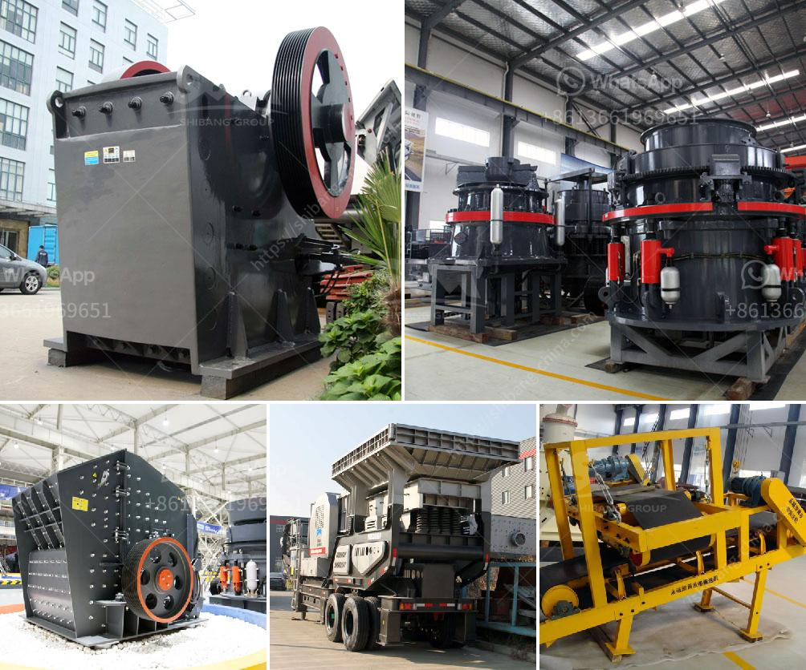

<h3>gold mining wash plants for sale in ghana</h3>
Gold mining in Ghana has been a prevalent activity for centuries. With rich reserves and a vibrant mining industry, the country has become a leading gold producer in Africa. However, the process of extracting gold from the earth requires extensive exploration and resources, including the use of wash plants.

Wash plants, also known as trommel wash plants, are essential tools used in gold mining operations. They are designed to separate gold particles from soil and other materials, allowing miners to collect the precious metal more efficiently. These plants effectively wash and screen large quantities of material, reducing the time and effort required for manual extraction.

In Ghana, where artisanal and small-scale gold mining (ASGM) is widespread, wash plants play a critical role in boosting production. With limited access to modern mining equipment, ASGM operators rely on these plants to process gold-bearing material and increase their chances of finding significant deposits.

One of the primary advantages of using gold mining wash plants in Ghana is their ease of operation. These plants are designed to be user-friendly, even for those with limited technical knowledge. Most wash plants are equipped with simple controls and require minimal maintenance, making them accessible to ASGM miners with limited resources.

Wash plants for sale in Ghana come in various sizes and types to cater to different mining needs. Portable trommel wash plants, for example, are compact and mobile, allowing miners to easily move them from one site to another. This flexibility is crucial as it enables miners to explore different areas, increasing their chances of discovering gold-rich pockets.

Another type of wash plant commonly used in Ghana is the gold shaker table. This equipment uses vibration and water flow to separate gold from other minerals. The shaker table is advantageous for miners operating in areas where water is scarce or plagued with seasonal variations. Additionally, shaker tables have a higher concentration ratio, making them suitable for processing lower-grade ores efficiently.

Aside from their operational versatility, gold mining wash plants are also highly efficient in gold recovery. The trommel design, with its rotating cylinder and perforated screen, helps separate gold particles from larger rocks or debris. In contrast, shaker tables use shaking motions and water flow to separate and concentrate gold particles, enhancing the recovery process.

For small-scale miners in Ghana, acquiring a wash plant can be a significant investment. However, the benefits outweigh the initial costs. By using effective wash plants, miners can minimize losses from gold-bearing material left behind during manual extraction. Additionally, these plants can process larger quantities of material, increasing the chances of finding sizable gold deposits.

In conclusion, gold mining wash plants have become essential tools for small-scale miners in Ghana. They offer a cost-effective and efficient way to recover gold from the earth, increasing production and boosting the local economy. With advancements in technology, wash plants are becoming more accessible, providing opportunities for miners to maximize their gold recovery potential. As the mining industry in Ghana continues to thrive, the demand for wash plants is poised to increase, contributing to the country's ongoing success as a significant player in the global gold market.
<h3>Contact us</h3><ul><li><strong>Whatsapp:&nbsp;<a href="https://wa.me/8613661969651">+8613661969651</a></strong></li><li><a href="https://swt.shibang-china.com/?git&amp;zhl&amp;gold mining wash plants for sale in ghana"><strong>Online Service(chat now)</strong></a></li></ul><h3>Related</h3><ul><li><a href='processing of copper crusher in zambia.md'>processing of copper crusher in zambia</a></li><li><a href='diamond equipment for mining for sale south africa.md'>diamond equipment for mining for sale south africa</a></li><li><a href='size maya size of a stone crusher.md'>size maya size of a stone crusher</a></li><li><a href='vertical mills for sale alberta.md'>vertical mills for sale alberta</a></li><li><a href='gemstone washing machine in china.md'>gemstone washing machine in china</a></li></ul>