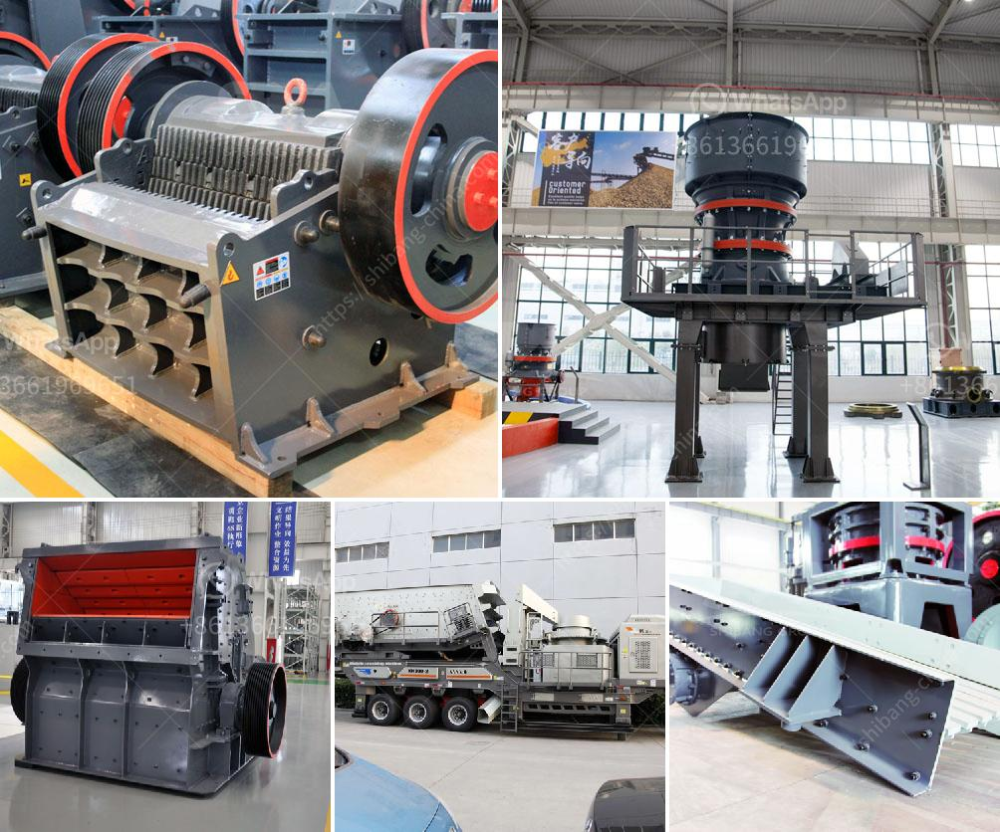

<h3>gold ore crusher for sale</h3>
Gold ore crusher is a crucial machine which needs to be carefully designed to break down the gold ore into fine particles. This process is the first step in extracting gold from rocks. The crusher machines are responsible for breaking down large rocks into smaller, more manageable sizes for further processing.

One of the key components in the crushing process is the jaw crusher. This machine is typically used in the primary crushing stage and can crush large rocks into small particles. The jaw crusher uses a compressive force to break down the gold ore and is designed to achieve optimal particle size reduction. It is a versatile machine that can be used in a variety of applications such as mining, quarrying, and recycling.

When considering a gold ore crusher for sale, it is essential to choose the right type of crusher for your needs. There are various types of crushers available in the market, including jaw crushers, impact crushers, cone crushers, and vertical shaft impact crushers.

Jaw crushers are the most commonly used crushers in the mining industry. They are characterized by their robust construction and high production capacity. Jaw crushers are suitable for crushing large rocks and ores, and are often used in primary crushing applications.

Impact crushers are ideal for crushing medium-hard materials such as limestone, gold ore, and coal. These crushers utilize a high-speed impact force to break down the material. They offer good control of the particle size and can produce a uniform shape of particles.

Cone crushers are commonly used in secondary and tertiary crushing applications. They are designed to crush large rocks into smaller particles. Cone crushers have a high production capacity and are known for their reliable performance.

Vertical shaft impact crushers are efficient crushers that are used to crush rocks and ores by utilizing high-speed rotation combined with impact crushing. These crushers are known for their high production capacity and excellent particle shape.

1. Production capacity: Determine the desired output and ensure that the crusher can meet your production requirements.

3. Maintenance requirements: Opt for a crusher that is easy to maintain and offers convenient access for maintenance.

4. Spare parts availability: Ensure that spare parts are readily available in case of any breakdowns.

In conclusion, a gold ore crusher is an essential machine in the gold mining industry. It plays a crucial role in breaking down the gold ore into fine particles for further processing. When looking for a gold ore crusher for sale, consider factors such as production capacity, power consumption, maintenance requirements, and spare parts availability. By choosing the right crusher, you can ensure efficient and reliable gold ore crushing operations.
<h3>Contact us</h3><ul><li><strong>Whatsapp:&nbsp;<a href="https://wa.me/8613661969651">+8613661969651</a></strong></li><li><a href="https://swt.shibang-china.com/?git&amp;zhl&amp;gold ore crusher for sale"><strong>Online Service(chat now)</strong></a></li></ul><h3>Related</h3><ul><li><a href='fine powder making machine.md'>fine powder making machine</a></li><li><a href='construction conveyor for sale.md'>construction conveyor for sale</a></li><li><a href='sand powder milling machine.md'>sand powder milling machine</a></li><li><a href='harga stone crusher kapsitas 20 ton.md'>harga stone crusher kapsitas 20 ton</a></li><li><a href='limestone grinding process.md'>limestone grinding process</a></li></ul>